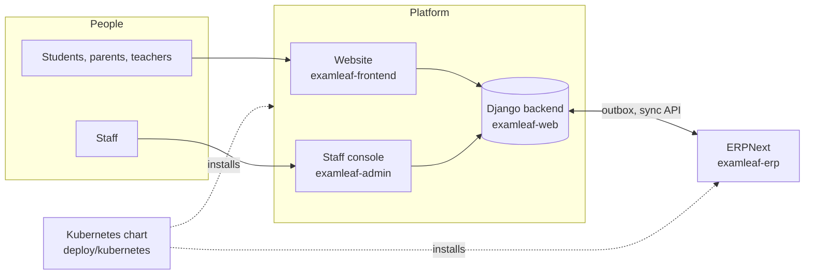

# ExamLeaf platform

      

The website, API, revision course and back office of ExamLeaf LLP (published by Bhaben Bhuyan): free worked
solutions behind the QR code printed on every sample paper, student accounts, the book shop with Razorpay and cash on
delivery, GST invoices, the app-based revision course, the staff console of the Admin Control Panel, ERPNext for the
business's books, and the REST API for the mobile app. The books themselves (questions, solutions, printed PDFs) live
in the companion repository `LazyIndianBook/Class-12-Assam`; the website imports their papers.

> [!IMPORTANT]
> **The one rule: the backend decides.** The Django backend is the system of record and checks every role,
> capability, scope and limit; the website and the staff console draw what it answers and never decide on their own.

> [!NOTE]
> **At a glance**
> - Resume the work from [docs/HANDOVER.md](docs/HANDOVER.md); every document is mapped in [docs/README.md](docs/README.md).
> - Phases A and B of the Admin Control Panel are merged on `main` and verified (the counts are in the
>   [Changelog](examleaf-web/CHANGELOG.md)); Phases C to E are planned.
> - One standard for every document: [docs/STYLE.md](docs/STYLE.md); the portal builds with `make docs`.

## What is where

*The folders of this repository and who uses what they build.*

| Path | What it holds |
|---|---|
| `examleaf-web/` | the Django 6.1 backend: REST API v1 (`/api/v1/`, OpenAPI at `/api/docs/`), allauth headless sign-in (`/_allauth/`), the admin, Razorpay and Anymail webhooks, media, QR PNGs, the staff clip player, emails and PDFs, Celery workers, Docker compose with PostgreSQL, Redis, Caddy; see its `README.md`, `DEPLOYMENT.md`, `RUNBOOK.md`, `API.md`, `CHANGELOG.md`, `SECURITY_REVIEW*.md` |
| `examleaf-frontend/` | the Next.js 16 frontend (TypeScript, App Router, Tailwind 4, restyled shadcn components, typed OpenAPI client, allauth headless client): public pages, the shop, checkout and orders, sign-in and account, the revision course page and learning dashboard; see its `README.md` |
| `examleaf-admin/` | the staff console at `admin.examleaf.in` (Next.js 16, the frontend's toolchain and design system): sign-in with two-step, the sidebar from the session manifest, inbox, approvals, audit trail, staff and customers, the data-rights queue and breach register, settings, API keys and the system's health, with links into ERPNext's business modules, against the backend's staff API (`/api/v1/staff/`), with a fixtures mode for development; see its `README.md` |
| `deploy/kubernetes/` | the Helm chart `examleaf-platform` for a Kubernetes cluster (the same stack, CloudNativePG for PostgreSQL, Traefik and cert-manager in place of Caddy, ERPNext's part switched off), its kind test profile and the record of a run (`README.md`, `TESTING.md`) |
| `examleaf-erp/` | the back office: ERPNext v16.50.0 with India Compliance (GST), HRMS and `examleaf_erp`, the private Frappe app that adds the custom fields and doctypes, the GST print formats and the sync API the platform's `erp` app calls; the development stack (`compose/`, `./dev.sh`), the production image (`image/build.sh`, CI in `.github/workflows/erp-image.yml`); see its `README.md`, `API.md`, `UPGRADE.md` |
| `docs/design/` | the redesign: resources brief, direction and component vocabulary, component spec, token layer, motion language, coverage matrix, parity map, Lighthouse and accessibility audits, before/after screenshots |
| `docs/examleaf-platform-plan.md`, `docs/examleaf-ai-checker-design.md`, `docs/examleaf-phase5-plan.md`, `docs/examleaf-phase6-plan.md`, `docs/examleaf-frontend-architecture.md`, `docs/examleaf-phase8-nextjs-plan.md` | the plans and decisions, each with a Status section filled by the builders |
| `docs/research/` | the archived research runs behind the plans (platform ideas, AI answer checker, production features), indexed in `docs/research/README.md` |
| `.github/workflows/ci.yml` | on pushes to main and pull requests that touch the code (no checkout of the books needed: the test papers are committed): ruff and tests on PostgreSQL, the Docker image build and smoke test, a dependency audit, and the frontend's lint, types, unit tests, build and Playwright journeys |

## Documentation

| Read | For |
|---|---|
| [docs/README.md](docs/README.md) | the map of every document, by audience and by component |
| [docs/HANDOVER.md](docs/HANDOVER.md) | where the work stands, what to do next, the owner's decisions |
| [examleaf-web/API.md](examleaf-web/API.md) | the REST API for the app, other frontends and the panel |
| [examleaf-web/DEPLOYMENT.md](examleaf-web/DEPLOYMENT.md), [RUNBOOK.md](examleaf-web/RUNBOOK.md) | running it and operating it |
| [docs/guides/roles/README.md](docs/guides/roles/README.md) | one page for each staff role |
| [docs/STYLE.md](docs/STYLE.md) | the documentation standard; `make docs` builds the portal, `make docs-check` renders every diagram |

## Running it locally
Backend: `cd examleaf-web && python3.14 -m venv .venv && .venv/bin/pip install -r requirements-dev.txt && .venv/bin/python manage.py migrate && .venv/bin/python manage.py import_papers --all && .venv/bin/python manage.py seed_shop --stock 100`, then `SITE_URL=http://localhost:3000 CSRF_TRUSTED_ORIGINS=http://localhost:3000 USE_X_FORWARDED_HOST=1 .venv/bin/python manage.py runserver 8100`. `import_papers` reads the books repository checked out beside this one as `../Class 12` (or `--root <checkout>`, or `PAPERS_ROOT`); without it, `import_papers --all --fixtures` imports the 13 test papers committed in `examleaf-web/content/fixtures/papers/`, which the tests and CI use. The parser is a copy of the books repository's `production/build/book.py` (`examleaf-web/content/papers_parser.py`); that file stays the source of truth. Frontend: `cd examleaf-frontend && npm ci && npm run dev` with the variables from its `.env.example`. Tests: `examleaf-web/.venv/bin/python -m pytest` and `cd examleaf-frontend && npm test && npm run test:e2e`.

## Deployment
One machine with Docker compose (`examleaf-web/docker-compose.yml`): PostgreSQL 17, two Redis instances, the Django web service, Celery worker, beat and media worker, the Next.js frontend, Caddy with automatic TLS routing the Django prefixes to the backend and every other path to the frontend; with the profile `admin`, the staff console (`examleaf-admin/`) at `admin.<domain>`, Caddy's second site. `examleaf-web/DEPLOYMENT.md` lists every setting and the accounts to open (Razorpay, MSG91 with DLT, Amazon SES, Google OAuth, Cloudflare R2, Firebase, Turnstile); `RUNBOOK.md` the operating procedures. On a Kubernetes cluster the same stack installs from `deploy/kubernetes/` (its `README.md` covers the operators, secrets, upgrades, backups and restore).

Repository created on 8 October 2026 by splitting the platform paths, with their history, out of `LazyIndianBook/Class-12-Assam`.

## Scope ahead
ExamLeaf will publish for other state boards and the central boards, for every class and not only Class 12, and more than sample papers: guidebooks, question banks, quick revision books and the app-based revision course. The data model already treats board, class, subject and product kind as data (`Board`, `ClassLevel`, `Subject`, `Book`, `Product.kind`), so a new board or class is content, not code; the `kind` lists are the places to extend for new product types. Before the first print run of another board or class, agree a paper-code scheme that stays unique across them, because the printed QR codes resolve `/s/<code>/` by code alone.

## Related documents

- [docs/README.md](docs/README.md): the documentation map.
- [docs/HANDOVER.md](docs/HANDOVER.md): how to resume.
- [examleaf-web/CHANGELOG.md](examleaf-web/CHANGELOG.md): what changed, by phase.
