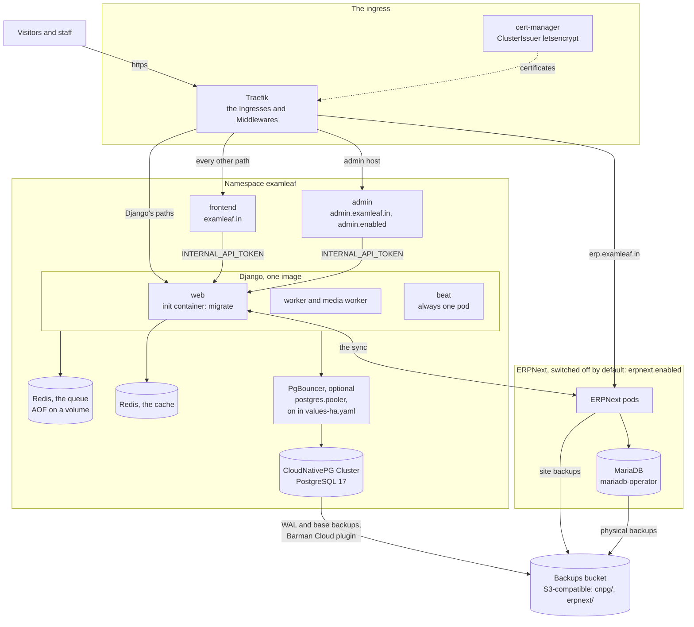
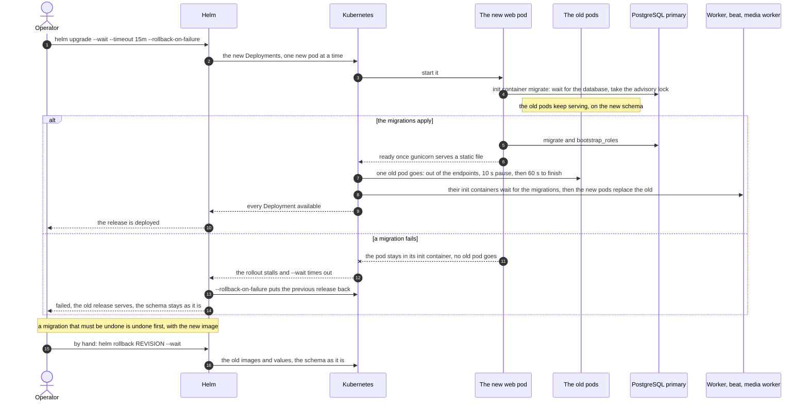

# ExamLeaf on Kubernetes

   

This directory packages the platform for a Kubernetes cluster, as section 3.4 of
[`docs/examleaf-admin-control-panel-plan.md`](../../docs/examleaf-admin-control-panel-plan.md) decided: one Helm chart,
`examleaf-platform`, with the Django backend and its Celery processes, the Next.js website and admin panel, PostgreSQL
through the CloudNativePG operator, two Redis, the Ingress and its certificates. ERPNext is a dependency of the chart
with its database, backups and Ingress prepared, switched off until it is added (section "ERPNext" below).
docker-compose (`examleaf-web/docker-compose.yml`) stays for development and for a one-machine server; this is the same
stack, translated. Operators read it to install, upgrade, back up and run the chart.

> [!NOTE]
> **At a glance**
>
> - [`TESTING.md`](TESTING.md) records the chart's runs on a `kind` cluster, the latest on Traefik (ERPNext rendered and
>   validated, not run); the chart has not yet run on a real cluster.
> - A cluster needs the operators first (Traefik, cert-manager, CloudNativePG and its Barman Cloud plugin) at the
>   releases the Makefile pins, and no secret ever goes into a values file.
> - An upgrade is one `helm upgrade --wait --rollback-on-failure`: web's init container runs the migrations while the
>   old pods serve.
> - Backups are continuous: every WAL file, and a base backup every day at 02:15 UTC, so any moment of the last 30 days
>   can be restored.
> - `values-ha.yaml` is the three-node profile: two of every pod that serves, a database standby and PgBouncer.

## Contents

- [What is in this directory](#what-is-in-this-directory)
- [What runs where](#what-runs-where)
- [Operators first](#operators-first)
- [Images](#images)
- [Secrets](#secrets)
- [DNS and the two hosts](#dns-and-the-two-hosts)
- [Install](#install)
- [Health checks](#health-checks)
- [Upgrades and migrations](#upgrades-and-migrations)
- [Backups and restore](#backups-and-restore)
- [Storage](#storage)
- [Node maintenance](#node-maintenance)
- [Sizing for a single node](#sizing-for-a-single-node)
- [High availability](#high-availability)
- [Logs and time](#logs-and-time)
- [ERPNext](#erpnext)
- [Differences from docker-compose](#differences-from-docker-compose)
- [Related documents](#related-documents)

## What is in this directory

| Path | What it holds |
|---|---|
| `examleaf-platform/` | the chart: `values.yaml` (every setting, each explained), `values-ha.yaml` (three nodes, section "High availability"), `values-kind.yaml` and `values-kind-ha.yaml` (the laptop), `templates/` |
| `Makefile` | the images, the chart's checks and the kind cluster (`make` lists the tasks) |
| `traefik-values.yaml` | Traefik's own settings that go with the chart (section "The ingress controller") |
| `kind-config.yaml`, `kind-extras.yaml` | the kind test cluster, and its stand-ins for Let's Encrypt and Cloudflare R2 |
| `TESTING.md` | what was run on kind, and what it showed |
| `load.mjs` | the steady request stream of TESTING.md's chaos runs (Node, no dependency) |

## What runs where

The diagram shows how a request and the data move through the cluster; the table sets each docker-compose service
against its Kubernetes object.



*The cluster: Traefik routes by path, the frontend and the admin call web with the internal token, only the site's pods reach PostgreSQL and the two Redis, and ERPNext is drawn as it is when switched on.*

| docker-compose.yml | Kubernetes (release `examleaf`) |
|---|---|
| `web` (migrate, bootstrap_roles, gunicorn) | Deployment `examleaf-web`: an init container waits for the database and runs `migrate` and `bootstrap_roles` (one pod at a time, under a lock); gunicorn is ready once it serves a static file |
| `worker`, `beat`, `media-worker` | Deployments `examleaf-worker`, `examleaf-beat` (always one pod), `examleaf-media-worker` (its own small environment); each waits until the migrations are applied |
| `frontend` | Deployment `examleaf-frontend` |
| `admin` (profile `admin`) | Deployment `examleaf-admin` at `admin.<domain>` (Django's paths there go to web), with `admin.enabled` |
| `db` (postgres:17) | CloudNativePG `Cluster` `examleaf-db` (PostgreSQL 17), continuous backup to a bucket; with `postgres.pooler` PgBouncer `examleaf-db-pooler` in front (values-ha.yaml) |
| `redis`, `redis-cache` | Deployments `examleaf-redis-queue` (with a volume) and `examleaf-redis-cache` |
| `caddy` | Ingresses and Middlewares for Traefik (k3s's bundled controller), certificates from cert-manager |
| `.env` | the ConfigMap `examleaf-config` (from `values.yaml` "config") and the Secrets you make (`examleaf-env` …) |
| volumes `media`, `pgdata`, `redisdata` | PersistentVolumeClaims `examleaf-media`, the Cluster's own, `examleaf-redis-queue` |
| (none) | with `erpnext.enabled`: frappe/helm's ERPNext (`examleaf-erpnext-*`), its MariaDB `examleaf-erp-db` through mariadb-operator, the site backups, `erp.<domain>` |

## Operators first

The chart expects these in the cluster. Each is installed the way its project documents, at the release the Makefile
pins (the kind test used exactly these).

| What | Release | Install | Why |
|---|---|---|---|
| Traefik | v3.7 (k3s v1.35.9 bundles v3.7.13; chart 41.7.0 is v3.7.14) | bundled with k3s in `kube-system`; elsewhere its Helm chart (`https://traefik.github.io/charts`), with `traefik-values.yaml` | the Ingresses' controller and the Middleware resources the chart uses |
| cert-manager | v1.21.2 | `kubectl apply -f https://github.com/cert-manager/cert-manager/releases/download/v1.21.2/cert-manager.yaml` | the certificates of both hosts; the Barman Cloud plugin needs it too |
| CloudNativePG | 1.30.1 | `kubectl apply --server-side -f https://raw.githubusercontent.com/cloudnative-pg/cloudnative-pg/release-1.30/releases/cnpg-1.30.1.yaml` | PostgreSQL |
| Barman Cloud plugin | v0.15.1 | `kubectl apply -f https://github.com/cloudnative-pg/plugin-barman-cloud/releases/download/v0.15.1/manifest.yaml` (after cert-manager, into `cnpg-system`) | backups and restores of PostgreSQL |
| External Secrets Operator | 2.12.0 | its Helm chart | only with `secrets.mode: externalSecret` |
| metrics-server | 0.9.0 | its manifest or chart | only for the autoscalers (`web.autoscaling`, `frontend.autoscaling`) |
| mariadb-operator | 26.10.1 | its two Helm charts, `mariadb-operator-crds` then `mariadb-operator` (`https://helm.mariadb.com/mariadb-operator`), into `mariadb-operator` | only with ERPNext |

CloudNativePG's own support for Barman Cloud inside the operator is deprecated (removal is announced for 1.31), so the
chart uses the plugin from the start.

> [!NOTE]
> The chart's routing was first written for ingress-nginx, which the Kubernetes project retired in March 2026 (no
> release or security fix after v1.15.1); it now targets Traefik, which k3s bundles, which is maintained, and which
> serves the Gateway API as well when the chart moves to it.

### The ingress controller

The chart's Ingresses (`ingressClassName: traefik`) carry Traefik's annotations `router.entrypoints` (`websecure`, or
`web` for the http redirect) and `router.middlewares`, which name the chart's Middleware resources
(`templates/middlewares.yaml`): `redirect-https`, `body-limit` (Buffering), `compress`, `strip-server` (Headers),
`health-auth` (BasicAuth), `health-hide` (ReplacePathRegex), `drop-subrequest` (Headers) and `admin-allowlist`
(IPAllowList), plus `erp-headers` and `erp-allowlist` with ERPNext. Traefik adds no headers of its own (no HSTS, no
`Server`), so Django's and Next's are what the browser gets.

Two of Traefik's own settings go with them (`traefik-values.yaml`): a read timeout of 5 minutes for a whole request
(Traefik's default of 60 seconds would cut off a photo from a slow phone, which Caddy gave 5 minutes), and the access
log as JSON on stdout. Traefik has no separate timeout for the headers: they share the 5 minutes (Caddy gave them 10
seconds). On k3s they go into a HelmChartConfig for the bundled Traefik, with the visitor's address kept:

```yaml
apiVersion: helm.cattle.io/v1
kind: HelmChartConfig
metadata:
  name: traefik
  namespace: kube-system
spec:
  valuesContent: |-
    ports:
      websecure:
        transport:
          respondingTimeouts:
            readTimeout: 300s
    accessLog:
      enabled: true
      format: json
    service:
      spec:
        externalTrafficPolicy: Local
```

Saved as `/var/lib/rancher/k3s/server/manifests/traefik-config.yaml` on the server, k3s applies it and redeploys
Traefik. Anywhere else, Traefik's chart (`ingress.controllerNamespace` follows the namespace you choose):

```sh
helm upgrade --install traefik traefik --repo https://traefik.github.io/charts --version 41.7.0 --namespace kube-system -f traefik-values.yaml --set service.spec.externalTrafficPolicy=Local
```

`externalTrafficPolicy: Local` keeps the visitor's address: Django counts failed log-ins, rate limits and the device
list by it (`PROXY_COUNT=1` trusts the one proxy in front, as with Caddy). Traefik drops a client's own
`X-Forwarded-*` headers and sends the address it saw, so this holds while nothing else stands in front. On k3s,
ServiceLB keeps the address with `Local` unless the node has `node-external-ip` set (k3s's documentation). If a load
balancer or Cloudflare's proxy stands in front, Traefik sees the balancer's address and every visitor would share one
limit: give the balancer the PROXY protocol and Traefik `ports.websecure.proxyProtocol.trustedIPs`, then try
`/api/v1/` from two addresses. Trusting the balancer's `X-Forwarded-For` instead (`forwardedHeaders.trustedIPs`) does
not fit as the site is written: the chain grows by one, and the website's server-side calls, which forward the last
address (`FrontendClientMiddleware`), would speak for the balancer.

The http redirect is the chart's (`<release>-http`, a RedirectScheme on the `web` entrypoint for every host): it
keeps the whole path and query, as Caddy's did, answers 301 to a GET and 308 to anything else (Caddy: 308), and
leaves cert-manager's HTTP-01 challenges alone, as their longer rule wins. Traefik's own entrypoint redirect
(`ports.web.http.redirections`) would do the same with `allowACMEByPass: true`; the chart does not need it.

### A ClusterIssuer

`ingress.clusterIssuer` names a cert-manager ClusterIssuer (`letsencrypt` by default). One for Let's Encrypt with the
HTTP-01 challenge, which needs port 80 of both hosts to reach the controller:

```yaml
apiVersion: cert-manager.io/v1
kind: ClusterIssuer
metadata:
  name: letsencrypt
spec:
  acme:
    server: https://acme-v02.api.letsencrypt.org/directory
    email: <the address Let's Encrypt writes to before a certificate expires>
    privateKeySecretRef:
      name: letsencrypt-account
    solvers:
      - http01:
          ingress:
            ingressClassName: traefik
```

The chart's NetworkPolicies let the controller reach cert-manager's challenge pods.

## Images

Every image of the platform lives under one registry, the chart's `registry` value (default
`ghcr.io/lazyindianbook`, the owner's GitHub organisation): `examleaf-web`, `examleaf-frontend` and the admin panel's
`examleaf-admin`, which the repository's Dockerfiles build unchanged, and ERPNext's `examleaf-erp` (section
"ERPNext"). From this directory:

```sh
docker login ghcr.io          # a token with write:packages
```

```sh
make images DOMAIN=examleaf.in RAZORPAY_KEY_ID=rzp_live_… TURNSTILE_SITE_KEY=… PUBLIC_MEDIA_DOMAIN=media.examleaf.in
```

```sh
make push
```

The three are tagged with the git commit (`TAG`; `REGISTRY` changes the registry, as the chart's value does). The two
Next.js builds have their `NEXT_PUBLIC_*` values compiled in: the website its domain and keys, the panel its own host
(`ADMIN_HOST`, default `admin.<DOMAIN>`, the chart's `admin.host`), the website's address and ERPNext's desk for its
links (`ERP_URL`, empty until ERPNext runs). A change of one of them means `make images` again. The packages of a
private repository are private, so the cluster pulls with a Secret, `ghcr-pull` (`imagePullSecrets`, and
`erpnext.imagePullSecrets` for ERPNext's pods), made from a token with `read:packages`:

```sh
kubectl -n examleaf create secret docker-registry ghcr-pull --docker-server=ghcr.io \
  --docker-username=<GitHub user> --docker-password=<token with read:packages>
```

## Secrets

> [!IMPORTANT]
> No secret ever goes into a values file.

The chart reads three Secrets in the release's namespace (four with ERPNext), and makes none from values:

| Secret (default name) | Keys | Read by |
|---|---|---|
| `examleaf-env` | `SECRET_KEY`, `LEARN_CODE_SECRET`, `INTERNAL_API_TOKEN` and `INTEGRATION_KEYS`, then as the features need them the keys `values.yaml` lists under `secrets.env` (insights, email, SMS, Razorpay, Google, Turnstile, S3, Firebase, Sentry) | web, worker and beat as their environment (every key); the frontend and the admin `INTERNAL_API_TOKEN`; the media worker `SECRET_KEY` and the four S3 keys |
| `examleaf-health-auth` | type `kubernetes.io/basic-auth`: `username` monitor, `password` HEALTH_CHECK_TOKEN | Traefik's BasicAuth, for `/health` |
| `examleaf-backup` | `AWS_ACCESS_KEY_ID`, `AWS_SECRET_ACCESS_KEY` (the backup bucket's keys, as `scripts/backup.sh` names them) | the Barman Cloud plugin; with ERPNext, mariadb-operator's backups and the site backups; no pod of the site |
| `examleaf-erp` (ERPNext only) | `db-root-password`, `admin-password` | MariaDB, bench (the site's database), the createSite Job |

**Made by hand** (`secrets.mode: existing`, the default). Keep the values in a password manager, put them into files
that never enter the repository, and load them:

```sh
kubectl create namespace examleaf
```

```sh
kubectl -n examleaf create secret generic examleaf-env --from-env-file=examleaf.env   # KEY=value lines, no comments
```

```sh
kubectl -n examleaf create secret generic examleaf-health-auth --type=kubernetes.io/basic-auth \
  --from-literal=username=monitor --from-literal=password="$HEALTH_CHECK_TOKEN"
```

```sh
kubectl -n examleaf create secret generic examleaf-backup \
  --from-literal=AWS_ACCESS_KEY_ID=… --from-literal=AWS_SECRET_ACCESS_KEY=…
```

```sh
shred -u examleaf.env
```

The values are made as DEPLOYMENT.md section 4 makes them (`python3 -c "import secrets; print(secrets.token_urlsafe(50))"`
for `SECRET_KEY` and `LEARN_CODE_SECRET`, `token_urlsafe(32)` for `INTERNAL_API_TOKEN` and `HEALTH_CHECK_TOKEN`).

> [!WARNING]
> `LEARN_CODE_SECRET` is set once and never changed (printed book codes depend on it).

`INTEGRATION_KEYS`, Fernet keys newest first, must be there from the first start: the integration accounts'
credentials and the support tickets' requesters' contact details are encrypted with them, and `migrate` stops without
them (`support.E001`, and `integrations.E001` once an account exists), so web's init container never finishes. A
cluster that ran before the Support module (Phase B) needs the key in `examleaf-env` before that release is rolled
out; a database restored elsewhere needs the same keys. One key:

```sh
python3 -c "from cryptography.fernet import Fernet; print(Fernet.generate_key().decode())"
```

**From a secret store** (`secrets.mode: externalSecret`). With the External Secrets Operator and a ClusterSecretStore
for your store (AWS Secrets Manager, Vault, 1Password, Doppler …), the chart renders ExternalSecrets that write the
same Secrets: `secrets.externalSecret.envKey` (default `examleaf/env`) is one JSON object whose properties are the
environment's keys, `backupKey` (`examleaf/backup`) holds the two backup keys, `erpKey` (`examleaf/erp`) ERPNext's
two, and the health Secret's password is the `HEALTH_CHECK_TOKEN` property of `envKey`. The ExternalSecrets were
rendered but not run (TESTING.md section 9).

A changed Secret reaches the pods when they start again: `kubectl -n examleaf rollout restart deployment` (the
settings in the ConfigMap restart the pods by themselves on `helm upgrade`). RUNBOOK.md's "Secrets and key rotation"
applies as it stands, with `kubectl create secret … --dry-run=client -o yaml | kubectl apply -f -` in place of editing
`.env`.

## DNS and the two hosts

Two names point at the ingress controller's address (an `A` and an `AAAA` record each): `examleaf.in` (the `domain`
value) and `admin.examleaf.in` (`admin.host`, default `admin.<domain>`) once the admin panel is enabled. cert-manager
asks Let's Encrypt for each host's certificate once the name resolves to the controller and port 80 answers there.

- **Routing.** Both hosts route as the Caddyfile does: `/api/`, `/_allauth/`, `/admin/`, `/shop/webhooks/`,
  `/anymail/`, `/shop/media/`, `/learn/preview/`, `/learn/hls/`, `/account/google/`, `/qr/` and `/static/` to Django,
  every other path to the website on the main host and to the panel on the admin host; http is redirected to https.
  The paths keep the Caddyfile's trailing slashes (`/api/*` there): Traefik matches a Prefix path character by
  character, so `/api` alone would also have caught `/apiary/`.
- **The admin host.** The admin host needs Django's paths because the panel signs in and calls `/api/v1/staff/` on its
  own host: with the admin on, the chart adds the host to `ALLOWED_HOSTS` and its origin to `CSRF_TRUSTED_ORIGINS`
  (both from the environment, as Django reads them), and sets `ADMIN_HOSTS` to it (the staff API answers there only,
  404 on the website's host) and `STAFF_PANEL_URL` to `https://admin.<domain>` (invitations link there).
- **Test mode.** On any site that is not production, `config.STAFF_TEST_MODE: "1"` shows the panel's TEST band (its
  default follows `DEBUG`, off on a server).
- **Cookies.** Its cookies are its own (Django's and the panel's are host-only, so a session there is not the
  website's).
- **The allowlist.** `admin.allowlist` (a list of CIDRs) limits who reaches the admin host at all, Django's paths
  there included: others get 403 from Traefik before the panel's own sign-in.
- **Health.** `/health` is not served on the admin host; the panel's server never sees it (`health-hide`), so it
  answers 404.
- **The subrequest header.** As the Caddyfile's admin site does, Traefik drops the request header
  `X-Middleware-Subrequest` before the panel (`drop-subrequest`: Next.js's internal header, never a visitor's,
  CVE-2025-29927).
- **Google sign-in.** Staff who sign in with Google there need `https://admin.<domain>/account/google/login/callback/`
  among the OAuth client's redirect URIs (`examleaf-admin/README.md` "Deploy").

## Install

```sh
cd deploy/kubernetes
```

```sh
make deps                                            # the ERPNext chart that Chart.lock pins (switched off)
```

```sh
helm upgrade --install examleaf examleaf-platform --namespace examleaf --create-namespace \
  -f values-production.yaml --set image.tag=<TAG> --set frontend.image.tag=<TAG> --set admin.image.tag=<TAG> \
  --wait --timeout 15m
```

`values-production.yaml` is yours, kept outside the repository or without secrets in it: at least `domain` (and
`registry` if the images live elsewhere than `ghcr.io/lazyindianbook`), the `config` settings that DEPLOYMENT.md
section 4 lists for a first deployment (`EMAIL_BACKEND`, `DEFAULT_FROM_EMAIL`, the seller's details …), `media` and
`postgres.storage` with the cluster's storage classes, and `postgres.backup`. The pull Secret `ghcr-pull` ("Images")
and the Secrets ("Secrets") come first. Then:

```sh
kubectl -n examleaf get pods,cluster                             # all Running; the Cluster "Cluster in healthy state"
```

```sh
kubectl -n examleaf logs deploy/examleaf-web -c migrate          # the migrations and bootstrap_roles
```

```sh
kubectl -n examleaf exec -it deploy/examleaf-web -- python manage.py createsuperuser
```

```sh
kubectl -n examleaf exec deploy/examleaf-web -- python manage.py check --deploy   # W005 and W021 only, with EMAIL_BACKEND set
```

```sh
kubectl -n examleaf exec deploy/examleaf-web -- python manage.py sendtestemail you@example.com
```

**The papers.** `import_papers` reads a checkout of the books repository (DEPLOYMENT.md section 4), which is not in
the image. Copy the folders it reads into the web pod and import from there:

```sh
tar czf papers.tgz -C /path/to/books production/{physics,chemistry,mathematics,biology}/{papers_md,format.json,orders,pyq}
```

```sh
POD=$(kubectl -n examleaf get pod -l app.kubernetes.io/component=web -o name | head -n 1)
```

```sh
kubectl -n examleaf cp papers.tgz ${POD#pod/}:/tmp/papers.tgz -c web
```

```sh
kubectl -n examleaf exec $POD -c web -- sh -c "mkdir -p /tmp/books && tar xzf /tmp/papers.tgz -C /tmp/books && python manage.py import_papers --all --root /tmp/books"
```

`/tmp` is the pod's own and goes with it; importing again is safe at any time (DEPLOYMENT.md section 11).

The panel's Content → Imports (Phase B) is a staff job, and staff jobs run in the worker pod, which has no books: with
`config.PAPERS_ROOT` null it answers "No production/ folder", and the chart has no volume for them (compose mounts the
host's checkout in web and in the worker). Until it has one, import as above, from a web pod. The panel's commit field
needs the version-control tool (git), which the image does not carry; it says so, and the commit left empty imports
the folder as it is.

## Health checks

The Caddyfile answers `/health` and `/health/*` with 404 unless the header `X-Health-Token` carries
`HEALTH_CHECK_TOKEN`. Traefik's middlewares cannot compare a header with a secret value, so the chart puts `/health`
behind Traefik's BasicAuth instead: user `monitor`, password `HEALTH_CHECK_TOKEN`, from the Secret
`examleaf-health-auth`. Anyone else gets 401. **The uptime monitor changes**: it sends basic auth instead of the
header (UptimeRobot, Better Stack, Uptime Kuma and Pingdom all can), with the same token:

```sh
curl -s -u "monitor:$HEALTH_CHECK_TOKEN" -H 'Accept: application/json' https://examleaf.in/health/
```

A second monitor, as DEPLOYMENT.md asks, watches `/health/integrations/` with the same credentials: a provider down
for half an hour, or dead letters and failed webhooks waiting for staff; `/health/` stays the site's own.

> [!IMPORTANT]
> `/health` must never reach the website: its server passes Django's paths on to Django (its development proxy), and the
> health pages would be open.

Traefik drops a router whose middleware cannot be built, and without its Secret the BasicAuth cannot, so `/health`
would fall through to the website's router; that router rewrites any `/health` path before the website sees it
(`health-hide`), and the answer is the website's 404, as Caddy's was while the token was unset. TESTING.md section 3
tries it.

Inside the cluster the gate is not in the way: the smoke test and the website's and the panel's own outage checks ask
web's Service directly, with the site's host and `X-Forwarded-Proto: https`, and need no token. Web's readiness probe
is not `/health/web/` but a static file ("Graceful shutdown": a shared dependency in the probe took every pod out of
the rotation at once). `/health/` waits two seconds for every Celery worker and fails unless the default and the media
queue each have one (`examleaf.health.WorkerPing`), so the media worker is part of a healthy site:
`CELERY_HEALTH_QUEUES` in settings.py lists both, and with `mediaWorker.enabled: false` `/health/` answers 500 until
that list changes.

`cronJobs.healthCheck` (off by default) runs `manage.py health_check health` against the web Service on a schedule;
`kubectl get jobs` (or kube-state-metrics) shows a failed run.

## Upgrades and migrations

```sh
make images push TAG=<new>            # or the CI's images
```

```sh
helm upgrade examleaf examleaf-platform -n examleaf -f values-production.yaml [-f values-ha.yaml] \
  --set image.tag=<new> --set frontend.image.tag=<new> --set admin.image.tag=<new> \
  --wait --timeout 15m --rollback-on-failure
```

Every Deployment that serves rolls one new pod at a time and keeps its old ones until the new one is ready
(`maxSurge: 1`, `maxUnavailable: 0`). The new web pod runs `migrate` and `bootstrap_roles` in its init container while
the old pods serve, under a PostgreSQL advisory lock on a session of its own with the primary: pods that start
together anyway (an autoscaler's, a first install of two) take turns, one migrates and the others find nothing to do,
and a pod killed while it migrates takes its migration's transaction and the lock with it. Worker, beat and the
media worker each wait in their init container until the migrations are applied, then replace their old pods; beat's
old pod is gone before the new one starts.

> [!IMPORTANT]
> As with compose, the old code runs against the new schema for the minutes of the rollout, so a migration that drops or
> renames something the old code reads goes out in two releases (the first stops reading it, the second drops it).

TESTING.md rolled a new image under load.



*An upgrade: the new web pod migrates in its init container while the old pods serve; a failed migration stalls the rollout and Helm puts the previous release back.*

**A failed upgrade** leaves the site as it was: a migration that fails keeps the new web pod in its init container,
so no old pod goes, the rollout stalls and `--wait` times out; `--rollback-on-failure` (Helm 4's name for `--atomic`)
then puts the previous release back. **By hand:**

```sh
helm -n examleaf history examleaf                     # the revisions, with their charts and images
```

```sh
helm -n examleaf rollback examleaf <REVISION> --wait  # the old images and values; the schema stays as it is
```

The old code then runs on the new schema, which the two-release rule makes safe. A migration that must be undone is
undone with the new image, before the rollback:
`kubectl -n examleaf exec deploy/examleaf-web -c web -- python manage.py migrate <app> <the migration before>`; data a
release damaged comes back by the point-in-time restore ("Backups and restore") to the minute before the upgrade. A
release can bring settings: compare `values.yaml` with yours and DEPLOYMENT.md section 13.

**The Admin Control Panel's Phase B** is such a release: some forty migrations in web's init container (179 took two
minutes on a busy laptop, TESTING.md section 7.1; an existing database only needs the new ones), and three things in
place before it rolls out:

- [ ] `INTEGRATION_KEYS` in `examleaf-env` ("Secrets": without it the init container never finishes and
    `--rollback-on-failure` puts the old release back).
- [ ] The SMS templates' ids as `config.MSG91_TEMPLATE_*` (migration `ops.0006` copies the ones the environment names
    into the panel's template registry, once; later ones are entered there).
- [ ] A passkey for each OWNER, ADMIN and FINANCE member (`STAFF_PASSKEY_ROLES`), who are asked for one before the panel
    opens for them.

DEPLOYMENT.md section 26 is the checklist of the rest.

**CI's dependency report** (the System page's Dependencies) is loaded by hand after a deploy, from the
`dependency-report` artifact of the latest `examleaf-web` workflow run (DEPLOYMENT.md section 25 says how to download
it):

```sh
POD=$(kubectl -n examleaf get pod -l app.kubernetes.io/component=web -o name | head -n 1)
```

```sh
kubectl -n examleaf cp dependency-report.json ${POD#pod/}:/tmp/dependency-report.json -c web
```

```sh
kubectl -n examleaf exec $POD -c web -- python manage.py load_dependency_report /tmp/dependency-report.json
```

It is kept at `DEPENDENCY_REPORT_PATH` in the private storage (the media volume or the bucket), so every pod reads it;
the page says when it is older than eight days.

## Backups and restore

**What is backed up.** With `postgres.backup.enabled`, CloudNativePG's Barman Cloud plugin archives every WAL file to
the bucket as PostgreSQL writes it, and the ScheduledBackup takes a base backup every day at 02:15 UTC and once at
the start. Any moment of the last `keepDays` (30, `BACKUP_KEEP_DAYS`) can be restored. The variables are
`scripts/backup.sh`'s:

| Value | `scripts/backup.sh`'s variable |
|---|---|
| `bucket` | `BACKUP_BUCKET` |
| `endpointURL` | `BACKUP_ENDPOINT_URL` (`https://<ACCOUNT_ID>.r2.cloudflarestorage.com` for R2) |
| the keys | `AWS_ACCESS_KEY_ID` and `AWS_SECRET_ACCESS_KEY` in the Secret `examleaf-backup` |

The files go under `cnpg/<cluster name>/` in the bucket, apart from backup.sh's `database/`.

Check that they run, and give the bucket its lifecycle rule:

- [ ] `kubectl -n examleaf get backups,scheduledbackups`
- [ ] `kubectl -n examleaf get cluster examleaf-db -o jsonpath='{.status.conditions[?(@.type=="ContinuousArchiving")].status}'`
    says `True`.
- [ ] Give the bucket a lifecycle rule for `cnpg/` a few days longer than the window (35 days): barman deletes what falls
    out of the window itself, and the rule only catches what it leaves behind. The newest base backup older than the
    window is kept as the window's start, so the oldest data in the bucket is up to 31 days old (the Privacy Policy says
    30 days of backups).

**The site's pods and the same bucket.** Three Phase B features use the backups bucket from the site's pods, not from
the plugin:

- the panel's System → Backups page and its hourly check (`staff.tasks.check_backups`: the newest object under `cnpg/`
  and, with ERPNext, `erpnext/mariadb/` and `erpnext/sites/`; a source with nothing newer than `BACKUP_STALE_HOURS`
  opens an inbox item),
- the audit log's daily copy to `audit/` (06:00) and
- the erasure ledger's lines to `erasures/` (at once, and each night at 03:05), which `manage.py reapply_erasures`
  reads after a restore so that an erased account is not back.

All three stay off, saying so, until `config.BACKUP_BUCKET` and `config.BACKUP_ENDPOINT_URL` are set and
`examleaf-env` holds `AWS_ACCESS_KEY_ID` and `AWS_SECRET_ACCESS_KEY` (`config.BACKUP_KEEP_DAYS` should equal
`postgres.backup.keepDays`: the page shows it). Make that a token of its own on the bucket, not the plugin's in
`examleaf-backup`: the two are then rotated and revoked apart, and the plugin's keys stay in no pod of the site.

R2's tokens are scoped to a bucket, not to a prefix (an S3 IAM policy can be), so a pod that is taken over could
delete what the token reaches there: the object lock on `audit/` (DEPLOYMENT.md section 23) and the age-encrypted
dumps are what such a day relies on, and the owner decides whether to take that risk.

> [!WARNING]
> Without the wiring the erasure ledger is only in the database, which a restore rolls back, and RUNBOOK.md's step 2
> (export the ledger to a file before restoring) is the only record.

**What differs from backup.sh: encryption.** The plugin has no counterpart to `BACKUP_AGE_RECIPIENT`, so whoever
holds the bucket's keys can read the backups; keep those keys to the plugin (they are in a Secret of their own, which
no pod of the site mounts). What the bucket itself offers:

- **Cloudflare R2** encrypts every object at rest with its own keys, always, and refuses the server-side encryption
  header (`x-amz-server-side-encryption`), so `postgres.backup.encryption` stays empty there. R2 also takes keys of
  your own per request (SSE-C), which barman-cloud 3.20 can send, but the plugin's ObjectStore has no field for it
  yet.
- **AWS S3** (e.g. a bucket in Mumbai, should the private data move there) takes `postgres.backup.encryption: AES256`
  (S3's own keys) or `aws:kms` (a KMS key the IAM policy controls), set on the base backups and the WAL.

Neither keeps the backups from someone with the bucket's keys, as age did. For a copy that only an offline key opens,
the documented way stays a dump streamed to a computer that has `age` (no extra image in the cluster):

```sh
kubectl -n examleaf exec examleaf-db-1 -c postgres -- pg_dump --format custom examleaf \
  | age --recipient age1… > examleaf-$(date +%Y%m%d-%H%M%S).dump.age
```

Keep it off the server, as DEPLOYMENT.md section 9 keeps backup.sh's (a weekly copy, say, besides the continuous
backups).

> [!WARNING]
> **The media volume** is not in these backups.

With the buckets of DEPLOYMENT.md section 17 the invoices and the pictures are in R2 and the volume holds almost
nothing; without them it holds the invoices (tax records: eight years), the returns' photographs, the tickets'
attachments, the dark-pattern audit's signed certificate and the legal-deposit proofs, so copy it out as DEPLOYMENT.md
section 9 does:

```sh
kubectl -n examleaf exec deploy/examleaf-web -c web -- tar czf - -C /app/media . > media-$(date +%F).tgz
```

**Restore** to a point in time makes a new Cluster from the bucket (CloudNativePG never restores over a running one).

- [ ] Note the account deletions completed since that point first (RUNBOOK.md "Restore the database from a backup",
    step 2).
- [ ] Make the new Cluster:

    ```sh
    helm upgrade examleaf examleaf-platform -n examleaf -f values-production.yaml --reuse-values \
      --set postgres.name=examleaf-db-2 \
      --set postgres.recovery.enabled=true \
      --set postgres.recovery.serverName=examleaf-db \
      --set-string postgres.recovery.targetTime="2026-10-09 02:00:00+05:30"   # leave it out for the latest moment
    ```

- [ ] The new cluster recovers from the base backup and the WAL, then archives under its own name in the same bucket;
    every pod of the site restarts with the new cluster's `DATABASE_URL`.
- [ ] The old Cluster stays (Helm keeps it) until you delete it:

    ```sh
    kubectl -n examleaf delete cluster examleaf-db
    ```

- [ ] Keep `postgres.name` and the recovery values in your values file afterwards (they only act when a Cluster is
    created).
- [ ] Then RUNBOOK.md's steps 4 and 5: erase the noted accounts again and check `/health/`.

TESTING.md shows such a restore.

**From docker-compose** (the first move, or a dump of RUNBOOK.md's kind):

- [ ] The dump, on the old server:

    ```sh
    docker compose exec -T db pg_dump --username examleaf --format custom examleaf > examleaf.dump
    ```

- [ ] The site's Deployments scaled to 0:

    ```sh
    kubectl -n examleaf scale deployment examleaf-web examleaf-worker examleaf-beat examleaf-media-worker --replicas 0
    ```

- [ ] The dump restored into the new database:

    ```sh
    kubectl -n examleaf exec -i examleaf-db-1 -c postgres -- pg_restore --clean --if-exists --no-owner --role examleaf \
      --dbname examleaf < examleaf.dump
    ```

- [ ] The Deployments scaled back to 1:

    ```sh
    kubectl -n examleaf scale deployment examleaf-web examleaf-worker examleaf-beat examleaf-media-worker --replicas 1
    ```

- [ ] And the media volume across (`tar` out of the compose volume, then into the web pod with
    `kubectl exec -i … tar xzf - -C /app/media`), before DNS moves.

## Storage

| Claim | Access | Size (default) | Notes |
|---|---|---|---|
| `examleaf-media` | `media.accessMode`: ReadWriteMany | 10Gi | only while the media are not in the buckets (`config.MEDIA_BUCKET` empty). Web, worker, beat and the media worker mount it. ReadWriteOnce works while those pods run on one node (single-node clusters; k3s's local-path and kind have no ReadWriteMany); the chart refuses it once several replicas or `spreadAcrossNodes` would mount it from more than one node: then the buckets (values-ha.yaml) or RWX storage (NFS, CephFS, Longhorn) |
| the Cluster's | ReadWriteOnce | 10Gi | made by CloudNativePG, one per instance |
| `examleaf-redis-queue` | ReadWriteOnce | 1Gi | the queue's AOF |

> [!NOTE]
> `helm uninstall` leaves the media claim, the queue's claim and the Cluster in place (`helm.sh/resource-policy: keep`):
> they hold invoices, queued emails and the database. Delete them by hand when they are truly not wanted.

## Node maintenance

Two disruption budgets refuse eviction on purpose: beat's (two beats would send every periodic task twice) and, with
one instance, CloudNativePG's for the primary. Before draining a node:

- [ ] Stop beat:

    ```sh
    kubectl -n examleaf scale deployment examleaf-beat --replicas 0
    ```

- [ ] Open CloudNativePG's maintenance window, keeping the volume:

    ```sh
    kubectl -n examleaf patch cluster examleaf-db --type merge -p '{"spec":{"nodeMaintenanceWindow":{"inProgress":true,"reusePVC":true}}}'
    ```

- [ ] Drain the node:

    ```sh
    kubectl drain <node> --ignore-daemonsets --delete-emptydir-data
    ```

- [ ] … the maintenance; then bring the node back:

    ```sh
    kubectl uncordon <node>
    ```

- [ ] Close the maintenance window:

    ```sh
    kubectl -n examleaf patch cluster examleaf-db --type merge -p '{"spec":{"nodeMaintenanceWindow":{"inProgress":false}}}'
    ```

- [ ] Start beat again:

    ```sh
    kubectl -n examleaf scale deployment examleaf-beat --replicas 1
    ```

On a single node the site is down while the node is. With values-ha.yaml the drain needs only the beat step: the
operator moves the primary off a node being drained (a switchover to the standby), web and the Next servers keep one
of their two (`minAvailable: 1`), and the workers finish their tasks first (the media worker's clip may take up to an
hour: "Graceful shutdown").

## Sizing for a single node

The requests and limits in `values.yaml`, for one node to start:

| Pod | Requests | Limits |
|---|---|---|
| web (3 gunicorn processes of 8 threads) | 250m, 640Mi | 1 CPU, 1Gi |
| worker (2 processes) | 100m, 384Mi | 1 CPU, 768Mi |
| beat | 20m, 192Mi | 500m, 384Mi |
| media worker (FFmpeg) | 100m, 256Mi | 2 CPU, 1Gi |
| frontend | 100m, 256Mi | 1 CPU, 512Mi |
| PostgreSQL, with the backup sidecar | 300m, 640Mi | 3 CPU, 1.5Gi |
| the two Redis | 100m, 128Mi | 1 CPU, 832Mi |
| **the site** | **about 1 CPU, 2.5Gi** | |

The operators and the controller add about 0.3 CPU and 0.6 GiB (Traefik, cert-manager, CloudNativePG and the
plugin; TESTING.md has what they used on kind), and the cluster itself (k3s, or a managed control plane elsewhere) about
0.5 CPU and 1 GiB. A node of 4 vCPU and 8 GB carries the platform with room for traffic and the admin panel (100m,
256Mi more). ERPNext asks for about 2.2 CPU and 5.8 GiB more and runs at 6–8 GiB (section "ERPNext"): with it, a node
of 8 vCPU and 16 GB. TESTING.md has the memory measured on kind; `values-kind.yaml` shows the smallest settings that
work.

## High availability

`values-ha.yaml` is the profile for three nodes, on top of your production values:

```sh
helm upgrade --install examleaf examleaf-platform -n examleaf -f values-production.yaml -f values-ha.yaml \
  --set image.tag=<TAG> --set frontend.image.tag=<TAG> --set admin.image.tag=<TAG> --wait --timeout 15m
```

Every pod that serves a request has a twin on another node, the database has a standby on another node, and no pod
of the site keeps anything of its own: the media are in the buckets (the chart refuses to start the profile without
them rather than make a volume three nodes cannot share), sessions and everything else in PostgreSQL. What changes:

<details markdown="1">
<summary>What changes: <code>values.yaml</code> against <code>values-ha.yaml</code> (7 rows)</summary>

| | values.yaml | values-ha.yaml |
|---|---|---|
| web, frontend, admin | 1 each | 2 each, autoscaled on CPU and memory (web to 6, the frontend to 4, the admin to 3), a disruption budget of `minAvailable: 1` |
| worker, media worker | 1 each | 2 each |
| beat, the two Redis | 1 each | 1 each (below) |
| spreading | none | `spreadAcrossNodes`: each component's pods spread evenly over the nodes (`topologySpreadConstraints`, a cordoned or failed node not counted) and each prefers a node without one (pod anti-affinity) |
| PostgreSQL | 1 instance | 2, never on one node (`antiAffinity: required`), PgBouncer in front (`pooler`, 2 pods) |
| alerts | off | `monitoring.enabled` (section "Alerts") |
| ERPNext, once on | standalone MariaDB | a primary and an asynchronous replica, the sites volume ReadWriteMany |

</details>

### The nodes, and what they cost

Three nodes of **4 vCPU and 8 GiB** each, k3s servers with embedded etcd, every one running workloads too (k3s's
default), so the control plane survives one node as the site does. What they carry, as requests: the site at its
autoscalers' minimums 2.1 CPU and 5.1 GiB, at their maximums 3.4 CPU and 8.4 GiB (`values-ha.yaml`, PostgreSQL's
backup sidecars included); the operators and Traefik about 0.3 CPU and 0.6 GiB; k3s itself about 0.5 CPU and 1 GiB per
node; kube-prometheus-stack about 0.5 CPU and 1.5 GiB. That is about 4.5 CPU and 10 GiB of 12 CPU and 24 GiB, and at
the autoscalers' maximums still within the 8 CPU and 16 GiB that two nodes give while the third is down: the rule
for the size is that two nodes carry everything. With ERPNext (2.2 CPU and 5.8 GiB, and its MariaDB replica 1 CPU
and 3 GiB more) the nodes become **8 vCPU and 16 GiB**.

At 2026's list prices (check them before buying), for example in DigitalOcean's Bangalore region, near the platform's
users: three Basic droplets of 4 vCPU and 8 GiB at $48 a month each, $144, plus a load balancer at $12 and 100 GiB of
block storage at $10 (Longhorn's replicas, for ERPNext's sites): about **$170 a month**, or about **$310** with the 8
vCPU / 16 GiB droplets ERPNext needs ($96 each). AWS Mumbai (`ap-south-1`) costs two to three times that for the same
sizes, plus EKS's $73 a month for its control plane if it is EKS rather than k3s on EC2. Cloudflare R2 (media, backups)
is billed apart and does not change with the profile.

In front of the nodes: k3s's ServiceLB answers on each node's ports 80 and 443, so either a load balancer that checks
them (above), or DNS with an address per node and a short TTL (a failed node keeps its share of visitors until its
record goes). Storage: k3s's local-path is enough for PostgreSQL (each instance has its own volume and replication
does the rest) and for the queue's Redis (below); ERPNext's sites volume needs a ReadWriteMany class (Longhorn's RWX,
NFS or CephFS: `erpnext.persistence.worker.storageClass`).

### What fails over, and how fast

<details markdown="1">
<summary>A pod lost and a node lost, by component (7 rows)</summary>

| Component | Copies | A pod lost | A node lost |
|---|---|---|---|
| web, frontend, admin | 2+ on different nodes | a deleted pod gets no new request (Traefik keeps a terminating pod "fenced") and finishes those it has: TESTING.md saw no request fail on a deleted web or frontend pod ("Graceful shutdown") | the node's pods leave the endpoints once the node is NotReady (Kubernetes' node-monitor grace period, under a minute), then are replaced on the others (not measured: section "Not tested" of TESTING.md) |
| worker, media worker | 2 | the queue waits for the other; the task the pod was running is lost (below) | the same |
| PostgreSQL | primary and standby | CloudNativePG promotes the standby: TESTING.md measured 35 s from the primary killed to the standby taking writes (and 103 s once, while its archive answered slowly), no pod of the site restarted, nothing lost | the same once the operator sees the instance gone (not measured) |
| PgBouncer | 2 | the Service sends to the other | the same |
| queue's Redis | 1, its AOF on a volume | back in 2 to 3 s with every queued task (TESTING.md: 200 of 200, deleted and killed) | rescheduled after the node's pods are evicted (5 minutes by default), and only if its volume can follow (a replicated class such as Longhorn; local-path waits for the node) |
| cache's Redis | 1, nothing saved | back in seconds, empty: the site goes on (every cache call gives up within a second), a minute of slower pages and throttles that let requests through | the same |
| beat | 1 | back in about 30 s (it waits for the migrations first, so in a rollout once web has migrated) | rescheduled with the node's pods (5 minutes); a periodic task due meanwhile runs at its next turn |

</details>

**PostgreSQL's replication is asynchronous** by default: a commit returns once the primary has it, and a failover can
lose the last moment of commits the standby had not yet received (normally well under a second). `postgres.synchronous`
makes a commit wait for the standby: `{method: any, number: 1, dataDurability: preferred}` loses nothing in a failover
and goes on alone, still writing, while the standby is away (asynchronous then); `dataDurability: required` stops
writes while there is no standby. Synchronous commits cost a round trip to the other node on every write.

**PgBouncer** runs in transaction mode: the site's pods connect to it (`DATABASE_URL` points at `examleaf-db-pooler`,
with `disable_server_side_cursors`, Django's setting for a transaction pooler), so a few PostgreSQL connections serve
every gunicorn thread and Celery process, however many pods the autoscaler starts; a failover breaks the transactions
under way and nothing else, since PgBouncer reconnects to the new primary behind the clients' open connections. Two of
its settings are the chart's, from TESTING.md: `query_wait_timeout: 10`, so that a query waiting for a primary gives up
after 10 seconds (by default PgBouncer holds it for 120: every gunicorn thread ended up waiting, the readiness probes
behind them, and Traefik took both web pods out of the rotation after the primary was already back), and
`server_login_retry: 1`, so that it tries the new primary within a second. The migrations bypass it (they hold an
advisory lock, which needs a session of its own: "Upgrades and migrations").

**The queue's Redis stays one pod.** Celery could follow a Redis failover only through Redis Sentinel (three
sentinels, and the broker's transport options set in settings.py): an application change for a recovery that AOF on a
volume already gives in seconds after a pod restart. A replica without Sentinel would be a copy nobody switches to.
While it is down, queueing an email falls back to sending it in the web process (settings.py), the workers reconnect
by themselves, and beat's tasks of those minutes run at their next turn.

**Beat stays one pod, Recreate.** Two beats would send every periodic task twice (the shop's clean-up, the account
purge, the insights jobs), and django-celery-beat has no lock between beats; Recreate stops the old pod before the new
one starts, and its disruption budget refuses eviction, so a drain waits for you ("Node maintenance"). A restart takes
about 30 seconds (run 2's whole upgrade took 29), more in a rollout, where beat waits for web's migrations; a task due
in that window runs at its next turn.

**A task under way comes back with another worker.** Since RESILIENCE.md the app acknowledges a task once it has run
(`acks_late`, reject on worker lost), so one cut short is delivered again: at once if only its process died, after the
broker's `visibility_timeout` (two hours, above every task's limit) if its whole worker did, and a task that kills its
process three times fails with its reason (RUNBOOK.md). Every task is safe to run twice, or is acknowledged early on
purpose (RESILIENCE.md "Celery, task by task"). An out-of-memory kill takes the whole container, not one process
(cgroup v2's `memory.oom.group`, which Kubernetes sets). TESTING.md's run 3 saw the earlier behaviour, a killed clip left
"processing"; `manage.py reprocess_clips` still queues clips stuck in it.

### Graceful shutdown

<details markdown="1">
<summary>What happens on a pod's deletion, and its terminationGracePeriodSeconds (5 rows)</summary>

| Pod | On deletion | terminationGracePeriodSeconds |
|---|---|---|
| web | leaves the endpoints at once; `preStopSeconds` (10) for Traefik to notice; then gunicorn's SIGTERM: it accepts nothing new and its threads finish what they have, up to `--graceful-timeout` (60, as `--timeout`) | 75: 10 + 60 + 5 |
| frontend, admin | the same pause; then Next stops accepting, finishes its requests and exits | 30: 10 + 20 |
| worker | Celery's warm shutdown: no new task, the running ones finish; `CELERY_TASK_TIME_LIMIT` (300 s) cuts the longest | 330 |
| media worker | the same; `process_clip` may run an hour (its own `time_limit`), so a drain may wait that long; `kubectl delete pod --grace-period` cuts it, and `reprocess_clips` queues the clip again | 3630 |
| beat | stops at once | 30 |

</details>

Kubernetes takes a deleted pod out of its Service's endpoints at once (terminating), and Traefik sends it nothing new
from then on; the pause covers the moment Traefik takes to hear of it, and the server then drains. Readiness goes
before liveness everywhere: unready after 30 s of failures, restarted only after 60 s of no answer at all. Web's
readiness is the pod's own: a static file through gunicorn, WhiteNoise and Django's middleware, not `/health/web/`
(database, cache, storage), which the monitors ask: those are shared, and under load the storage check timed out on
both pods at once and took the whole of Django's paths out of the rotation (TESTING.md section 7).

gunicorn's recycling is `gunicorn.conf.py`'s now: a process is replaced after 5000 requests plus a jitter of up to
2500 (`GUNICORN_MAX_REQUESTS`, `GUNICORN_MAX_REQUESTS_JITTER`), and Django is imported once in the master
(`preload_app`), so a replaced process serves again within milliseconds, where TESTING.md's run 3 saw a pod answer
nothing for 14 to 20 seconds on a saturated laptop while its processes loaded Django together (RESILIENCE.md, 3).

### Alerts

`monitoring.enabled` renders PodMonitors for PostgreSQL's instances, the pooler and the queue's Redis (with
redis_exporter beside it, for the queues' lengths), and a PrometheusRule, `examleaf-alerts`, for kube-prometheus-stack
(or any Prometheus Operator); `monitoring.labels` must carry the labels its Prometheus selects rules and monitors by
(`release: kube-prometheus-stack` for the stack's defaults), and `monitoring.namespace` is let through the
NetworkPolicies to the metrics ports.

<details markdown="1">
<summary>The alerts: when each fires and how severe (14 rows, 15 rules)</summary>

| Alert | When | Severity |
|---|---|---|
| ExamleafPodRestarting | a container restarted more than twice in 30 minutes | warning |
| ExamleafPodCrashLooping | in CrashLoopBackOff for 15 minutes | critical |
| ExamleafContainerOOMKilled | a container was killed for memory | warning |
| ExamleafDeploymentDegraded | fewer pods ready than wanted for 15 minutes (a stuck rollout: a failed migration, an image that cannot be pulled, no room) | warning |
| ExamleafDisruptionBudgetBroken | fewer healthy pods than a disruption budget promises, for 10 minutes | critical |
| ExamleafPostgresRoleChanged | an instance changed role: a failover or a switchover | warning |
| ExamleafPostgresNoStandby | the primary streams to no standby for 10 minutes (with 2+ instances) | critical |
| ExamleafPostgresReplicationLag | a standby more than a minute behind (with 2+ instances) | warning |
| ExamleafBackupTooOld | no base backup for 26 hours (`monitoring.backupAgeHours`) | critical |
| ExamleafWALArchivingFailing | WAL could not be archived to the bucket | critical |
| ExamleafCertificateExpiring, …ExpiringSoon | a certificate expires within 21 days (renewal failing: cert-manager renews at 30), within 7 days | warning, critical |
| ExamleafCertificateNotReady | a certificate not ready for 30 minutes | warning |
| ExamleafQueueBacklog | over 100 tasks wait in `celery` or `media` for 15 minutes (`monitoring.queueLength`) | warning |
| ExamleafQueueRedisDown | the queue's Redis does not answer for 5 minutes | critical |

</details>

Pod restarts, deployments and disruption budgets come from kube-state-metrics, which the stack runs. The
certificates' metrics are cert-manager's own: give cert-manager a ServiceMonitor (its Helm chart's
`prometheus.servicemonitor.enabled`, or a ServiceMonitor on the `cert-manager` Service's port
`tcp-prometheus-servicemonitor`) with `honorLabels: true`, so that each certificate keeps its own `namespace` label
(the rules select `namespace="examleaf"`; without it Prometheus renames it `exported_namespace`). TESTING.md read every
metric the rules use from its exporter, and `promtool check rules` passed them.
**Dead letters** and failed webhooks of the integrations are not Prometheus's: the second uptime monitor, on
`/health/integrations/` ("Health checks"), fails while they wait for staff, and the first, on `/health/`, is the alert
for the site itself, from outside, which still works when the cluster does not.

Where they go is Alertmanager's configuration, in kube-prometheus-stack's values, with the secrets in a Secret that
Alertmanager mounts (never in values):

```sh
kubectl -n monitoring create secret generic alertmanager-examleaf \
  --from-literal=smtp-password=<SES SMTP password> --from-literal=pagerduty-key=<PagerDuty Events v2 integration key>
```

```yaml
alertmanager:
  alertmanagerSpec:
    secrets: [alertmanager-examleaf]  # mounted at /etc/alertmanager/secrets/alertmanager-examleaf/
  config:
    global:
      smtp_smarthost: email-smtp.ap-south-1.amazonaws.com:587
      smtp_from: alerts@examleaf.in
      smtp_auth_username: <SES SMTP user>
      smtp_auth_password_file: /etc/alertmanager/secrets/alertmanager-examleaf/smtp-password
    route:
      receiver: email
      group_by: [alertname, namespace]
      routes:
        - matchers: ['severity="critical"']
          receiver: pager
          continue: true  # and the email too
    receivers:
      - name: email
        email_configs: [{to: ops@examleaf.in, send_resolved: true}]
      - name: pager
        pagerduty_configs:
          - routing_key_file: /etc/alertmanager/secrets/alertmanager-examleaf/pagerduty-key
```

Every warning is an email to `ops@`, every critical one also pages (PagerDuty's free plan, or Opsgenie's
`opsgenie_configs`, or ntfy and Telegram through `webhook_configs`). SES's SMTP credentials are not its API keys: SES →
SMTP settings makes them.

## Logs and time

**Logs.** Django, Celery and gunicorn write one JSON object a line to standard output (`LOG_JSON`), so a pod's log is
the kubelet's file, and the kubelet rotates it by size: `containerLogMaxSize` 10Mi and `containerLogMaxFiles` 5 by
default, where docker-compose.yml keeps 50 MB and ten files a service. CERT-In's Directions ask for 180 days of logs
and the DPDP Rules a year from 13 May 2027 (DEPLOYMENT.md section 10; the panel's Legal and privacy, Retention).
Rotation by size keeps no fixed number of days, so two things:

- Set the kubelet to compose's numbers on every node. k3s: in `/etc/rancher/k3s/config.yaml` of each server and agent,
  `kubelet-arg: ["container-log-max-size=50Mi", "container-log-max-files=10"]`, then restart k3s (elsewhere, the
  kubelet configuration's `containerLogMaxSize: 50Mi` and `containerLogMaxFiles: 10`). The files are under
  `/var/log/pods/<namespace>_<pod>_<uid>/<container>/`: after a month of traffic see how many days the oldest file of
  the busiest pod (web) goes back, and raise `containerLogMaxFiles` if 500 MB do not last 180 days.
- Ship the pods' logs off the node, daily at least, and keep that copy 180 days (a year from 13 May 2027). The node is
  a buffer, gone with the node. The chart runs no shipper: a DaemonSet of your choice (Vector, Fluent Bit, Promtail …)
  to the store you keep logs in will do, and Traefik's access log (JSON, `traefik-values.yaml`) goes with them. Put the
  days they last in the Privacy Policy.

**The clock.** CERT-In asks every system's clock to follow NIC's or NPL's NTP servers (samay1.nic.in, samay2.nic.in,
time.nplindia.org) or a source traceable to them; a cloud's own time service is accepted (DEPLOYMENT.md section 23,
step 6). A pod has no clock of its own, it uses its node's, so it is the nodes that are checked: `timedatectl` must say
"System clock synchronized: yes", and the servers are set where the node's service keeps them (systemd-timesyncd:
`NTP=samay1.nic.in samay2.nic.in time.nplindia.org` in `/etc/systemd/timesyncd.conf`; chrony: the same servers in
`chrony.conf`). A container cannot see which of these the node uses, so say it in `config.LOG_TIME_SOURCE` ("chrony on
the nodes to time.nplindia.org and samay1.nic.in"): the System page's Logs and time shows it beside the application's
clock compared with the database's, and says when it is not set.

## ERPNext

ERPNext v16 is the business's system of record beside the platform (plan sections 3.1 to 3.4); the facts behind its
values are in `docs/research/2026-10-09-admin-control-panel/research-erpnext.md`. `Chart.yaml` lists frappe/helm's
`erpnext` chart 8.0.84 (app v16.50.0) with `condition: erpnext.enabled`, which `make deps` fetches. While it is off
nothing of it is rendered. With it on, the release gets frappe/helm's Deployments (nginx, gunicorn, worker-default,
worker-short, worker-long, the scheduler, socketio) and its two Valkey, and from this chart:

<details markdown="1">
<summary>What this chart adds for ERPNext (6 parts)</summary>

| Part (values.yaml) | What |
|---|---|
| `erp.database` | a `MariaDB` of mariadb-operator, `examleaf-erp-db`, kept by `helm uninstall`: MariaDB 11.8 (v16 needs it, and no supported release runs on PostgreSQL), `utf8mb4` and `utf8mb4_unicode_ci` with `skip-character-set-client-handshake`, a 2 GiB buffer pool in a 4 GiB pod, `innodb-flush-log-at-trx-commit = 1`, the binlog kept 14 days. Standalone, or with `replicas: 2` (values-ha.yaml) a primary and an asynchronous replica on another node, which the operator promotes when the primary fails; ERPNext then writes through `examleaf-erp-db-primary` |
| `erp.siteSetup` | the site's set-up Job (below): its site config, the outgoing Email Account, the bootstrap |
| `erp.database.backup` | a `PhysicalBackup` (mariadb-backup) every day at 02:30 to the platform's bucket under `erpnext/mariadb`, kept 30 days |
| `erp.siteBackup` | a CronJob every 6 hours: `bench --site all backup --with-files` onto the sites volume, then rclone copies the backups folder (the database dump, the public and private files, `site_config_backup.json`) to the bucket under `erpnext/sites` |
| `erp.host`, `erp.allowlist` | the Ingress `examleaf-erp` for `erp.examleaf.in`: its certificate, HSTS, nosniff, Referrer-Policy and X-Frame-Options set by Traefik (`erp-headers`), an optional allowlist (`erp-allowlist`); no Buffering, so that socketio's WebSockets pass and ERPNext's nginx keeps its own 50 MB limit |
| NetworkPolicies | ERPNext's pods open to each other within the namespace (its Jobs' pods carry no labels to select them by), its nginx to the controller, its Valkey and MariaDB to the namespace and to mariadb-operator, the web Service to its webhooks |

</details>

The `erpnext` values cover the chart's gaps: the custom image, the external MariaDB (the chart's own `mariadb-sts`
would start MariaDB 10.6, past its end of life, and its Bitnami subchart is frozen on `bitnamilegacy`), requests and
limits for every component (the chart sets none), HTTP probes on `/api/method/ping` (the chart's only check ports),
the gunicorn autoscaler kept off (it targets `apps/v2`, which does not exist), and the sites volume ReadWriteOnce for
one node.

### Before switching it on

- [ ] **mariadb-operator** 26.10 ("Operators first").
- [ ] **The image** `<registry>/examleaf-erp:16.50.0-<commit>` (`ghcr.io/lazyindianbook/examleaf-erp`), built with
    frappe_docker v4.0.0 by `examleaf-erp/image/build.sh` (`FRAPPE_BRANCH=v16.50.0`, `apps.json` as a BuildKit
    secret), which prints the tag; CI pushes it on an `erp-v*` git tag. The same image runs every component.
    `erpnext.image.tag` has no default and the chart refuses to render ERPNext without it.
    frappe/helm's chart reads only `erpnext.image.repository`, so that value spells the registry out, and the chart
    refuses one that is not `<registry>/examleaf-erp`. The pull Secret `ghcr-pull` serves it too
    (`erpnext.imagePullSecrets`). Never `frappe/erpnext:latest`, which is the `develop` branch.
- [ ] **The Secret** `examleaf-erp`, with `db-root-password` (MariaDB's root, which bench uses to make the site's
    database) and `admin-password` (the site's Administrator), or `secrets.externalSecret.erpKey`:
    `kubectl -n examleaf create secret generic examleaf-erp --from-literal=db-root-password=… --from-literal=admin-password=…`.
    The backup bucket's keys are `examleaf-backup`'s.
- [ ] **Storage**: `erpnext.persistence.worker.storageClass` named (the chart refuses an empty one; `local-path` on
    k3s), ReadWriteOnce on one node, ReadWriteMany (Longhorn's RWX, NFS, CephFS) as soon as ERPNext's pods can land on
    different nodes, since every one of them mounts the sites volume: values-ha.yaml asks for it, and the chart refuses
    a ReadWriteOnce sites volume with `spreadAcrossNodes`. `erp.database.storage` for MariaDB (each instance its own).
- [ ] **Names**: DNS for `erp.examleaf.in`. Another host means `erp.host` and the values that repeat it (the `*erpSite`
    anchor in values.yaml: the Jobs' site name and the probes' Host). `erpnext.nginx.environment.upstreamRealIPAddress`
    is the cluster's pod network (k3s's 10.42.0.0/16 by default), so that ERPNext's nginx takes the visitor's address
    from the controller. The release is called `examleaf`: `erpnext.dbHost` (`examleaf-erp-db`, or
    `examleaf-erp-db-primary` with a replica) and `erpnext.dbExistingSecret` follow its name, and the chart refuses a
    `dbHost` that is not its MariaDB's.

Then `helm upgrade … --set erpnext.enabled=true --set erpnext.image.tag=<tag>`.

### The site, its Jobs and its upgrades

frappe/helm's Jobs are not part of the release: each is rendered with `helm template -s` and applied (each name
carries a timestamp). With the release's own values file in `$VALUES`:

```sh
erp_job() {  # frappe/helm's charts/erpnext/templates/job-$1.yaml, with jobs.$2.enabled
  helm template examleaf examleaf-platform -n examleaf -f "$VALUES" --set erpnext.enabled=true \
    --set "erpnext.jobs.$2.enabled=true" -s "charts/erpnext/templates/job-$1.yaml" | kubectl -n examleaf apply -f -
}
```

```sh
erp_job create-site createSite   # once: erp.examleaf.in with erpnext, india_compliance, hrms, offsite_backups, examleaf_erp (MariaDB)
```

Then, once and in this order (`examleaf-erp/README.md` "For the Kubernetes chart"):

1. **The site config.** The `examleaf_*` keys of `examleaf-erp/README.md` "Site config" (the company's name,
    abbreviation, GSTIN and address, the sync user and the platform's egress addresses, the platform's webhook URL and
    its secret, the Google domain and OAuth client) go into a file outside the repository, `site-config.json`, and
    with the outgoing Email Account's fields into `email-account.json` (SES's SMTP: `{"email_id": "erp@examleaf.in", "smtp_server": "email-smtp.ap-south-1.amazonaws.com", "login_id": "<SES SMTP user>", "password": "<its password>"}`), both into a Secret:

    ```sh
    kubectl -n examleaf create secret generic examleaf-erp-setup \
      --from-file=site-config.json --from-file=email-account.json && shred -u site-config.json email-account.json
    ```

2. **The set-up Job** (`templates/erp-site-setup.yaml`): it merges `site-config.json` into the site's config (with
    `allow_reads_during_maintenance: 1`, so that Desk stays readable during `migrate`), makes the Email Account (Frappe
    signs in to SES before it saves it), then runs `bench --site erp.examleaf.in execute examleaf_erp.setup.bootstrap`.
    The Email Account comes first because the bootstrap turns on two-factor sign-in, which Administrator needs too (it
    holds every role), and the first two-factor sign-in emails the authenticator's set-up. Each step changes nothing
    when run again, so a failed Job is simply applied again:

    ```sh
    helm template examleaf examleaf-platform -n examleaf -f "$VALUES" --set erpnext.enabled=true \
      --set erp.siteSetup.enabled=true -s templates/erp-site-setup.yaml | kubectl -n examleaf apply -f -
    ```

    ```sh
    kubectl -n examleaf logs -f job/<the Job's name>
    ```

3. **The sync user's key**, made straight into a Secret, so that it is never in a log or a file (generating keys
    again revokes the old secret):

    ```sh
    kubectl -n examleaf exec deploy/examleaf-erpnext-worker-d -- bench --site erp.examleaf.in execute \
        frappe.core.doctype.user.user.generate_keys --args "['erp-sync@examleaf.in']" \
      | python3 -c 'import json, sys; d = json.loads(sys.stdin.read().strip().splitlines()[-1]); print("token=" + d["api_key"] + ":" + d["api_secret"])' \
      | kubectl -n examleaf create secret generic examleaf-erp-sync --from-env-file=/dev/stdin
    ```

    From there it becomes the credentials of the platform's ERPNext integration account (provider `erpnext` in the
    admin's Integrations; the platform's ERP app says which fields), and the Secret is deleted.

Once the site exists, keep its `site_config.json` as a secret: it holds the Fernet `encryption_key` that decrypts
every password field (API secrets, email passwords), and a site restored without it cannot read its own secrets.

```sh
kubectl -n examleaf exec deploy/examleaf-erpnext-worker-d -- cat sites/erp.examleaf.in/site_config.json \
  | kubectl -n examleaf create secret generic examleaf-erp-site-config --from-file=site_config.json=/dev/stdin
```

> [!IMPORTANT]
> Bench commands go to a worker pod (`examleaf-erpnext-worker-d`) or a pod of their own, **never to the gunicorn pod**,
> and `bench browse` never there: gunicorn is PID 1 in it, reaps the `xdg-open` that browse leaves behind and shuts
> down on its exit code.

A Desk sign-in link for Administrator comes from a one-off pod on the ERPNext image with the sites volume mounted. And
gunicorn loads the app once: a new image rolls the pods (`helm upgrade`), but anything else that changes the code they
run (an `install-app`) needs
`kubectl -n examleaf rollout restart deployment examleaf-erpnext-gunicorn examleaf-erpnext-worker-d examleaf-erpnext-worker-s examleaf-erpnext-worker-l examleaf-erpnext-scheduler`.

A copy goes into the password manager too, again whenever System Settings' "Encrypt Backup" adds its
`backup_encryption_key`. Every upgrade (Frappe tags a release every week: patch weekly, a major after a staging run):

1. [ ] A backup; wait for it:

    ```sh
    kubectl -n examleaf create job --from=cronjob/examleaf-erp-site-backup erp-backup-$(date +%s)
    ```

2. [ ] The new image:

    ```sh
    helm upgrade examleaf examleaf-platform -n examleaf -f "$VALUES" --set erpnext.image.tag=<new>
    ```

3. [ ] `bench migrate`, in maintenance mode:

    ```sh
    erp_job migrate-site migrate
    ```

4. [ ] The cache:

    ```sh
    erp_job clear-cache clearCache
    ```

A new app means a new image (apps are baked in, a pod cannot fetch one), then
`kubectl -n examleaf exec deploy/examleaf-erpnext-worker-d -- bench --site erp.examleaf.in install-app <app>`, then
steps 3 and 4 and the rollout restart above (`examleaf-erp/UPGRADE.md`).

### ERPNext's backups and restore

Two copies, both in the platform's backup bucket: mariadb-operator's daily physical backup (`erpnext/mariadb`,
30 days) and the site backups every 6 hours (`erpnext/sites`; rclone only adds, so give that prefix a 30-day lifecycle
rule). The `offsite_backups` app, installed with the site, can push the same to the bucket from ERPNext's own settings
instead of the CronJob.

- [ ] A site is restored in a pod that mounts the sites volume:

    ```sh
    bench --site erp.examleaf.in restore <…-database.sql.gz> --with-public-files <…> --with-private-files <…> --db-root-username root --db-root-password <…>
    ```

- [ ] Then its `site_config.json` from the Secret.
- [ ] The database alone, from a `MariaDB` with `bootstrapFrom` the PhysicalBackup (mariadb-operator's documentation).

Try one every quarter in a scratch namespace.

### ERPNext's security

ERPNext is for staff only: sign-in through Google Workspace SSO with 2FA by role, email-link log-in off (it is on by
default), sessions of 8 to 12 hours instead of the default 170 (System Settings), no portal or website pages for the
public. `erp.allowlist`, or a VPN in front, limits who reaches the host at all.

### The platform's ERPNext sync

The platform's side (`examleaf-web/erp/`, DEPLOYMENT.md section 24) runs in the site's own pods and beat (the relay
every minute, the pull every 15 minutes, the reconciliation at 03:30 India time). Everything is off until switched
on, in DEPLOYMENT.md's order: the switches are `config` values (`ERP_ENABLED`, then the `ERP_SYNC_*` flows and the
`ERP_PULL_*` reads, `ERP_STOCK_PROJECTION` at the cut-over; values.yaml lists them with `ERP_WAREHOUSE`,
`ERP_MAX_ATTEMPTS`, `ERP_ALERT_EMAILS` and `ERP_INSTANCE_PREFIX`), and each is also a flag the panel can set without
a deploy. Both directions stay inside the cluster:

- **The platform to ERPNext**: the integration account for provider `erpnext`, made in the admin with the sync user's
  key ("The site, its Jobs and its upgrades", step 3):
  `{"api_key": "…", "api_secret": "…", "base_url": "http://examleaf-erpnext.examleaf.svc:8080", "site_name": "erp.examleaf.in"}`,
  ERPNext's nginx Service (the site's name goes as `X-Frappe-Site-Name`, since the Service's host name is not the
  site's).
- **ERPNext to the platform**: its six webhooks post to `examleaf_webhook_base`,
  `http://examleaf-web.examleaf.svc:8000/api/hooks/erp-events/`, signed with the account's webhook token
  (`examleaf_webhook_secret`; both in `site-config.json` above). With ERPNext on, the chart adds web's Service names to
  `ALLOWED_HOSTS` (DEPLOYMENT.md asks for it), and the NetworkPolicy lets ERPNext's pods reach web. Plain http is
  enough: the hook's path is exempt from the https redirect (`SECURE_REDIRECT_EXEMPT` in settings.py, since f00d1c7;
  `examleaf/test_resilience.py`), its HMAC signature being its authentication, so the webhooks need no
  `X-Forwarded-Proto` header (the fixtures send only `Content-Type`). The ERPNext dev stack's webhooks reached a
  platform over plain http the same way (`examleaf-web/erp/SHADOW-RUN.md`).

### ERPNext's sizing

An estimate for 5 to 15 staff and a few hundred synced orders a day (research-erpnext.md section 3.6):

<details markdown="1">
<summary>ERPNext's requests and limits, by component (7 rows)</summary>

| Component | Requests | Limits |
|---|---|---|
| gunicorn (3 workers of 4 threads) | 500m, 1Gi | 2 CPU, 2Gi |
| worker-default, worker-short | 100m, 256Mi each | 1 CPU, 512Mi each |
| worker-long (GSTR-1, reports, imports) | 200m, 512Mi | 2 CPU, 1.5Gi |
| scheduler, socketio, nginx | 50m each; 192Mi, 128Mi, 64Mi | 500m each; 384Mi, 256Mi, 256Mi |
| valkey-cache, valkey-queue | 50m each; 256Mi, 128Mi | 320Mi, 256Mi |
| MariaDB | 1 CPU, 3Gi | 4Gi |
| **ERPNext** | **about 2.2 CPU, 5.8 GiB** | about 9.9 GiB |

</details>

About 6 to 8 GiB in steady state; with the platform, a node of 8 vCPU and 16 GB. On kind it stays off (TESTING.md
section 6: rendered and validated against the API server, not run).

## Differences from docker-compose

- **TLS and the edge.** cert-manager and Traefik in place of Caddy. Traefik adds no security headers of its own, so
  Django's and Next's are what the browser gets, and `strip-server` removes gunicorn's `Server` header as Caddy did.
  The http redirect keeps the whole path; it answers a GET with 301 where Caddy answered 308. HTTP/3 is off (Caddy
  answered on 443/udp; Traefik's chart has `ports.websecure.http3.enabled`).
- **The health gate** is basic auth with `HEALTH_CHECK_TOKEN` as the password and answers 401, where Caddy wanted the
  `X-Health-Token` header and answered 404 ("Health checks" above). It is on the main host only; Caddy's admin site
  served `/health` with the token too.
- **Request IDs.** Traefik makes none: django-guid makes one per request (and takes a client's own only when it is a
  UUID), so the access log and Django's log share no ID, where Caddy put its own ID into both.
- **Body limits.** 10 MB on Django's form and API paths, read whole before gunicorn sees them, as Caddy did. The
  website's pages and Django's file paths stream instead, because Traefik's Buffering also holds back every response
  until it is complete: the website's streamed pages would lose their streaming, and pictures, invoices and the
  course's video would go through Traefik's disk. The clip and revision admin pages stream to Django with no limit at
  the edge (Caddy's was 500 MB): buffering 500 MB there would let anyone park that much on the controller's disk
  before Django could refuse it, while streamed, Django refuses a body over 1 MB from anyone but signed-in staff
  before reading it (`learn.uploads.LargeBodyGuard`), and the clip form checks `LEARN_MAX_UPLOAD_MB` for staff.
- **Timeouts.** A request has 5 minutes, its headers included (`traefik-values.yaml`); Caddy gave the headers 10
  seconds and the body 5 minutes.
- **Migrations** run in web's init container, as compose's web command runs them, and the Celery processes wait for
  them (compose waited for web to be healthy), and pods that start together migrate one at a time, under an
  advisory lock. The readiness probe is a static file, not compose's `/health/web/` health check.
- **Database connections**: with the pooler (values-ha.yaml), through PgBouncer in transaction mode, where compose
  connects to PostgreSQL directly.
- **Beat** cannot overlap: Recreate on rollout and a disruption budget against eviction.
- **Backups** are continuous (WAL and daily base backups, to any moment of 30 days) instead of a nightly `pg_dump`,
  and not age-encrypted ("Backups and restore").
- **Hardening.** Every container runs as its image's unprivileged user by number, without capabilities or a service
  account token, with a read-only root filesystem and an emptyDir at `/tmp` (compose made only the frontend
  read-only). NetworkPolicies deny ingress by default; the media worker's restricted environment is the same.
- **Secrets** are Secrets (by hand or from a store) instead of `.env`; a change needs a rollout restart.
- **The papers** are copied into a pod to import them (`import_papers --root`); compose mounts the books checkout
  (`BOOK_SOURCE`) in web and in the worker, which is also what the panel's Content imports read ("Install").
- **Logs** are `kubectl logs`; the kubelet rotates them at 10 MiB and five files unless the nodes are set to compose's
  50 MiB and ten ("Logs and time"); the access log is the controller's.

## Related documents

- [Testing the chart on kind](TESTING.md): what was run, what it showed, and what the next run should check.
- [Deployment](../../examleaf-web/DEPLOYMENT.md): the one-machine stack this chart translates, section by section.
- [Runbook](../../examleaf-web/RUNBOOK.md): operating the platform, including restoring the database and rotating keys.
- [Resilience](../../examleaf-web/RESILIENCE.md): the timeouts, the shutdown and the Celery rules the chart carries.
- [The Admin Control Panel's plan](../../docs/examleaf-admin-control-panel-plan.md): section 3.4 decided this packaging.
- [The ERPNext back office](../../examleaf-erp/README.md): the image, the site config and "For the Kubernetes chart".
- [ERPNext upgrades](../../examleaf-erp/UPGRADE.md): how a new Frappe release or app reaches the site.
- [The staff console](../../examleaf-admin/README.md): its "Deploy" section for the admin host.
