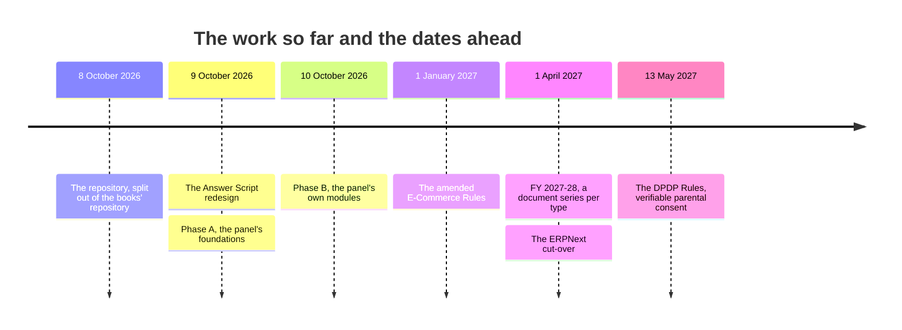
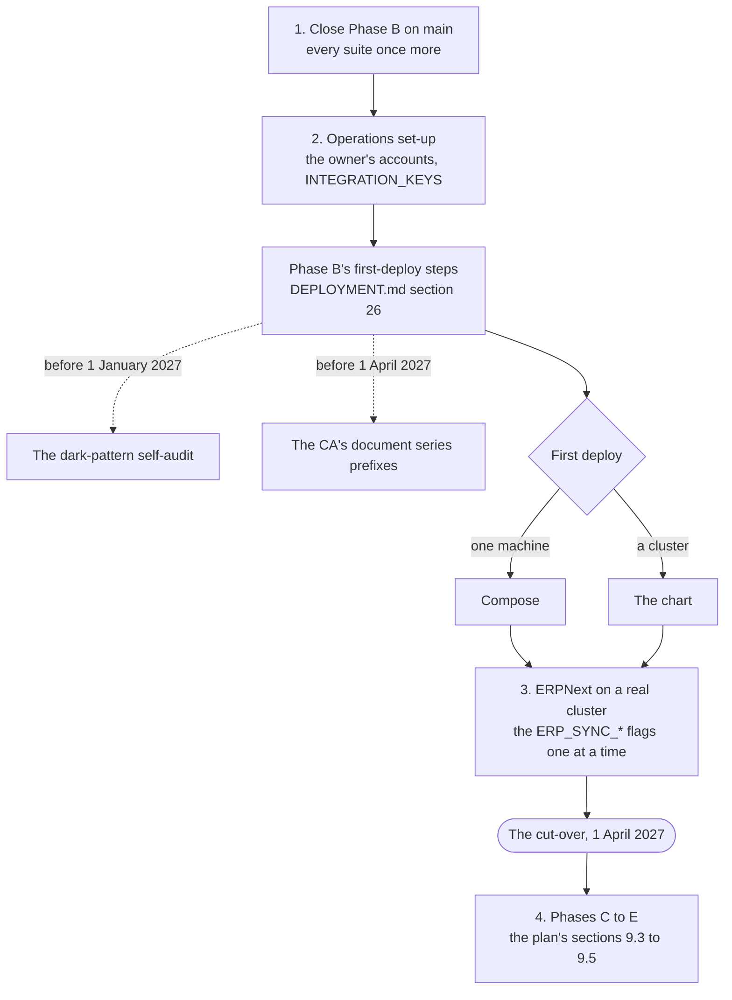

# Handover: where the ExamLeaf work stands and how to resume it

  

A new person with their own Claude Code can resume from this file alone: it says what exists, what is verified, what
was in flight when the session ended, what to do next and in which order, and which decisions only the business
owner can take. It was written 9 October 2026 at the end of a long Claude Code session and brought up to date on 10
October 2026 at the end of the Phase B session. Everything below is in this repository: the Answer Script redesign
and Phase A were merged into `main` (fast-forward) and pushed to `origin` (github.com/LazyIndianBook/platform) on 9
October 2026; Phase B was built on the integration branch `phase-b` on 10 October 2026 and merged into `main` the
same way (section 4 says where that stands).

> [!NOTE]
> **At a glance**
> - Both bodies of work are on `main`: the Answer Script redesign and Phase A since 9 October 2026, Phase B since 10
>   October 2026. Nothing was in flight when the session ended (section 4).
> - Every suite was run on the merged head: the backend on SQLite and on PostgreSQL 17, the console's and the
>   website's unit and Playwright tests, ruff and the migrations' check (section 4 has the counts).
> - Next, in order: close Phase B on `main`, the operations set-up with the owner's accounts, ERPNext on a real
>   cluster, then Phases C to E (section 5).
> - The decisions only the owner can take, and the CA's and the lawyer's questions, are in `docs/decisions.md`
>   (section 6).

**Contents**

- [1. The two bodies of work on this branch](#1-the-two-bodies-of-work-on-this-branch)
- [2. Components and where each lives](#2-components-and-where-each-lives)
- [3. What Phase A delivered](#3-what-phase-a-delivered-all-merged-all-tests-green-at-the-merge), and [what Phase B delivered](#what-phase-b-delivered-merged-on-the-integration-branch-phase-b-every-modules-tests-green-at-its-merge)
- [4. In flight when the session ended](#4-in-flight-when-the-session-ended)
- [5. What to do next, in order](#5-what-to-do-next-in-order-the-plans-section-9-has-the-detail)
- [6. Decisions only the owner can take](#6-decisions-only-the-owner-can-take-plan-section-10-has-recommendations)
- [7. Known gaps and follow-ups](#7-known-gaps-and-follow-ups-small-deliberate)
- [8. Conventions used, so the history stays consistent](#8-conventions-used-so-the-history-stays-consistent)
- [Related documents](#related-documents)

## 1. The two bodies of work on this branch

*The three days of the work, all of it on `main` now, and the dates the law sets that sections 5 and 6 work towards.*

1. **The "Answer Script" redesign of the public site** (`examleaf-frontend/`): finished and verified. Report with
   before/after screenshots and numbers: `docs/design/answer-script-implementation.md`. Design sources:
   `implementation/design/*.dc.html`, plan
   [`implementation/README_IMPLEMENTATION.md`](../implementation/README_IMPLEMENTATION.md).
2. **The Admin Control Panel** (the business's back office): planned in full, Phases A and B built and merged, Phases
   C to E pending. Plan: `docs/examleaf-admin-control-panel-plan.md` (1,784 lines; sections 9 and 10 are the phases and
   the owner's decisions). Research behind it: `docs/research/2026-10-09-admin-control-panel/` (the inventory of what
   the backend did for staff and six reports, each report with a numbered sources file; index row in
   `docs/research/README.md`).

## 2. Components and where each lives

| Directory | What | How to verify |
|---|---|---|
| `examleaf-web/` | Django 6.1 backend: the platform (accounts, content, learn, practice, shop) plus the Phase A apps `staff/`, `shipping/`, `integrations/`, `insights/`, `erp/` and Phase B's `support/` (the panel's other modules live inside these apps) | `cd examleaf-web && .venv/bin/python -m pytest -q -p no:cacheprovider` (at the merge of Phase B: 1,888 passed, 13 skipped on SQLite, 5,427 subtests; Phase A's final head had 1,030 passed, 11 skipped on SQLite and 1,040 passed, 1 skipped on PostgreSQL); `ruff check . && ruff format --check .`; `manage.py makemigrations --check` |
| `examleaf-frontend/` | Next.js 16 public site | `npm run lint && npm run format:check && npm run typecheck && npm test` (228 Vitest tests at the merge of Phase B; 180 at Phase A's); Playwright needs the seeded backend (`scripts/e2e-backend.sh`, README "Tests") |
| `examleaf-admin/` | Next.js 16 staff console at `admin.<domain>` | same four commands (350 Vitest unit tests at the merge of Phase B; 62 at Phase A's); `npx playwright test --project=chromium` in mock mode (`STAFF_API_MOCK=1`: 23 tests) or against a seeded Django (`E2E_STAFF_API=real npx playwright test --project=real`; its README) |
| `examleaf-erp/` | ERPNext v16: the private Frappe app `examleaf_erp`, the image build, the dev stack | `cd examleaf-erp/compose && ./dev.sh up && ./dev.sh new-site && ./dev.sh test` (58 tests; needs Docker and about 3 GB RAM); contract in `examleaf-erp/API.md` |
| `deploy/kubernetes/` | Helm umbrella chart `examleaf-platform` (CloudNativePG, Traefik, cert-manager, mariadb-operator and frappe/helm for ERPNext, HA profile, alerts) | `make lint`; `make kind-up && make kind-install` for a one-node test cluster (README.md, TESTING.md records three runs) |
| `examleaf-web/docker-compose.yml` + `Caddyfile` | the simple production deployment (Caddy, web, worker, beat, media-worker, frontend, optional `admin` profile) | `examleaf-web/DEPLOYMENT.md` |

Every app has a README of its own; `examleaf-web/API.md` documents every endpoint (the staff section is generated and a
test fails if it drifts from the code); `examleaf-web/CHANGELOG.md` lists what each piece added; `RUNBOOK.md` the
operations; `DEPLOYMENT.md` the settings table (sections 21 to 24 are the new apps, 25 to 27 Phase B's). The one-page
guide of each role is in `docs/guides/roles/` and the owner's, the CA's and the lawyer's open decisions in
`docs/decisions.md`.

## 3. What Phase A delivered (all merged, all tests green at the merge)

- **RBAC and security** (`staff/`): roles in code (`accounts/roles.py`: OWNER, ADMIN, FINANCE, SALES, PACKER, SUPPORT,
  CONTENT_EDITOR, REVIEWER, MARKETING, AUDITOR, SALES_REP; limits and separation-of-duties conflicts), a catalogue of
  action permissions (`staff/catalogue.py`), scopes, approvals bound to a payload hash (`ChangeRequest`), two append-only
  hash-chained audit logs (money events kept 8 financial years) with a PostgreSQL trigger, background `Job`s with
  progress, inbox, saved views, settings and feature flags editable from the panel, API keys, invitations, offboarding,
  access reviews, DPDP queues (data requests with their 48 h and one-month/90-day clocks, incidents with the 6 h CERT-In
  and 72 h Board clocks, processors), notes, policy acknowledgements, impersonation (panel token → website session with
  a banner and refused writes), break-glass sessions with a required reason and a 2-hour limit, Google Workspace sign-in
  with the server-side `hd` check, per-role idle limits (15/30 min) on an 8-hour session, `ADMIN_HOSTS` (staff API and
  `/admin/` answer 404 elsewhere). OWNER is a role; only break-glass accounts are superusers.
- **Staff console** (`examleaf-admin/`): sign-in with two-step and passkeys, manifest-driven navigation, inbox,
  approvals, audit, people, customers with logged reveals, privacy queues, settings, system, jobs; "next phase" pages for
  orders, catalogue, content, course, marketing, partners, support. Reconciliation to the API as built was in flight
  when the session ended (see section 4).
- **Couriers** (`shipping/`, `integrations/`): manual carrier and Shiprocket (recorded double for test mode; live smoke
  test command), tracking webhook `/api/hooks/parcel-events/` plus polling, NDR/RTO, COD remittance and weight-dispute
  reconciliation, India Post tariff fixture, PIN serviceability survey; shared framework for every provider (encrypted
  credentials with MultiFernet key rotation, call log, circuit breaker, dead letters, inbound events).
- **Predictive analytics** (`insights/`): seasonal-naive forecasts with backtests, newsvendor print-run advice, item
  analysis, cohorts (aggregate only: the DPDP Act forbids behavioural monitoring of under-18s), code activation,
  delivery stats, fraud rules, offer effects. Staff enter exam seasons and print costs in the admin.
- **ERPNext** (`examleaf-erp/` and `erp/`): ERPNext v16.50.0 on MariaDB 11.8 (no supported release runs on PostgreSQL;
  revisit at v17), India Compliance for GST, HRMS, offsite backups, the private app with fixtures, five DocTypes, the
  12-method idempotent sync API, GST print formats and a hardening bootstrap; the Django outbox relay, signed doorbell
  webhooks with a 15-minute pull, nightly reconciliation, per-flow flags (all off: shadow mode). Ownership: the platform
  keeps B2C customers (never copied), legal invoice numbers, payments, book codes; ERPNext owns stock and the B2B side.
  Run in shadow mode against a real ERPNext (the dev stack) on 10 October 2026, every flow, the doorbells, idempotency,
  a planted difference, dead letters and the rollback by flag: `examleaf-web/erp/SHADOW-RUN.md` (what held, the fixes,
  what the staging site still needs).
- **Kubernetes**: the chart tested on kind three times (install, routing, health, body limits, backups, point-in-time
  restore, upgrades, network policies, chaos under load with numbers in `deploy/kubernetes/TESTING.md`), HA profile
  (`values-ha.yaml`: replicas, budgets, autoscaling, PgBouncer pooler, replicated PostgreSQL and MariaDB, advisory-locked
  migrations, 15 Prometheus rules). Not yet run on three real nodes.
- **Backend fixes found on the way**: `/health/` no longer flaps (`examleaf/health.py`); the frontend's health probe
  sends the forwarded host (a 503 bug with DEBUG=0).

### What Phase B delivered (merged on the integration branch `phase-b`; every module's tests green at its merge)

The panel's own modules, each with its endpoints in `/api/v1/staff/…`, its pages in the console and its README (the
plan's section 9.2; `examleaf-web/CHANGELOG.md` has one entry for each module and a consolidated one above them):

- **Orders** (`shop/staff_orders.py`, `shop/README.md`): the list with tabs and a search for a person that is recorded
  by its hash, an order's record with the next step and a timeline, refunds by line or by bank transfer through the
  approvals, returns (asked for on the website or by staff; deciding is apart from receiving), staff orders and quotes
  with the discount rule's answer shown first, the packing room (queue, slips, 4×6 labels, pick list, bulk jobs), the
  cash-on-delivery risk hold, and every status message recorded and held overnight.
- **Finance** (`shop/staff_finance.py`, `shop/settlements.py`): Finance today, payments with the stuck ones asked of
  Razorpay again, refunds and offline payments with their approvals, payment links (a B2B invoice of ERPNext too), and
  Razorpay's settlements fetched each morning, matched by Razorpay's id and posted to ERPNext once.
- **Tax** (`shop/tax.py`, `shop/staff_tax.py`): the HSN and SAC master with dated rates, a bundle's treatment, the
  billing state, shipping that follows the goods, one number series for each document type from 1 April 2027, the
  credit notes' cut-off, cancelling a document, the threshold monitor, the calendar and the GSTR-1 files as a job.
- **Catalogue** (`shop/staff_catalogue.py`): each part of a product by its own permission (the page, the prices
  through an approval, the tax, the stock), the courier's data, versions, the prior price from 1 January 2027, coupons
  and offers with the dark-pattern guardrails as validation, a school's single-use codes, the shelves, and the import
  and export as jobs.
- **Content** (`content/`): drafts reviewed and published by a second person with a rollback, reader-reported
  mistakes and errata, imports from the books repository as jobs, the legal deposits and their reminder.
- **Course** (`learn/`): the outline and its moves, review and scheduled publish, a 30-day bin, the quiz bank,
  access granted and revoked (one or many), print runs of book codes made by a job and voided, the fraud rules, and a
  learner's page that is logged and shows a child only counts.
- **Support** (the new `support/` app): tickets with a number and the legal clocks in calendar time, the support
  mailbox, saved replies, the actions on a customer's orders from a ticket, the grievance register, and "My requests"
  on the website.
- **Customers** (`staff/customers.py`): tabs and badges, a merged timeline, what they bought, every look a logged
  read (a child's marked), the children waiting for a parent with each link sent, a consent recorded by hand, and
  bulk actions that are checked first.
- **Legal and privacy** (`staff/privacy_api.py`, `examleaf/retention.py`): the compliance cockpit, legal holds that the
  erasure obeys, the retention schedule in code with its nightly clean-up, numbered policy versions, the e-commerce
  disclosures, the dark-pattern self-audit, nominees, and the one audience function that keeps children out of
  marketing.
- **Staff, settings and connections, system**: the role catalogue, a person's access, offboarding as a checklist,
  passkeys for the privileged roles; settings with their history, the connections page (keys tested before they are
  kept), the DLT template registry; backups and restore drills, logs and time, dependencies, hardening and the
  checkout's scripts.
- **Home and reports** (`insights/`): one definition for each number, test mode kept out by construction, the cards
  of each role, the reports with a minimum cell of 10 people (5 for a chapter's or class's learners) and any report as
  a file.
- **ERPNext in shadow mode**: the sync run against a real ERPNext (the dev stack), every flow, a planted difference,
  dead letters and the rollback by flag, recorded in `examleaf-web/erp/SHADOW-RUN.md`; the fixes it led to are in the
  CHANGELOG.
- **Documents**: a one-page guide for each of the eleven roles (`docs/guides/roles/`), the RUNBOOK rewritten so that
  every recipe a panel page replaced names the page, with the shell as the break-glass line, the decisions register
  (`docs/decisions.md`) and DEPLOYMENT.md's settings by module.
- **Verified at the merge**: the backend 1,888 passed and 13 skipped on SQLite (5,427 subtests); the console 350 Vitest
  unit tests and 23 Playwright tests in mock mode; the website 228 Vitest tests. Not left to chance: every new
  endpoint is a row of the authorization matrix (`staff/tests/test_matrix.py`) and the generated reference in API.md
  is checked against the code.
- **Not in Phase B, by plan**: the console's Shipping, Marketing and Partners pages (the shipping staff API is built);
  the ERPNext cut-over and the partners (Phase C); marketing campaigns and the teachers' classes (Phase D).

## 4. In flight when the session ended

Nothing: every Phase B branch was merged onto `phase-b` before the session ended, each with a `Merge <module> (P<n>)
into phase-b` commit naming what was verified at the merge, and the agents' worktrees under `.claude/worktrees/` were
removed. The last three to land were the deployment carry-through (P16), the documentation (P13) and the security
review (P14; `docs/security/phase-b-authorization-review.md`), each followed by the fixes their findings asked of the
application (the consolidated CHANGELOG entry's "At the integration" paragraph lists them). The briefs the packages were
built from and the merge tools are in `docs/phase-b-integration/`.

Verified on the merged head before the merge into `main`: the backend suite on SQLite (2,510 passed, 13 skipped,
6,961 subtests) and on PostgreSQL 17 (2,522 passed, 1 skipped); the console's lint, formatting, types and 355 unit
tests, its 23 Playwright tests in mock mode and 20 against a seeded Django (the invitation accepted, the Orders,
Finance, Home and reports, Catalogue, Course and Customers journeys among them); the website's lint, types, 230 unit
tests and 47 Playwright tests (the course pages with `WEB_COURSE=1`); ruff and the migrations' check.

## 5. What to do next, in order (the plan's section 9 has the detail)

*The order of the steps below; the dotted lines are the first-deploy steps the law dates.*

1. **Close Phase B on `main`**: run every suite once more (`docs/phase-b-integration/tools/integrate.sh check` and
   `pg`; the console's `npm run test:e2e` in mock mode and with `E2E_STAFF_API=real`; the website's `npm run test:e2e`
   with `DJANGO_PYTHON` and `DJANGO_DATABASE_URL` set as CI sets them). The decisions register (`docs/decisions.md`)
   says what waits for the owner, the CA and the lawyer.
2. **Operations setup** (needs the owner's accounts): as before (a Shiprocket Lite account with an API user, R2 buckets
   with bucket lock, a Google OAuth client with an Internal consent screen, `ADMIN_HOSTS`, the admin host in
   `ALLOWED_HOSTS` and `CSRF_TRUSTED_ORIGINS`, Sentry or GlitchTip, the uptime monitors), and now `INTEGRATION_KEYS`
   from the first start (`support.E001` stops `migrate` without it). Then Phase B's own first-deploy steps,
   DEPLOYMENT.md section 26: the disclosures filled in the panel, the connections page's credentials, the support mail
   forwarder, the dependency report loaded, the restore drill recorded, the dark-pattern self-audit before 1 January
   2027, the document series prefixes from the CA before 1 April 2027. First deploy: compose (DEPLOYMENT.md) or the
   chart (`deploy/kubernetes/README.md`; `kind` was not run for Phase B: `TESTING.md` lists what that run should check).
3. **ERPNext**: the shadow run on the Docker dev stack is recorded (`examleaf-web/erp/SHADOW-RUN.md`); on a real
   cluster, build the image, switch ERPNext on in the chart, create the site, run the bootstrap Job, create the
   `erp-sync@` API key, turn on the `ERP_SYNC_*` flags one at a time and watch `erp_status` and the nightly
   reconciliation; cut-over planned for 1 April 2027 (plan 9.3).
4. **Phases C to E**: the plan's sections 9.3 to 9.5 (the B2B channel on ERPNext's price lists and stock, predictive
   analytics graduating to statistical methods once two seasons exist, the DPDP deadline of 13 May 2027 for
   verifiable parental consent, access reviews). Build them as Phase B was built (`docs/phase-b-integration/`).

## 6. Decisions only the owner can take (plan section 10 has recommendations)

`docs/decisions.md` is the register: every decision of plan section 10.1 with its status, what the code does today
and the setting that carries the answer.

> [!WARNING]
> **The thresholds come first, and they are placeholders today.** The refund caps per role and the export and bulk
> limits are `ROLE_LIMITS` in `accounts/roles.py`: above them, money and data wait for a second person.

The others that matter first: Gyan Post eligibility; the Shiprocket plan; the WhatsApp provider (MSG91 recommended;
off); Sentry or GlitchTip; Tally export or Zoho; the CA's questions (the GST treatment of a book sold with a printed
course code, "Exempted" or "Nil-Rated" for HSN 4901, one document series or two and their prefixes, who files GSTR-1
and the QRMP choice, the fee's GST, rounding, returned COD parcels) and the lawyer's (the legal form under E-Commerce
Rule 4(1)(a), the National Consumer Helpline status, whether reviews make ExamLeaf an intermediary, the children's-data
analytics, the educational-institution question).

> [!IMPORTANT]
> **Three answers have a date the law sets.** The legal form before 1 January 2027 (the lawyer), the document series'
> prefixes before 1 April 2027 (the CA), and the method of verifiable parental consent before 13 May 2027 (the lawyer).

## 7. Known gaps and follow-ups (small, deliberate)

| Gap | Where | What to do |
|---|---|---|
| The chart has no books volume: the panel's Content imports run under compose (the worker mounts the books) but not on Kubernetes yet | `deploy/kubernetes/` (`PAPERS_ROOT` is unset in the chart's values) | import with `--root` in a pod until the chart mounts the books (the chart's `values.yaml` says how) |
| The import's commit mode needs `git` in the image; without it the folder's fingerprint stands in for the commit, which is honest but cannot name a commit | the backend's image | put `git` in the image when an import must name its commit |
| The System page reads the ERPNext apps' versions from a checkout the image lacks | `staff/system_api.py` (`examleaf-erp/image/apps.json`) | CI could pass them in |
| The two codes reports answer different questions on purpose (the Course module's by print run and its own window; the reports module's with the districts and the title's total) | the Course module, the reports module | nothing: each says which in its definitions |
| The website's Playwright course tests skip unless the backend runs with `WEB_COURSE=1`; the website's Playwright needs `DJANGO_PYTHON` and `DJANGO_DATABASE_URL` (a bare `npm run test:e2e` writes into the dev database) | `examleaf-frontend/` | set them as CI sets them |
| The console's Playwright journeys are not in CI (the unit checks are); the console's end-to-end database keeps what a cut-off run left, and each seed clears its own kind first | `examleaf-admin/`, `.github/workflows/ci.yml` | run them locally, as the console's README ("Tests") says |
| From before: an abandoned break-glass session sends no end alert | `staff/` | an owner or the auditor reads what the session did within 24 hours (RUNBOOK.md "Break-glass accounts") |
| From before: the Django admin does not ask the break-glass reason | the Django admin | give the reason in the panel first, in the same browser on the admin host (the same section) |
| From before: Shiprocket answer shapes marked `_inferred` need checking against a live account | `shipping/carriers/recorded/shiprocket.json` | check them against a live account |
| From before: `insights` thresholds are starting values | `insights/` | review them each month in season (`insights/README.md`, "The monthly review") |
| From before: the three-node HA run, the autoscaler, synchronous replication and ERPNext on Kubernetes are untested | `deploy/kubernetes/` (`values-ha.yaml`) | run them on three real nodes |
| From before: `kind` was not run for Phase B | `deploy/kubernetes/TESTING.md` | run it: `TESTING.md` lists what that run should check |

## 8. Conventions used, so the history stays consistent

- Commit messages: a subject line saying what changed, then a paragraph on why, in sentences; each ends with a
  `Co-Authored-By:` trailer naming the model that wrote it. Small commits per concern. A merge of an agent branch is a
  `--no-ff` merge whose message names the module and what was verified at the merge.
- Work in parallel agents was done in git worktrees under `.claude/worktrees/`, each from the integration branch;
  node_modules were cloned with `cp -Rc` (APFS clonefile) to save disk. Merges kept both sides of the shared files
  (`docs/phase-b-integration/tools/`), with a merge migration and a union migration for the permissions and kinds per
  module, then the API reference, `openapi.json` and the console's and the website's types regenerated.
- What the merges taught (kept in the briefs' `AFTER-BATCH-A.md` too): schema component names are global, so
  serializers carry their module's prefix; one enum name per choice set in `ENUM_NAME_OVERRIDES`; every job kind's
  serializer branch returns; `select_for_update(of=("self",))` wherever a lock's queryset joins a nullable table
  (only PostgreSQL catches it: run the suite there); the console's `copy.ts` needs its closers back after a union;
  delete `examleaf-admin/.next` before Playwright.
- Local quirks: Docker here is Colima; the disk fills quickly with many agents (`docker system prune`, remove merged
  worktrees); the backend venv is `examleaf-web/.venv` (Python 3.14); the local PostgreSQL 17 at 5432 takes
  `createdb examleaf_phaseb` for the suite; `socket.getfqdn()` takes five seconds on this Mac (settings now set the
  Message-ID domain from `SITE_URL`); ports 3000 to 3048 and 8100 to 8122 were used by dev servers.
- Guardrails kept throughout: the backend decides everything (the console only draws the manifest); no sample values
  shipped; every URL kept; private pages `noindex`; never show PAID before the server confirms; no emoji, gradients,
  glow or blur in the UI; copy as written.

## Related documents

- [The documentation map](README.md): every document, by audience and by component.
- [Decisions register](decisions.md): each decision's status, what the code does today and the setting that carries
  the answer.
- [The panel's plan](examleaf-admin-control-panel-plan.md): the phases (section 9) and the decisions (section 10).
- [Changelog](../examleaf-web/CHANGELOG.md): what each phase delivered, with the tests at each merge.
- [Phase B integration](phase-b-integration/README.md): the briefs, the merge order and the merge tools.
- [Runbook](../examleaf-web/RUNBOOK.md) and [Deployment](../examleaf-web/DEPLOYMENT.md): operating and deploying it.
- [Role guides](guides/roles/README.md): one page per staff role.
