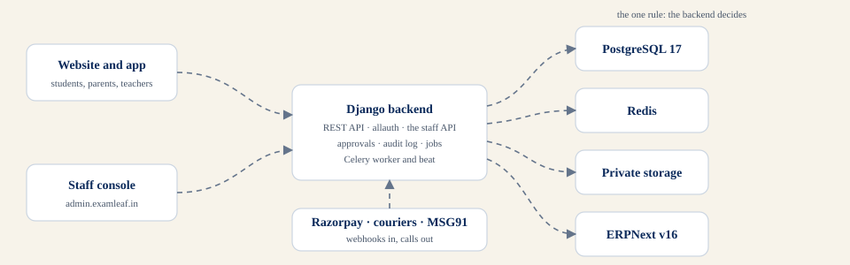
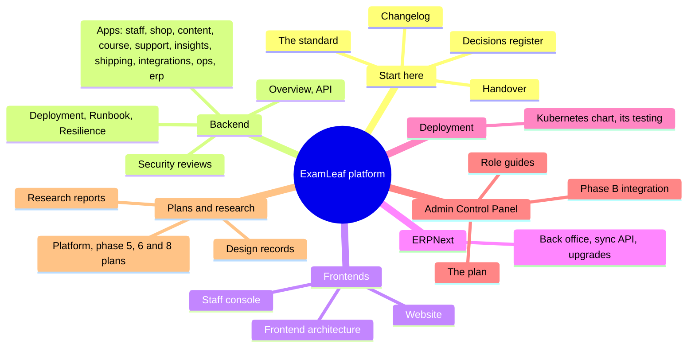
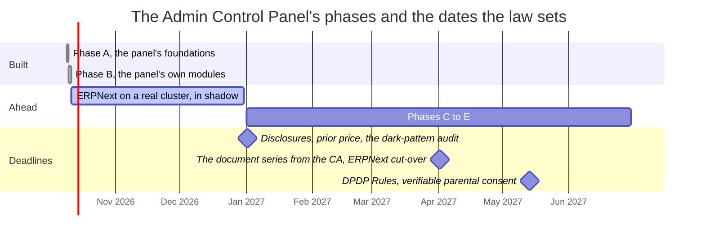
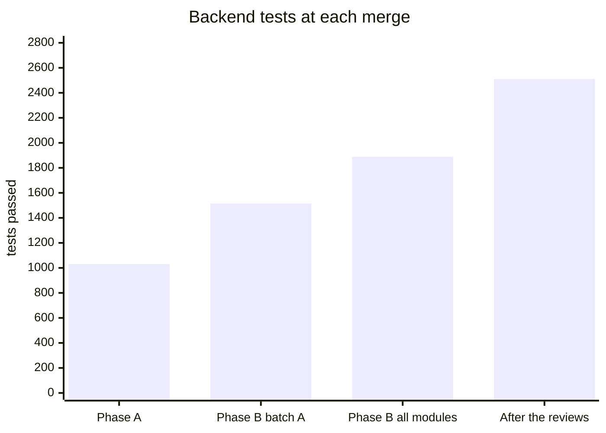

# ExamLeaf platform documentation

     

The map of everything written about the ExamLeaf platform: the website and app's backend, the public website, the
staff console of the Admin Control Panel, the ERPNext back office and the deployment of all of it. Every document lives
beside the code it describes; this page says which to open for what, and the portal built from these files
(`make docs`, read at `http://localhost:8008/`) carries the same map as its home.

> [!NOTE]
> **At a glance**
> - One rule runs through every part: the backend decides; the website and the console draw what it answers.
> - Two bodies of work are merged and verified: the Answer Script redesign of the website, and Phases A and B of the
>   Admin Control Panel; Phases C to E are planned (the plan's section 9).
> - Operators start at the Runbook and Deployment; developers at a component's README and the API; the owner at the
>   Handover and the decisions register; staff at their role's guide.
> - Every document follows one standard ([STYLE.md](STYLE.md)): the same opening, badges, callouts and diagrams.

## By audience

| You are | Start with | Then |
|---|---|---|
| The owner or a new lead | [Handover](HANDOVER.md), [Decisions register](decisions.md) | [The panel's plan](examleaf-admin-control-panel-plan.md), [Changelog](../examleaf-web/CHANGELOG.md) |
| An operator | [Deployment](../examleaf-web/DEPLOYMENT.md), [Runbook](../examleaf-web/RUNBOOK.md) | [Resilience](../examleaf-web/RESILIENCE.md), [Kubernetes chart](../deploy/kubernetes/README.md), [Backups and the chart's testing](../deploy/kubernetes/TESTING.md) |
| A member of staff | [Your role's guide](guides/roles/README.md) | [The staff app](../examleaf-web/staff/README.md), the module READMEs below |
| A backend developer | [Backend overview](../examleaf-web/README.md), [API](../examleaf-web/API.md) | the app READMEs, [Security reviews](security/phase-b-authorization-review.md), [Phase B integration](phase-b-integration/README.md) |
| A frontend developer | [Website](../examleaf-frontend/README.md), [Staff console](../examleaf-admin/README.md) | [Frontend architecture](examleaf-frontend-architecture.md), [Design](design/answer-script-implementation.md) |
| An app or API developer | [API](../examleaf-web/API.md) | [ERPNext sync API](../examleaf-erp/API.md) |
| ERPNext's keeper | [Back office](../examleaf-erp/README.md), [ERPNext sync](../examleaf-web/erp/README.md) | [The shadow run](../examleaf-web/erp/SHADOW-RUN.md), [Upgrades](../examleaf-erp/UPGRADE.md) |

## The map

*Every document, grouped as the portal's navigation groups them.*

## The documents

- **Start here**

    ---

    [The repository](../README.md): what each folder holds and how to run it.
    [Handover](HANDOVER.md): where the work stands, what to do next, the decisions only the owner can take.
    [Decisions register](decisions.md): each decision's status and the setting that carries it.
    [Changelog](../examleaf-web/CHANGELOG.md): what changed, by phase, with the test counts at each merge.

- **The backend**

    ---

    [Overview](../examleaf-web/README.md) · [API](../examleaf-web/API.md) · [Deployment](../examleaf-web/DEPLOYMENT.md) · [Runbook](../examleaf-web/RUNBOOK.md) · [Resilience](../examleaf-web/RESILIENCE.md)
    Apps: [staff](../examleaf-web/staff/README.md) · [shop](../examleaf-web/shop/README.md) · [content](../examleaf-web/content/README.md) · [course](../examleaf-web/learn/README.md) · [support](../examleaf-web/support/README.md) · [insights](../examleaf-web/insights/README.md) · [shipping](../examleaf-web/shipping/README.md) · [integrations](../examleaf-web/integrations/README.md) · [ops](../examleaf-web/ops/README.md) · [erp](../examleaf-web/erp/README.md)

- **The frontends**

    ---

    [Website](../examleaf-frontend/README.md): Next.js 16, the papers, the shop, the account, the course.
    [Staff console](../examleaf-admin/README.md): the panel's pages, the mock, the journeys.
    [Frontend architecture](examleaf-frontend-architecture.md) and the [design records](design/answer-script-implementation.md).

- **ERPNext and deployment**

    ---

    [Back office](../examleaf-erp/README.md) · [Sync API](../examleaf-erp/API.md) · [Upgrades](../examleaf-erp/UPGRADE.md) · [The shadow run](../examleaf-web/erp/SHADOW-RUN.md)
    [Kubernetes chart](../deploy/kubernetes/README.md) · [Chart testing](../deploy/kubernetes/TESTING.md)

- **The Admin Control Panel**

    ---

    [The plan](examleaf-admin-control-panel-plan.md) (sections 9 and 10: the phases and the owner's decisions).
    [Role guides](guides/roles/README.md): one page per role.
    [Phase B integration](phase-b-integration/README.md): the briefs and the merge tools.
    [Security review](security/phase-b-authorization-review.md): OWASP API1, API3 and API5 on Phase B.

- **Plans and research**

    ---

    [Platform plan](examleaf-platform-plan.md) · [Phase 5](examleaf-phase5-plan.md) · [Phase 6](examleaf-phase6-plan.md) · [Phase 8 (Next.js)](examleaf-phase8-nextjs-plan.md) · [AI answer checker](examleaf-ai-checker-design.md)
    [Research index](research/README.md): the reports behind the plans.

## For contributors and the records beside the code

| Document | What it holds |
|---|---|
| [The console's resilience](../examleaf-admin/RESILIENCE.md), [the website's](../examleaf-frontend/RESILIENCE.md) | what keeps each Next.js app answering when Django is slow or gone |
| [The console's agent rules](../examleaf-admin/AGENTS.md), [the website's](../examleaf-frontend/AGENTS.md) | the Next.js 16 rules an agent reads before touching either app |
| [The Frappe app](../examleaf-erp/apps/examleaf_erp/README.md) | what `examleaf_erp` adds to ERPNext: doctypes, fixtures, the sync API, the GST rules |
| [The legal pages' drafts](../examleaf-web/pages/drafts/terms.md) | terms, [privacy](../examleaf-web/pages/drafts/privacy.md), [refunds](../examleaf-web/pages/drafts/refunds.md), [shipping](../examleaf-web/pages/drafts/shipping.md) and [contact](../examleaf-web/pages/drafts/contact.md), as the site's pages were seeded |
| [The redesign's implementation plan](../implementation/README_IMPLEMENTATION.md), [its prompt](../implementation/CLAUDE_CODE_PROMPT.md) | the Answer Script redesign's working files |

## Where the work stands

*Phases A and B are merged and verified; the dates on the right are the law's, each carried by a setting.*

*The backend suite on SQLite at each merge (the same suite passes on PostgreSQL 17); the console and the website are counted in the Changelog.*

## The standard

Every document opens the same way and uses the same visual vocabulary; [STYLE.md](STYLE.md) says how. The badges are
local files (`assets/badges/`, drawn by `scripts/docs/badges.py`), the callouts are GitHub's alerts, the diagrams are
Mermaid checked by `scripts/docs/check_mermaid.py`, and the portal (`mkdocs.yml`, `scripts/docs/build_site.py`)
renders the same files with search, dark mode and navigation.

## Related documents

- [The repository's README](../README.md): the folders, running it locally, deployment in one page.
- [Handover](HANDOVER.md): how to resume the work.
- [The documentation standard](STYLE.md): how to write the next document.
