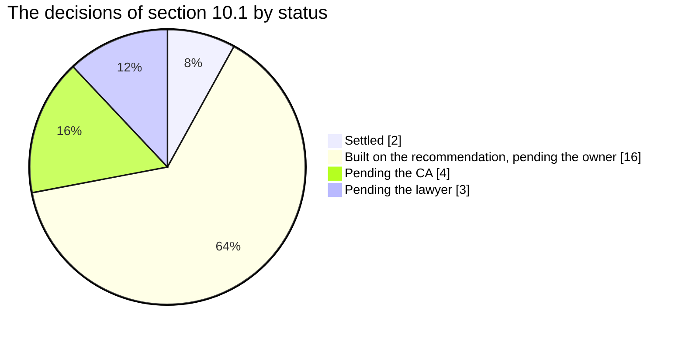
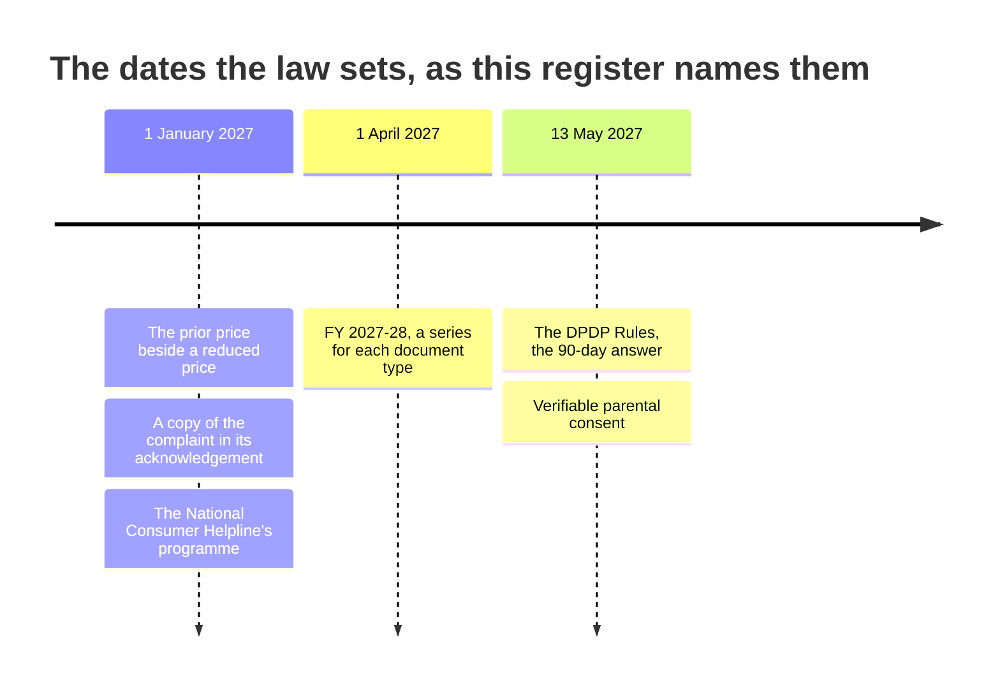

# Decisions register

    

This register holds every decision of the plan's section 10.1
([examleaf-admin-control-panel-plan.md](examleaf-admin-control-panel-plan.md)), with where it stands, what the code
does today and what changes when the answer comes, for the owner, the CA and the lawyer who answer and for whoever
makes the change. It also holds the adviser questions of section 10.2 that a setting carries, and the dates and
periods the law sets that the code keeps as settings; it was read at the merge of Phase B, 10 October 2026. Where this
page and the code differ, the code is right: change the page.

> [!NOTE]
> **At a glance**
> - Section A's 25 decisions: 2 settled, 16 built on the plan's recommendation and waiting for the owner's yes, 4
>   waiting for the CA and 3 for the lawyer.
> - Until an answer comes, the code does what the plan recommends, and takes the cautious reading where the lawyer
>   decides.
> - Three dates the law sets bind the answers: 1 January 2027, 1 April 2027 and 13 May 2027 (section D).
> - An answer is recorded in the pull request, or in a panel setting's reason, and its status is changed here.

## Statuses

| Status | Meaning |
|---|---|
| Settled | decided and built; nothing waits for an answer |
| Built on the recommendation, pending the owner | the plan's recommendation is what the code does; the founder has not yet said yes |
| Pending the CA | a chartered accountant's answer decides it; the code does what the plan recommends meanwhile |
| Pending the lawyer | counsel's answer decides it; the code takes the cautious reading meanwhile |

A third party can also hold the answer (the postal division, the courier); the row says so. When an answer comes, make
the change the last column names, record it in the pull request or, for a panel setting, in the reason field of the
change (it is kept in the audit log with who made it and when), and change the status here.

*Section A's 25 rows; a row that names two parties counts under the first its status names.*

## A. The decisions of section 10.1

| Decision | Status | What the code does today | What changes when the answer comes |
|---|---|---|---|
| ERPNext's database | Settled | ERPNext runs on MariaDB 11.8 through mariadb-operator (`deploy/kubernetes/`); the platform, the panel and every new service run on PostgreSQL 17. The outbox and the nightly reconciliation carry facts between the two (`erp/README.md`). | Nothing, until ERPNext v17 ships with India Compliance tested on PostgreSQL: then a project of its own (a dump, a conversion and a restore, with a full reconciliation). No setting. |
| Kubernetes or Compose | Settled | The umbrella chart on one node (`deploy/kubernetes/`, with a `kind` profile) and `examleaf-web/docker-compose.yml` for the simple single-server deployment and for development (DEPLOYMENT.md). | A second node needs RWX storage first. No setting. |
| Self-hosted or Frappe Cloud | Built on the recommendation, pending the owner | Self-hosted: the chart deploys ERPNext beside the platform, and `examleaf-erp/` builds its image. The platform reaches it through the ERPNext connection (Settings → Connections → ERPNext: base address, site name, key and secret), so another host is a change of credentials, not of code. | Frappe Cloud: replace the connection's keys with the Cloud site's address and keys and switch the chart's ERPNext off; the data moves by ERPNext's own site backup and restore. The plan's trigger is two months of missed weekly patching. |
| Frappe HR | Built on the recommendation, pending the owner. **The code differs:** HRMS is installed | The plan says not now. The image (`examleaf-erp/image/apps.json`, `hrms` v16.50.0) and the chart's create-site job (`installApps: [erpnext, india_compliance, hrms, offsite_backups, examleaf_erp]` in `deploy/kubernetes/examleaf-platform/values.yaml`) install it, `examleaf-erp/README.md` lists an HR role profile, and `docs/HANDOVER.md` counts it among the apps. No platform code uses it. | To follow the plan: take `hrms` out of `apps.json` and `installApps` before the production site is created, and rebuild the image. A site that already has it needs ERPNext's own uninstall. If the founder prefers it installed, change the plan's row instead. |
| Frappe Insights | Built on the recommendation, pending the owner | Not installed. The platform's own reports (`/reports/`, `insights/`) and the Home cards do the work; ERPNext's reports stay in ERPNext. | Phase E, when the two sets of reports leave a gap: a read-only PostgreSQL role that sees only roll-up views without names. |
| Frappe Helpdesk | Built on the recommendation, pending the owner | Not installed. The `support` app is the helpdesk: tickets with a number, the legal clocks, saved replies, the support mailbox and the grievance register (`support/README.md`). | Nothing planned. |
| Frappe CRM | Built on the recommendation, pending the owner | Not installed. Schools and distributors are ERPNext's Lead, Opportunity and Quotation with School Adoption and Specimen Request (`examleaf_erp`); the panel's Partners module is Phase C's. | Revisited when several reps need built-in calling and a kanban. |
| Apps not installed (LMS, Education, Webshop, Payments, Print Designer, Drive, Books) | Built on the recommendation, pending the owner | None of them is in the image. | None. |
| Gyan Post | Built on the recommendation, pending the owner; the Guwahati postal division's written answer decides it | `SHIPPING_GYAN_POST=0`: India Post goes through the manual flow (the order's "Send by hand", Book Post or Speed Post); `PostalTariff` rows hold both tariffs (`manage.py loaddata postal_tariffs`, DEPLOYMENT.md section 22). | If the books qualify: `SHIPPING_GYAN_POST=1` in `.env` (Gyan Post is then priced beside the couriers for prepaid orders), after the tariff is checked at the counter. Gyan Post has no COD. |
| Shiprocket plan | Built on the recommendation, pending the owner | No setting: Shiprocket's API v1 on the account in Settings → Connections → Shiprocket. It has no sandbox, so test mode answers from recorded examples and `manage.py shipping_smoke_test --yes` books and cancels one real parcel. | The Business plan at about 50 parcels a month is an account change at Shiprocket; nothing in the code. |
| WhatsApp, and its provider | Built on the recommendation, pending the owner | Not built. The connections page's WhatsApp card says it comes in Phase D; the template registry accepts a WhatsApp template but cannot send one; `shipping.messages.notify_whatsapp` is only a hook. | Phase D: utility templates only, opted in per number, through MSG91; INR billing by 31 December 2026. |
| Error tracking: Sentry or GlitchTip | Built on the recommendation, pending the owner | The SDK reads `SENTRY_DSN`, with personal data scrubbed before anything is sent (`examleaf/sentry.py`). GlitchTip speaks the same protocol, so the recommendation needs only its DSN. The connections page shows the host errors go to. | GlitchTip on the cluster: set `SENTRY_DSN` to its address. Sentry's cloud instead: add it to the processor register with its region (Legal and privacy → Processors). |
| Tally export or Zoho | Built on the recommendation, pending the owner | Neither. The CA receives the GSTR-1 files in the Offline Tool's templates (Tax → GSTR-1) and, after the cut-over, ERPNext's reports. | A Tally XML export would be new work (a job beside `gstr1_export`); a Zoho sync, a new connection. |
| GST on a book sold with a printed course code | Pending the CA | Each bundle has a treatment, set per product: split (the default and the recommendation: the components as lines, the bundle's price shared by their MRPs, the course as its own line at 18%, HSN 999293), composite (one line at the principal supply's code and rate) or mixed (one line at the highest rate). The CA's decision is kept in words beside it (`Product.tax_note`, `tax_note_date`). | Catalogue → the bundle → Tax: the treatment and the note as written (FINANCE; `staff.change_product_tax`). It applies to orders from that day, never backwards. Mixed means the whole price at 18%; composite with the book as principal means exempt. The plan also asks for an Assam advance ruling before the next print run's price is set. |
| Legal form | Pending the lawyer | The seller's legal name is `SELLER_LEGAL_NAME` (default "ExamLeaf LLP"), printed on every invoice; the disclosures' legal name is a panel setting (`DISCLOSURE_LEGAL_NAME`) that wins once set. | If counsel says a company is needed (E-Commerce Rule 4(1)(a)) and the founder incorporates before 1 January 2027: set the new name in Legal and privacy → Disclosures, and `SELLER_*` and the GSTIN in `.env`. DigiLocker onboarding also needs a registered entity. |
| QRMP | Pending the CA | `SHOP_GST_QRMP` is on: the tax calendar shows the quarterly GSTR-1 with the IFF in the quarter's first two months, PMT-06 on the 25th and GSTR-3B on the 24th for Assam. | Settings → "GST returns quarterly under QRMP" (ADMIN, owners; `staff.manage_settings`), with a reason. Off: GSTR-1 on the 11th and GSTR-3B on the 20th. The threshold monitor warns at ₹4 crore, before ₹5 crore forces monthly filing. |
| A `returned` order state | Built on the recommendation, pending the owner | No such state. A cash-on-delivery parcel that comes back is cancelled from its order's record: its copies go back unless damaged and its invoice is credited by a credit note (a refund of method `none`, so no money moves); a prepaid order is sent again or refunded. The Orders list has a Returns tab. | If the CA prefers cancelling the invoice to a credit note: Tax → Documents → Cancel exists (`staff.cancel_document`); making it the automatic path is a change to `cancel_returned` in `shop/services.py`. |
| India Compliance's API credits, a processor | Built on the recommendation, pending the owner | The platform never calls India Compliance; ERPNext does, and GSTIN checks run offline. The processor register starts empty. | Add Resilient Tech to Legal and privacy → Processors ("Add a processor") with its contract dates once signed; buy the credits for returns and e-way bills. |
| One series per document type | Pending the CA (the prefixes) | From `SHOP_SERIES_FROM_FY` (2027-28) each document type has a series of its own, gapless under a row lock and from 1 each April: `SHOP_SERIES_PREFIXES` defaults to `tax_invoice=TI`, `bill_of_supply=BS`, `invoice_cum_bill_of_supply=IB`, `credit_note=CN`, `debit_note=DN`, `receipt_voucher=RV`, `refund_voucher=RF`. `EL` and `CN` close with FY 2026-27. The test series `T` and `TC` stay apart. | Set `SHOP_SERIES_PREFIXES` in `.env` before 1 April 2027 and restart (the server refuses to start if two prefixes are alike or one is `TC`). ERPNext's B2B series must not use any of them. A year's series never changes once it has a document. Table 13 (Tax → Series) reports each. |
| Who files GSTR-1 | Pending the CA | The platform's export stays: Tax → GSTR-1 runs the month's or the quarter's files as a job (`staff.run_gstr1`). Filing from India Compliance is the cut-over's (Phase C). | No setting. The CA signs off the month-by-month comparison before the first filing from ERPNext. |
| The storefront stays B2C | Built on the recommendation, pending the owner | The checkout has no GSTIN field and the GSTR-1 file for registered buyers (`hsn-b2b`) is empty. A buyer who needs a B2B document orders through Sales. | None. |
| Parental verification by 13 May 2027 | Pending the lawyer (the method) and the owner | `PARENTAL_CONSENT_MODE` is `declared` by default: a parent ticks a box. `verified` sends the parent a link by email or text; the account reads but cannot save marks or order until the parent agrees. Staff can record a consent by hand (method `staff_manual`, `adult_account` or `digilocker`, and where the evidence is). The DigiLocker check through API Setu is not built. | Settings → "A parent's consent" (ADMIN, owners): switch to `verified` before 13 May 2027. Rule 10's method decides what is built next (Phase C). `STAFF_DPDP_RULES_FROM` moves the rights clocks if MeitY moves the date. |
| Learner analytics on under-18s | Pending the lawyer | Aggregate only. No insights row points to an account or a learner; a cell under `INSIGHTS_MIN_CELL` (10) or `INSIGHTS_MIN_CELL_CLASS` (5) is hidden; a child's course shows counts and the week last active, never times or a trail; `accounts.audiences.marketable` keeps anyone under 18 out of marketing. No setting carries the answer. | If counsel says ExamLeaf is an educational institution, more becomes possible, but only by code changes reviewed in a pull request. |
| Thresholds | Built on the recommendation, pending the owner | The numbers are `ROLE_LIMITS` in `accounts/roles.py` (the role guides give them): refunds up to ₹2,000 for SALES and ₹1,000 for SUPPORT, ₹10,000 for ADMIN and FINANCE; exports of 500 rows for SALES; idle limits of 15 and 30 minutes (`STAFF_IDLE_TIMEOUTS`); students' passwords of at least 10 characters. | A reviewed pull request that edits the number and the role guide's table together. Every `migrate` syncs the roles. |
| Where logs are kept for 180 days and a year | Built on the recommendation, pending the owner and counsel | System → Logs and time lists each log, where, for how long and who reads it, against CERT-In's 180 days and the DPDP Rules' year. The audit log keeps 730 days (`STAFF_AUDIT_RETENTION_DAYS`) and its money chain eight financial years, and is copied daily to the backups' bucket. | If counsel wants logs in India: a bucket on AWS Mumbai instead of R2 (`BACKUP_ENDPOINT_URL` and the `S3_*` keys); `LOG_TIME_SOURCE` records where the clock is synchronised from. |

## B. Adviser questions that a setting carries (section 10.2)

The questions that decide a setting or a field of data. Each row names where the answer goes.

| Question | Asked of | Where the answer goes |
|---|---|---|
| A book sold with a printed course code: split supplies, composite or mixed? (CA 1) | the CA | The bundle's tax treatment: Catalogue → the product → Tax, with the CA's note and its date (above). |
| Document series: which prefixes, and does the bill of supply leave the shared `EL` series? (CA 3) | the CA | `SHOP_SERIES_PREFIXES` and `SHOP_SERIES_FROM_FY` in `.env`, before 1 April 2027 (above). |
| HSN 4901 in GSTR-1 table 8: "exempted" or "nil rated"? (CA 2) | the CA | The master's rate row for 4901: the build files books under "Exempted". A new dated rate for 4901 with taxability "nil-rated" (Tax → HSN and SAC codes → 4901 → a new dated rate, with the notification and the day) moves it from that day; older documents keep theirs. |
| QRMP or monthly (CA 4) | the CA | `SHOP_GST_QRMP` (above). |
| How does a company join the National Consumer Helpline's convergence programme, mandatory from 1 January 2027? (lawyer 5) | the lawyer | Legal and privacy → Disclosures → the National Consumer Helpline's convergence programme (`NCH_STATUS`: Not joined, Applied, A member; `NCH_SINCE`, the day). The website shows the membership; Support logs a complaint the Helpline forwards with its docket and keeps its 30-day clock (`support/clocks.py`). |
| Do user reviews make ExamLeaf an intermediary under the IT Rules, with their 24-hour and 15-day clocks? (lawyer 6) | the lawyer | `SUPPORT_INTERMEDIARY_RULES`, off: Settings → "The IT Rules' grievance clocks" (ADMIN, owners, with a reason) adds the 24-hour acknowledgement and the 15-day resolution to grievance tickets; with it on, an erased account's registration details are also kept 180 days. |
| Is ExamLeaf an "educational institution" under the DPDP Rules' Fourth Schedule? If not, which learning analytics on under-18s does s.9(3) allow? (lawyer 1) | the lawyer | No setting carries it. The code takes the cautious reading everywhere (A, "Learner analytics on under-18s"): the answer changes code, not a switch. |
| Which Rule 10 method for parents: DigiLocker, an existing adult account, or both? (lawyer 3) | the lawyer | `PARENTAL_CONSENT_MODE` (above) and the method recorded on each consent. |
| The Delivery of Books Act's deadline in the Act's own text (lawyer 10) | the lawyer | `CONTENT_LEGAL_DEPOSIT_DAYS` (30, "to be verified against the Act"): the legal deposit reminder's due date. |
| Are "free" QR solutions behind a sign-up in need of a disclosure? (lawyer 4) | the lawyer | `SOLUTIONS_REQUIRE_LOGIN` (1: solutions for signed-in students; 0: open to everyone), and the legal pages' words (Policy versions). |
| Processor contracts under s.8(5), and where logs and error reports may be kept (lawyer 9) | the lawyer | The processor register (Legal and privacy → Processors: each processor, what it keeps, where, its agreement's dates). |
| Any change to the DPDP Rules' timeline (lawyer 12) | the lawyer | `STAFF_DPDP_RULES_FROM` (2027-05-13) and `STAFF_DPDP_RESPONSE_DAYS` (90). |

The CA's other questions (reverse charge, the rate when the printer prints on its own paper, the revenue policy, TDS, the
Razorpay fee's GST and the one-paisa rounding between ERPNext and the platform, the 95%-digital condition) belong to
ERPNext's books and to the cut-over (Phase C), and no setting of the platform carries them.

## C. What the build decided until the CA answers

From `examleaf-web/shop/README.md` "Decisions taken until the CA answers", so that they are in one place with the rest:
the series prefixes TI, BS, IB, CN, DN, RV and RF from FY 2027-28; split as every bundle's default; books under
"Exempted" in table 8; the HSN summary and table 8 net of the period's credit notes; NOS and NA as the units; the
shipping exempt with the books it carries and shared by value on a mixed cart; QRMP on. Each is in code or data that
the answer replaces as section A and B say.

## D. Dates and periods the law sets, kept as settings

*Each date is a setting's default below or a deadline a row of sections A and B names.*

Not decisions, but the places to move when the law moves.

| Setting | Default | Carries |
|---|---|---|
| `SHOP_PRIOR_PRICE_FROM` | 2027-01-01 | the day a reduced price shows the lowest price of the 30 days before (the amended E-Commerce Rules) |
| `SUPPORT_COMPLAINT_COPY_FROM` | 2027-01-01 | the day the acknowledgement carries a copy of the complaint as recorded |
| `STAFF_DPDP_RULES_FROM`, `STAFF_DPDP_RESPONSE_DAYS` | 2027-05-13, 90 | the day the DPDP Rules' 90-day answer replaces the month, and its length |
| `STAFF_DATA_REQUEST_ACK_HOURS` | 48 | a data request's acknowledgement |
| `STAFF_AUDIT_RETENTION_DAYS`, `STAFF_AUDIT_MONEY_RETENTION_FY` | 730, 8 | the audit log's retention, never below 365 days and 8 financial years |
| `CONTENT_LEGAL_DEPOSIT_DAYS` | 30 | the legal deposit's period |
| `SHOP_RETURN_DAYS` | 15 | the days after delivery in which a customer may ask for a return |
| `SHOP_HSN_DIGITS` | 4 | 4 up to ₹5 crore of turnover, 6 above |

## Related documents

- [The panel's plan](examleaf-admin-control-panel-plan.md): section 10, the decisions and the advisers' questions with
  their recommendations.
- [Handover](HANDOVER.md): section 6, the decisions that matter first.
- [Deployment](../examleaf-web/DEPLOYMENT.md): every setting this page names, by module.
- [Role guides](guides/roles/README.md): the thresholds as each role sees them.
- [The shop app](../examleaf-web/shop/README.md): the tax decisions taken until the CA answers.
