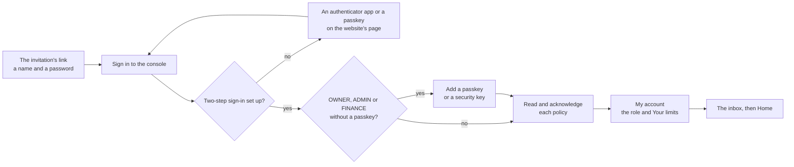

# Role guides

  

One page for each role of the Admin Control Panel, for the member of staff who holds it: who it is for, what it can do
and cannot do, its limits, the pages it uses, its first day and the parts of
[RUNBOOK.md](../../../examleaf-web/RUNBOOK.md) that concern it. They are written from the code, not from memory:
`examleaf-web/accounts/roles.py` (the roles, `ROLE_CARDS`, `ROLE_LIMITS`, `ROLE_SCOPES`, `SOD_CONFLICTS`),
`examleaf-web/staff/catalogue.py` (what each permission is, its risk) and the console's modules
(`examleaf-admin/src/lib/modules.ts`). The panel's own page, People → Roles (`/people/roles/`), draws the same facts
from the running system; if a page here and the panel differ, the panel is right: tell the person who keeps these
guides.

> [!NOTE]
> **At a glance**
> - Eleven roles, one page each; a person may hold more than one and has the highest of their roles' limits.
> - The backend decides: the console draws a module for whoever holds one of its permissions, and the API checks
>   every call again.
> - A session ends 8 hours after sign-in, and sooner when idle: 15 minutes for OWNER, ADMIN, FINANCE and PACKER, 30
>   for the others.
> - The limits are placeholders until the owner sets them ([the decisions register](../../decisions.md)).

| Role | Page | For |
|---|---|---|
| Owner | [OWNER.md](OWNER.md) | the founder |
| Admin | [ADMIN.md](ADMIN.md) | the operations head |
| Finance | [FINANCE.md](FINANCE.md) | the accountant |
| Sales | [SALES.md](SALES.md) | sales and school orders |
| Sales representative | [SALES_REP.md](SALES_REP.md) | phone and school orders, quotations |
| Packer | [PACKER.md](PACKER.md) | the packing room |
| Support | [SUPPORT.md](SUPPORT.md) | support agents |
| Content editor | [CONTENT_EDITOR.md](CONTENT_EDITOR.md) | authors and editors |
| Reviewer | [REVIEWER.md](REVIEWER.md) | senior editors |
| Marketing | [MARKETING.md](MARKETING.md) | coupons, offers and the insights |
| Auditor | [AUDITOR.md](AUDITOR.md) | an accountant or lawyer who reviews |

STUDENT and TEACHER are customers, not staff, and have no guide here. The plan's INTEGRATION role is an API key with the
permissions it names (People → API keys), not a person.

## Who can do what, by module

The rows are the console's modules (`https://admin.<domain>`, the sidebar) and the columns the roles. "yes" means the
role can change things there, inside its limits; "read" means lists and records only; "part" means a named part of
the module, which the role's page spells out; "link" means the sidebar's links into ERPNext; a blank means the module
is not drawn for the role.

| Module | OWNER | ADMIN | FINANCE | SALES | SALES_REP | PACKER | SUPPORT | CONTENT_EDITOR | REVIEWER | MARKETING | AUDITOR |
|---|---|---|---|---|---|---|---|---|---|---|---|
| Home and Inbox | yes | yes | yes | yes | yes | yes | yes | yes | yes | yes | read |
| Approvals | yes | yes | yes | yes | yes | | yes | yes | yes | yes | read |
| Orders | yes | yes | part | yes | part | part | part | | | | read |
| Finance | yes | yes | yes | part | | | read | | | | read |
| Catalogue | yes | yes | part | yes | read | read | read | part | | part | read |
| Tax | yes | yes | yes | part | | | | part | | | read |
| Content | yes | yes | | part | part | | part | yes | yes | | read |
| Course | yes | yes | | part | | | yes | yes | part | | read |
| Customers | yes | yes | read | | | | yes | | | | read |
| Support | yes | yes | | part | | | yes | part | | | read |
| Legal and privacy | yes | yes | part | | | | part | part | | | read |
| Reports | yes | yes | yes | part | | | | | | part | read |
| People, Roles, Access review | yes | part | | | | | | | | | read |
| API keys | yes | read | | | | | | | | | read |
| Settings | yes | yes | | | | | | | | | read |
| Connections | yes | yes | read | | | | | | | | read |
| Message templates | yes | yes | | | | | | | | read | read |
| System | yes | yes | | | | | | | | | read |
| Audit trail | read | | | | | | | | | | read |
| In ERPNext (GST returns, Inventory, Purchases, CRM) | link | link | link | | | | | | | | link |

Notes on the cells. The Audit trail is read and exported, never changed, and each read is itself logged; only OWNER and
AUDITOR hold it. AUDITOR's "read" includes exporting a report, the audit log and the grievance register as files. SALES
makes and cancels payment links in Finance, and SUPPORT only reads them. SALES and CONTENT_EDITOR see Tax only as the HSN
and SAC master (to pick a product's code); SALES and SALES_REP see Content only as the books' list. MARKETING's reports
are the forecasts and cohorts, because the others need data its role does not hold. The console's Shipping, Marketing
and Partners entries are drawn for the roles that will use them and say they come in a later phase.

## Where each guide gets its facts

- **What a role can do**: the lists in `ROLES` (`accounts/roles.py`), read by module, with each permission's label and
  risk from `staff/catalogue.py`. OWNER holds every catalogued permission and ADMIN every one but the owners' own and
  money's approvals; both are computed, not listed.
- **What it cannot do, and who to ask**: the permissions it lacks, and the approval table of
  [staff/README.md](../../../examleaf-web/staff/README.md) "Approvals (maker-checker)": who asks, who approves and when
  the answer waits.
- **Limits**: `ROLE_LIMITS` (a person holds the highest of their roles' limits; none listed means 0). The numbers are
  placeholders until the owner sets them (the decisions register, [decisions.md](../../decisions.md)). A person sees
  their own under My account → "Your limits".
- **Idle limit**: `STAFF_IDLE_TIMEOUTS` in `examleaf-web/examleaf/settings.py`: 15 minutes for OWNER, ADMIN, FINANCE and
  PACKER, 30 minutes (`STAFF_IDLE_TIMEOUT`) for the rest, and 8 hours after sign-in for everyone.
- **Pages**: `examleaf-admin/src/lib/modules.ts` (which permission opens a module) and the console README's "Routes".

## Before a person's first day

An owner invites the person (People → "Invite a staff member": their work email address, the role and the reason; for
OWNER, ADMIN, FINANCE or AUDITOR a second person approves first). The invitation's email links `/invite/<token>/` on
the panel's host, a link that works once, for 7 days: there the person chooses the name the console shows and a
password (the link proves the address), or, if an account already has that address, signs in first and opens the link
again. Two other ways give a role ([RUNBOOK.md](../../../examleaf-web/RUNBOOK.md) "Staff accounts", step 1): with
Google for staff on and `STAFF_GOOGLE_AUTO_STAFF=1` the person signs in once with their work Google account and an
owner then grants the role (People → the person → Access → "Grant a role"); and a break-glass session can make the
account in the Django admin and give the role, as it does for the first owner, whom nobody can invite. Whichever way,
the person then starts at the guide's "Your first day":



*Every role's first day, in the order the console asks for each step; each guide's "Your first day" adds the role's
own.*

Separation of duties decides which roles one person may hold: FINANCE never with PACKER, MARKETING never with FINANCE,
and AUDITOR with no other role. The panel refuses a grant that breaks it.

## Language and the other languages

These guides are in English. The role cards in `accounts/roles.py` (`ROLE_CARDS`) already take a language key
(`en`, `as`, `bn`), and the console's words are objects of one shape so that Assamese and Bengali join them. The same is
ready for the guides: a translation keeps this layout, with the same file name in a folder named for the language:

```text
docs/guides/roles/README.md          this index, in English
docs/guides/roles/OWNER.md ...       the eleven guides, in English
docs/guides/roles/as/OWNER.md ...    Assamese, when written (the same eleven file names)
docs/guides/roles/bn/OWNER.md ...    Bengali, when written
```

Every guide uses the same headings in the same order, and keeps permission names, paths, button labels and audit event
names exactly as the panel shows them (those are in English until the console is translated), so a translator changes
the sentences and nothing else. The index would gain a row of links per language.

## Keeping them true

A guide is wrong the day a role's list in `accounts/roles.py`, a limit in `ROLE_LIMITS` or a module's permission in
`modules.ts` changes. When one does, change the guide in the same pull request. The facts above each guide's table are
quick to check against People → Roles.

## Related documents

- [RUNBOOK.md](../../../examleaf-web/RUNBOOK.md): "Staff accounts", from the invitation to break-glass.
- [The staff app](../../../examleaf-web/staff/README.md): the roles, the approvals and how a permission is added.
- [The staff console](../../../examleaf-admin/README.md): the console's pages and routes.
- [Decisions register](../../decisions.md): the thresholds behind each role's limits.
- [The panel's plan](../../examleaf-admin-control-panel-plan.md): section 4, the roles as planned.
