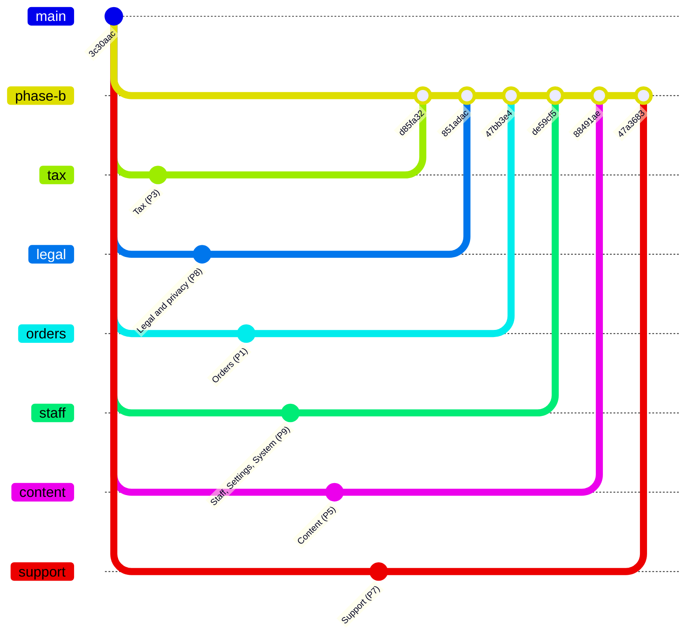
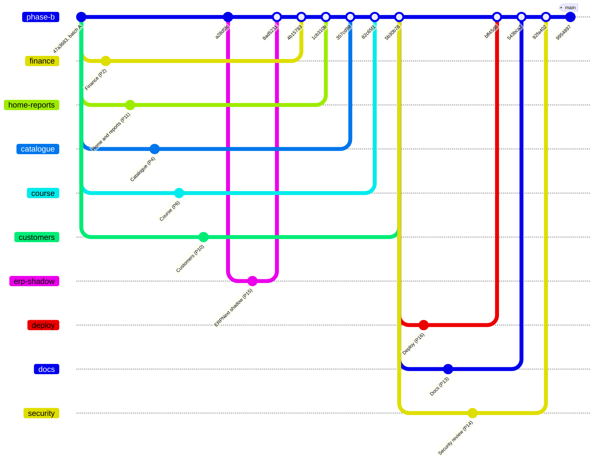
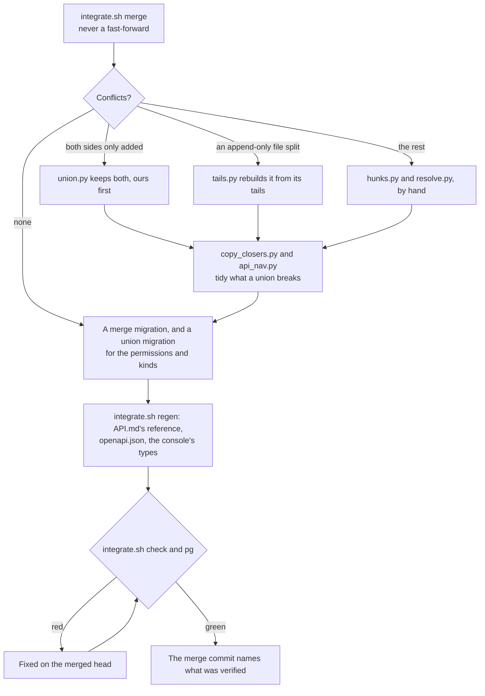

# Phase B integration: the briefs and the tools

  

This is how Phase B of the Admin Control Panel was built (10 October 2026): eleven module packages written in
parallel by agents in git worktrees from one set of briefs, merged one by one onto the integration branch `phase-b`,
then a wave of verification packages (the ERPNext shadow run, the documentation, the security review, the deployment
carry-through). The briefs and the tools are kept here so that Phases C to E can follow the same pattern.

> [!NOTE]
> **At a glance**
> - Fifteen packages, each built from its brief in a worktree of its own: six modules in batch A, five in batch B
>   and four verification packages.
> - Each was merged with `--no-ff` onto `phase-b`, both sides of every shared file kept, with a merge migration and a
>   union migration per module, the generated files regenerated and every suite run at the merge.
> - `main` was fast-forwarded to the merged head at the end, so it has no merge commit of its own.
> - The rules the merges taught are in [`briefs/AFTER-BATCH-A.md`](briefs/AFTER-BATCH-A.md).

## The merge order

*Batch A: six modules built in parallel from `main` at 3c30aac, merged onto `phase-b` in this order.*

*Then the ERPNext shadow run, batch B's five modules from batch A's head and the three other verification packages
from Customers' merge; `main` was fast-forwarded to the merged head (the tag).*

The lessons the merges taught are in the briefs' `AFTER-BATCH-A.md` and in the consolidated CHANGELOG entry; the
merge order and the verification at each merge are in `git log phase-b` (one `Merge <module> (P<n>) into phase-b`
commit per package, each naming its counts; the Tax module's and the shadow run's merges kept git's default message,
`Merge branch 'worktree-agent-…' into phase-b`).

## Each merge, step by step

*One package's merge onto `phase-b`, with the tool for each step (`tools/`, below); a package of Phases C to E merges
the same way.*

## The briefs

- [`briefs/COMMON.md`](briefs/COMMON.md): the rules every package followed (one module file per package mounted from
  `staff/urls.py`, models at the end of `models.py` under a `# Phase B: <module>` marker, a catalogue row, a role row
  and a matrix row for every endpoint, API.md regenerated, the console's module pattern, the report format).
  `briefs/P<n>-*.md`: one brief per package, with the integration's notes appended where the tech lead took a
  decision while merging.
- [`briefs/AFTER-BATCH-A.md`](briefs/AFTER-BATCH-A.md): what batch B read after COMMON.md, the rules the first merges
  taught.

| Brief | Package | Built in | Merged as |
|---|---|---|---|
| [P1-orders.md](briefs/P1-orders.md) | Orders | batch A | `47bb3e4` |
| [P2-finance.md](briefs/P2-finance.md) | Finance | batch B | `4b15783` |
| [P3-tax.md](briefs/P3-tax.md) | Tax | batch A | `d85fa32` |
| [P4-catalogue.md](briefs/P4-catalogue.md) | Catalogue | batch B | `357cd99` |
| [P5-content.md](briefs/P5-content.md) | Content | batch A | `88491ae` |
| [P6-course.md](briefs/P6-course.md) | Course | batch B | `82c65f1` |
| [P7-support.md](briefs/P7-support.md) | Support | batch A | `47a3683` |
| [P8-legal.md](briefs/P8-legal.md) | Legal and privacy | batch A | `851adac` |
| [P9-staff-settings-system.md](briefs/P9-staff-settings-system.md) | Staff, Settings and System | batch A | `de59cf5` |
| [P10-customers.md](briefs/P10-customers.md) | Customers | batch B | `5b30b78` |
| [P11-home-reports.md](briefs/P11-home-reports.md) | Home and reports | batch B | `1cb310b` |
| [P13-docs.md](briefs/P13-docs.md) | Documentation | verification | `543bca2` |
| [P14-security-review.md](briefs/P14-security-review.md) | Security review | verification | `92fa402` |
| [P15-erp-shadow.md](briefs/P15-erp-shadow.md) | ERPNext in shadow mode | verification | `8ad5231` |
| [P16-deploy.md](briefs/P16-deploy.md) | Deploy carry-through | verification | `bff45d6` |

## The tools

- `tools/integrate.sh`: `merge <branch>` (no-ff; stops on conflicts), `regen` (merge migrations, the API reference
  in API.md, `openapi.json` and the console's types), `check` (ruff, migrations, the backend suite, the console's
  checks), `pg` (the backend suite on the local PostgreSQL). Paths at the top are the tech lead's machine's.
- `tools/union.py`: resolve conflict hunks by keeping both sides (ours first) where both sides only added.
- `tools/hunks.py`: print a conflicted file's hunks (`--edges N` for the first and last lines of each side).
- `tools/resolve.py`: `resolve_hunk(file, n, text_or_callable)` for the hunks a union cannot resolve.
- `tools/tails.py`: rebuild an append-only file (the console client, `shop/models.py`) from the merged prefix, HEAD's
  tail and the branch's section, when a conflict split a function or a class.
- `tools/copy_closers.py`: put back the `},` closers a union loses in the console's `copy.ts`.
- `tools/api_nav.py`: rewrite API.md's Contents block from the headings in file order.

## Related documents

- [Handover](../HANDOVER.md): section 8, the conventions these merges kept.
- [Changelog](../../examleaf-web/CHANGELOG.md): the consolidated Phase B entry and one entry per module, with the
  counts at each merge.
- [The panel's plan](../examleaf-admin-control-panel-plan.md): section 9, the phases still to build this way.
- [Security review of Phase B](../security/phase-b-authorization-review.md): package P14's report.
- [The staff app](../../examleaf-web/staff/README.md): how a module's endpoints, permissions and matrix rows are added.
