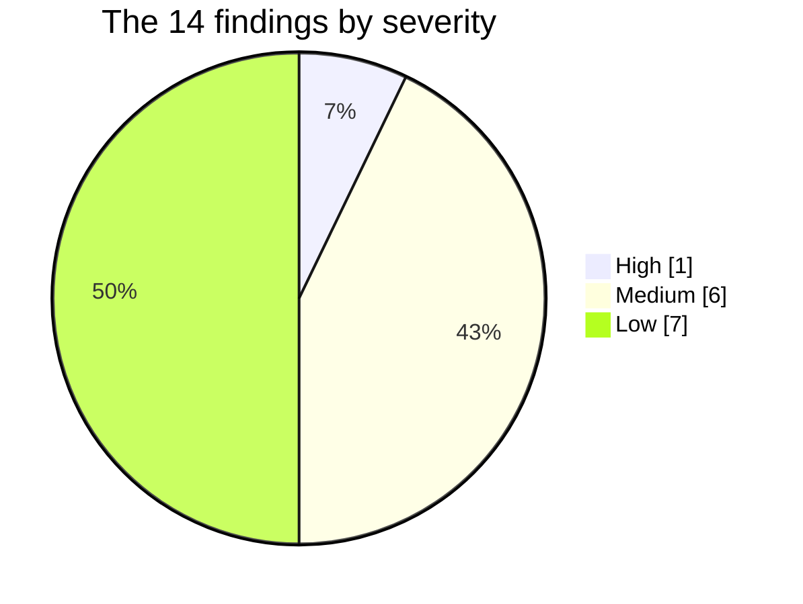
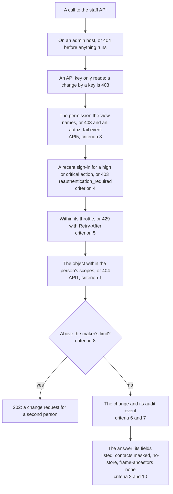

# ExamLeaf Admin Control Panel: security review of Phase B's authorization

  

The review of Phase B's authorization against OWASP API1, API3 and API5 and the plan's security exit criteria: how each
criterion became a test, what the tests found, how each finding was fixed and what was judged acceptable. It is for
the developer who adds a staff endpoint, whose rules these tests now enforce, and for whoever reviews the next phase.

**Date:** 10 October 2026. **Scope:** the staff API and the public endpoints of Phase B as merged on `phase-b` at
5b30b78 (Orders, Finance, Tax, Catalogue, Content, Course, Support, Customers, Legal and privacy, Staff, Settings and
connections, System, Home and Reports, the ERPNext sync), against the plan's section 9.2 security exit criteria: an
access-log event for every person lookup and every view of a child's record; reveal and export throttles; step-up on
every money, role, key and export action, each with a test; a review of the authorization tests against OWASP API1,
API3 and API5. **Method:** each criterion was turned into a test that derives its cases from the code itself (the URL
walk, the authorization tables, the catalogue, the approvals registry), so that an endpoint added later without the
rule fails the suite; every failure was read, fixed in the shared place where one covered all callers, and given a
test that fails without the fix (checked by running the test on the code before it). The console and the website were
read, not changed.

> [!NOTE]
> **At a glance**
> - 14 findings, each fixed with a test that fails on the old code: 1 High, 6 Medium and 7 Low.
> - The High: cancelling an order paid online refunded it without a re-authentication; every refund now steps up in
>   `approvals.ask()`.
> - The tests derive their cases from the code, so an endpoint added later without its rule fails the suite.
> - 617 new tests; at the end of the review 2,504 backend tests pass on SQLite.

**Contents**

- [Summary](#summary)
- [Findings](#findings)
- [The criteria, one by one](#the-criteria-one-by-one)
- [Judged acceptable](#judged-acceptable)
- [For the console and the tech lead](#for-the-console-and-the-tech-lead)
- [Tests added](#tests-added)
- [Related documents](#related-documents)

## Summary

*One High, six Medium and seven Low, two of the Low in the tests themselves (L6 and L7).*

1. **H1.** Cancelling an order paid online is its refund, but the cancellation endpoints name `shop.change_order`
   (medium), so a session authenticated hours ago refunded at once within the maker's limit: through the order's page,
   a ticket, the Django admin, and the bulk cancellation job (SALES: Rs 2,000 a refund, 100 orders a job). The step-up
   now lives in `approvals.ask()`, which every refund goes through.
2. **M1 to M6.** Exports and a coupon's codes file below high (no step-up); a child's erasure confirmed for the parent
   without a step-up; the ticket queue's person searches outside the access log; a data request's contact answered
   whole; a subject-scoped editor making products in another subject; a coupon's unused single-use codes listed in
   the clear to the auditor, SALES and MARKETING.
3. **What holds up.** Every one of the 145 object routes a scope narrows answers 404 out of scope; every customer's
   object is 404 to another customer; every high action steps up; every Phase B approvals action keeps the
   maker-checker rules; the four inbound hooks are constant-time, rotation-safe, deduplicated and size-capped; no
   answer holds a secret or a raw contact (but the data request, now masked).

## Findings

| ID | Severity | Endpoint | What | Fix | Test |
|---|---|---|---|---|---|
| H1 | High | `orders/<n>/cancel/`, `support/tickets/<n>/cancel/`, the admin's Cancel, `jobs/` (`orders_cancel`) | a refund by cancellation ran without a re-authentication | `approvals.step_up()` in `ask()` for every request (the admin's session read too: `api.views.recently_authenticated`); `jobs.start()` steps up the action a kind's rows ask (`shop.order_jobs.ASKS`); `require_reauth` removed (ask covers change-requests/) | `test_step_up.py`: the four cancellation tests, `test_a_change_request_for_a_high_action_…` |
| M1 | Medium | `tax/gstr1/` and its job, `product_export`, the categories' export, `coupon_codes` | exports (and a coupon's codes file, money as a file) at medium or low: no step-up | `staff.run_gstr1`, `shop.export_product`, `shop.export_category` high; `shop.add_couponcode` listed by hand as high | `test_every_export_is_high`, `test_a_high_job_asks_…` (15 kinds) |
| M2 | Medium | `privacy/deletions/<id>/parent-confirmation/` | the last step before a child's erasure, without a step-up; plain views could not name methods in `reauth` | `StaffPermission` reads a plain view's method for `reauth`/`no_reauth`; the view's `reauth = ("POST",)` | the step-up walk and its guard |
| M3 | Medium | `support/tickets/?q=` | a person searched by email or number wrote a `sensitive_read`, not the access log's `customer.lookup`, and no count | `audit.lookup()` with the count found | `test_access_log.py` (10 lookups, 7 child views) |
| M4 | Medium | `data-requests/<id>/` (and create, change) | the requester's address or number answered whole to every reader of the queue (the auditor too) | masked in every answer (`DataRequestSerializer`); `data-requests/<id>/reveal/` (`staff.reveal_contact`, re-authenticated, `staff_reveal`'s rate, a `sensitive_read`) | `test_no_answer_holds_a_customers_raw_contact`, `test_a_data_requests_requester_is_masked_…` |
| M5 | Medium | `catalogue/products/` (POST, PATCH), the product import | an editor narrowed to a subject made or moved products into another (then a 500 on the answer's scoped read); the import updated any product | `CatalogueProductWriteSerializer` takes its writer and refuses a subject out of reach; `import_row` looks the product up in scope | `test_a_product_is_never_made_or_moved_out_of_its_writers_subjects` |
| M6 | Medium | `catalogue/coupons/<code>/codes/` | every unused single-use code (a spendable discount) listed in the clear to `shop.view_couponcode` | an unused code masked to its prefix and last four; a spent one whole | `test_a_coupons_unused_codes_are_masked_in_its_list`, the secrets walk |
| L1 | Low | every POST on a `view_` permission (role preview, print-run, code lookup), the inbox, saved views | an API key reached the POSTs; the inbox and saved views failed with a 500 for a key | `StaffPermission` refuses a key any non-safe method; `human()` in the two person-bound querysets | `test_an_api_key_changes_nothing_and_breaks_no_read` |
| L2 | Low | `data-requests/<id>/export/`, `course/codes/batches/`, `support/tickets/<n>/book-code/` | two exports at the general rate (600 a minute); a code lookup at the search rate (3,600 an hour, beside the Course module's 120) | `staff_export`; `staff_code_lookup` (one budget for both lookups) | `test_throttles.py` |
| L3 | Low | `inbox/<id>/done/`, `…/snooze/`, `…/assign/` | no audit event | `inbox.done`, `inbox.snoozed`, `inbox.assigned` in the change's transaction | `test_audit_trail.py` |
| L4 | Low | `orders/` (POST), `orders/quotes/<id>/convert/` | an address without its (optional) state passed validation and failed with a 500 | the address's default where it enters the payload | `test_an_address_without_its_state_…` |
| L5 | Low | `privacy/holds/` (POST) | a hold's record found in the whole table: one out of the maker's scope held, its number confirmed | `privacy.find_hold_target` scoped by the model's `view_` permission | `test_a_hold_on_a_record_out_of_scope_is_no_such_record` |
| L6 | Low (tests) | the matrix | eight endpoints in no table (the PUT twins of seven PATCH rows, a saved view's GET); the every-staff endpoints partly tested; no walk of `ADMIN_HOSTS`, `no-store` or the CSP | rows added; the tables asserted equal to the URL walk; the walks | `test_the_tables_hold_every_endpoint_and_nothing_else`, `test_every_staff_endpoint_is_404_off_the_admin_host` |
| L7 | Low (tests) | `support/tests/test_api.py`, `learn/test_codes.py` | the queue's order test failed by day (an SMS acknowledgement goes from 08:00); the Course module's lookup test rebound the rates' dict and left `staff_code_lookup` at 2 an hour for every later test, which failed the ticket's lookup test in the whole suite once L2 put it on that rate | SMS off in that test; the rate lowered with `monkeypatch.setitem` | themselves, in the whole suite |

## The criteria, one by one

*What a call to the staff API passes through, in order, with the criterion below that checked each step; the inbound
hooks (criterion 9) are a path of their own.*

**1. API1, object-level authorization** (`staff/tests/test_objects.py`). Every row of the tables whose route takes an
object (its first placeholder names it; a row that writes its object, a setting's key, by `LITERALS`) is asked by an
owner, who holds every permission, with `StaffScope` rows that reach no fixture (another subject, order status, ticket
category, school, inbox queue): the 145 scoped rows are 404, with a valid body where an action reads its body first
(an empty body is 400 for any id, which leaks nothing but proves nothing). A person's own objects (a job, a saved view,
a session) are 404 to another member of staff; a second object of a route (a version, an attachment, a picture, an
attribute, a device, a scope) is 404 under another parent; a note and a hold on a record out of scope are refused. The
objects no scope narrows are listed with why (`UNSCOPED`), and a test asserts every object route of the walk has its
rule. Customers: another customer's order (its return, cancellation, payment, invoice, credit note), address and
attempt are 404; the lists, My requests and the nominee are never another's. A mutation (the Orders module without
`scoped()`) fails 24 rows. Found: L5 (and M5, a write that left the writer's scope).

**2. API3, data exposure and mass assignment** (`staff/tests/test_exposure.py`). Every project serializer lists its
fields (none `__all__` or `exclude`). Every GET of the tables is read with the matrix's customer given a number, a
log-in number, a date of birth, a parent's contact, a saved address, a nominee, a ticket and an order from their
number: no answer holds one raw (the parcel's documents excepted: the packing room prints the address), which found
M4. No answer and no audit event holds a provider's secret, a webhook token, an API key or `SECRET_KEY`, which found
M6. Writes ignore or refuse a paper's publish flag and code, a ticket's number and hash, a data request's
verification and state, a saved view's owner, a revision's state, an API key's prefix and hash, a superuser flag,
stock, a coupon's code, the public profile's staff flags and a nominee's verification. The console's mock was read:
its connections hold credentials masked and its API keys no secret.

**3. API5, function-level authorization** (`staff/tests/test_matrix.py`, `test_public.py`). The tables and the URL walk
are asserted to be the same set of 462 endpoints (L6); every GET names a `view_` permission (the existing test, and
the ERPNext sync's own); a key holding every view permission a key may hold is refused every change and fails no read
(L1); every staff route is 404 on another host than `ADMIN_HOSTS` before anything runs. Phase B's public endpoints
are throttled, need the session's CSRF token for a write, take Turnstile's token on the forms, and answer no staff
data.

**4. Step-up** (`staff/tests/test_step_up.py`). Derived: every row whose view names a high or critical permission, or
always asks (its `reauth`), answers 403 `reauthentication_required` with allauth's flows (and no `authz_fail`) to a
session authenticated an hour ago and goes on for a fresh one (68 rows); every job kind and bulk action whose own
permission is high (15); every change request whose maker's permission is high; a guard that the derivation holds a
money, role, key, export, erasure, void, cancel-document and credential action each; every export permission high.
Found H1, M1, M2.

**5. Throttles** (`staff/tests/test_throttles.py`). Each rate a staff view names (asserted to cover them all) answers
429 with Retry-After past a limit of 2: the reveals (a customer's, a nominee's, a ticket's, a data request's, a
refund's payee, an impersonation token), the exports, the bulk actions, the searches for a person, the code lookups,
money, test sends, reports; and the public report, My requests and contact endpoints. The configured rates stay under
ceilings (reveals 30 an hour, exports 10, bulk 20, code lookups 120, searches 60 a minute). Found L2. API.md's rate
table, doubled by the merges, lists each rate once with every endpoint on it.

**6. The access log** (`staff/tests/test_access_log.py`). Every search of a person (users and guests, orders, tickets,
entitlements; the console's command palette searches through `users/?q=`) is one `customer.lookup` with the query's
keyed hash (the same hash for an address in every list) and no trace of the words; every view of a child's record
(the record, its timeline and spending, a minor's order, ticket, learner page, nominee) is a `sensitive_read` marked
`child`. Found M3.

**7. Audit completeness** (`staff/tests/test_audit_trail.py`). Every POST, PUT, PATCH and DELETE row is walked as an
owner with a valid body, or the record put in the state its action needs (189 rows): a success leaves events by the
owner naming a target (but three that name none: the log's own export, a pick list, an approval of a fixture without
a target) and none of the fixtures' personal details. 35 rows are listed with the test that asserts their event
(checked to exist and to read the log), 10 that change no record with why, 8 courier calls of the shipping app (Phase
A) apart. Found L3 and L4.

**8. The approval paths** (`staff/tests/test_approval_paths.py`). coupon.create, coupon.change, offer.create,
offer.change and product.price each: the maker's approval refused, a wrong hash refused, an expired request refused,
a run after the world changed failing. The eight that never wait on their own (the course's and the customers' bulk
actions) refuse at their run when their precondition went; the job that holds them (job.run, a child among the
targets) keeps the four rules. A guard asserts the table holds every action not of Phase A. Nothing failed.

**9. The inbound hooks** (`staff/tests/test_hooks.py`). parcel-events, sms-events, support-mail and erp-events each
compare with `hmac.compare_digest`, take the previous token for 24 hours after a rotation and not after, keep a
replayed event once, refuse a body over Django's limit (413, nothing kept) and answer a malformed body in a JSON
detail, never a 500; Caddy's 10 MB cap covers `/api/hooks/`. Nothing failed.

**10. Headers.** The matrix asserts `Cache-Control: no-store` and the CSP's `frame-ancestors 'none'` on every staff
answer (refusals too; report-only under `DEBUG`, as settings.py has it). Phase B changed neither the CSP nor the
Caddyfile. Read, not changed: the website's `/account/requests/` is `noindex` (its page and the account layout); the
console sends `X-Robots-Tag: noindex, nofollow` on every answer, `robots.txt` disallows all and its root layout is
unindexed, none of it changed in Phase B.

## Judged acceptable

- **Prices, coupons, offers and staff orders at medium.** They move money by discount, but research 2.3's step-up list
  names refunds, payouts and approvals, not price edits; beyond the maker's discount limit each waits for FINANCE,
  whose approval (`staff.approve_discount`, high) steps up.
- **The course's grants and extensions** (`learn.add_entitlement`, `learn.change_entitlement`, medium): goodwill
  access, audited, and in bulk a job that waits above `bulk_rows` or for a child; not a payment.
- **A password reset link and signing a customer out** (medium): research 5's table asks no re-authentication for them
  (staff never set or see a password).
- **Printing packing slips, labels and invoices in bulk** (`orders_print`, `staff.pack_order`): the packing room's
  daily work, within `bulk_rows`, audited; the documents carry addresses by their nature.
- **The objects no scope narrows** (`test_objects.UNSCOPED`): customers, data requests, holds, staff, the registers,
  the catalogue's coupons and offers, returns (the packing room receives every returned parcel whatever its order's
  status, outside a PACKER's order scope by design).
- **Saved views** write no audit event: a person's own list filters, no record.
- **The Django admin's refund and cancel now step up** with the panel's: the admin has no re-authentication page of
  its own, so its users re-authenticate in the console (the admin shares the session). The admin's order actions are
  the panel's now; retiring them is the plan's direction (5.0).
- **A phone's keyed hash differs between lists** (the customers' and orders' lists hash the last ten digits, the
  tickets' the E.164 number): each list's lookups compare among themselves, not across. Not changed: the hash an
  address gets is the same everywhere, and the lookups' purpose (who looked whom up) holds.

## For the console and the tech lead

- The console's privacy request page shows the requester masked now; a Reveal there calls
  `POST data-requests/<id>/reveal/ {reason}` (as the ticket page's `RequesterValue` does). Its mock should mask the
  requester and a coupon's unused codes as the API does, and answer the new endpoint.
- `openapi.json` and `schema.d.ts` need regenerating for `data-requests/{id}/reveal/` and `DataRequestRequester`
  (this review did not touch the console); API.md's generated reference is regenerated.
- The catalogue's risk changed for `staff.run_gstr1`, `shop.export_product`, `shop.export_category` and
  `shop.add_couponcode` (high): FINANCE, MARKETING and SALES re-authenticate before those, as the manifest says.
- A hold names only a record its maker may read (L5): FINANCE, whose holds are money's, can no longer name a data
  request (it has no `staff.view_datarequest`); ADMIN and the owners can.
- `phase-b` moved on after 5b30b78: merged, only API.md conflicts (the rate table and the generated reference, which
  `manage.py staff_api_reference` regenerates); its Python changes add no endpoint, so the walks should hold there.

## Tests added

617 new tests, 582 of them cases of parametrised tables:

| File | New tests |
|---|---|
| `staff/tests/test_objects.py` | 184 |
| `staff/tests/test_step_up.py` | 92 |
| `staff/tests/test_audit_trail.py` | 225 |
| `staff/tests/test_throttles.py` | 28 |
| `staff/tests/test_access_log.py` | 17 |
| `staff/tests/test_approval_paths.py` | 15 |
| `staff/tests/test_hooks.py` | 13 |
| `staff/tests/test_public.py` | 13 |
| `staff/tests/test_exposure.py` | 8, two of them walks of every GET |
| `staff/tests/test_matrix.py` | 21: the every-staff table's 9, nine new rows, the tables' coverage, the admin-host walk, the API-key walk |
| `shop/test_staff_orders_api.py` | 1 |

Updated: the ticket lookup and queue tests in `support/tests/test_api.py`, the admin's refund and cancel tests in
`shop/test_admin.py` (they re-authenticate), the Course lookup test's rate in `learn/test_codes.py`. At the end of the
review 2,504 backend tests pass on SQLite (13 skipped, 6,961 subtests).

## Related documents

- [The staff app](../../examleaf-web/staff/README.md): the authorization model these tests enforce, and how an
  endpoint is added.
- [API](../../examleaf-web/API.md): every staff endpoint, its permission and the rate table.
- [Security review, phases 1 to 4](../../examleaf-web/SECURITY_REVIEW.md) and [phases 5 and
  6](../../examleaf-web/SECURITY_REVIEW_PHASE5_6.md): the reviews before this one.
- [The panel's plan](../examleaf-admin-control-panel-plan.md): section 6, the security the panel was planned with.
- [Changelog](../../examleaf-web/CHANGELOG.md): "Phase B, security review", the fixes as merged.
- [Phase B integration](../phase-b-integration/README.md): how the review was built and merged.
