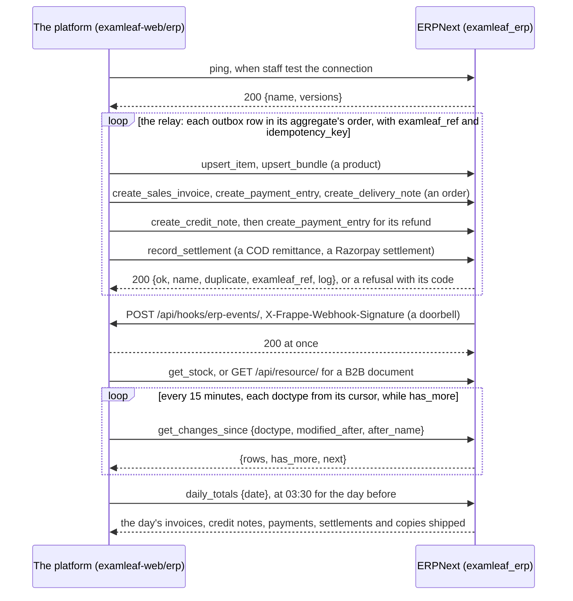

# examleaf_erp API: the platform's way into ERPNext

   

The contract between the platform's Django `erp` app (its outbox relay and its pull) and ERPNext: twelve whitelisted
methods of the `examleaf_erp` app (`apps/examleaf_erp/examleaf_erp/api.py`, plumbing in `sync.py`), and six webhooks
back. It is for whoever changes either side of the sync; everything below was run against ERPNext v16.50.0 with India
Compliance v16.10.0 (`compose/`, `./dev.sh test`: 58 tests). The research behind it is
`docs/research/2026-10-09-admin-control-panel/research-erpnext.md` 5.1 to 5.8.

> [!NOTE]
> **At a glance**
> - Every call is a `POST` to `/api/method/examleaf_erp.api.<method>` as the EL Sync user (`Authorization: token
>   <api_key>:<api_secret>`), and the method's answer comes inside Frappe's `{"message": …}`.
> - The eight mutating methods take `examleaf_ref` and `idempotency_key`: the same key and body replay the first answer,
>   the same reference under a new key answers a short duplicate.
> - Unknown fields are refused, which also keeps personal data out: a shipping address is a city, a district, a state
>   and a PIN.
> - One transaction per call, kept in the ExamLeaf Sync Log; retry 5xx and 429 with the same key, never a 4xx unchanged.
> - The webhooks are doorbells: re-read on every ring, and keep the 15-minute `get_changes_since` pull.

## Contents

- [The calls, as the platform makes them](#the-calls-as-the-platform-makes-them)
- [Contract deviations](#contract-deviations)
- [Calling it](#calling-it)
- [Errors](#errors)
- [Methods](#methods)
- [Webhooks (ERPNext to the platform)](#webhooks-erpnext-to-the-platform)
- [Related documents](#related-documents)

## The calls, as the platform makes them



*The sync API as `examleaf-web/erp` calls it: the relay's writes, a doorbell's re-read, the pull, the nightly totals.*

## Contract deviations

The platform's `erp` app was briefed with the method names, the `examleaf_ref` and `idempotency_key` arguments, the
answers `{ok, name, duplicate, examleaf_ref}` and `{ok: false, error: {code, message, field}}`, and the webhook body
`{doctype, name, modified, examleaf_ref, event}` with `X-Frappe-Webhook-Signature`. All of those hold. Where the brief
named a field loosely or differently, this API's names are below; `erp/contract.py` maps them in one place.

1. **The envelope.** Frappe wraps every answer: the body is `{"message": <answer>}`. Refusals carry their HTTP status
   (400, 404, 409, 422, 500) and the same envelope. Frappe's own refusals before the method runs (no token: 403, a
   wrong token: 401, GET instead of POST: 403, a caller without the EL Sync role: 403) have Frappe's body
   (`{"exc_type": "PermissionError", ...}`), not this shape, and write no Sync Log row.
2. **`idempotency_key` is required** on the eight mutating methods, and **the four read methods take neither
   `examleaf_ref` nor `idempotency_key`** (an unknown field is refused). Formats: `examleaf_ref` is `kind:id`
   (`^[a-z][a-z0-9_-]{1,30}:[A-Za-z0-9][A-Za-z0-9/_.:-]{0,100}$`, so `credit_note:CN/2026-27/00001` passes),
   `idempotency_key` is `^[A-Za-z0-9][A-Za-z0-9:_./-]{0,139}$` (the outbox row's id).
3. **Duplicates come in two forms.** The same key with the same body replays the first answer in full with
   `duplicate: true`. The same `examleaf_ref` under a new key answers the short form
   `{ok: true, name, duplicate: true, docstatus, examleaf_ref, log}`: re-read the document if you need more, unless
   the reference's invoice is another order's (`order_number`) or its credit note is against another invoice
   (`invoice_number`): `409 conflict`, so that a number issued again (a restored database, a second platform) is
   refused rather than answered as the first document's duplicate (found by the shadow run,
   `examleaf-web/erp/SHADOW-RUN.md`). The same key with another body is `409 idempotency_key_reused`.
4. **Answers carry more than the brief's four fields**: `log` (the Sync Log row of this call), `warnings` (ERPNext's
   messages, when it had any) and each method's own fields below. Ignore what you do not use.
5. **Unknown fields are refused** (`400 invalid_request`, `field` names it), so a typo in a payload fails instead of
   being dropped. This is also how personal data is kept out: a shipping address takes city, district, state and PIN
   only, and a `name`, `phone` or `line1` is refused.
6. **Field names, method by method** (brief's term → this API):
   - `upsert_item`: code → `item_code`; name → `item_name`; item group → `kind` (`shop.Product.Kind`:
     `sample-papers`, `solutions`, `bundle`, `digital`); HSN/SAC → `hsn_code`; GST treatment and rate → `gst_rate`
     alone (`"0"` is exempt, anything else taxable), plus optional `gst_rate_effective_from`; MRP → `mrp`; uom → not
     taken (always Nos); disabled → `is_active` (the inverse); class → `class_level`. `subject`, `board`, `edition`,
     `isbn`, `weight_grams` as named.
   - `upsert_bundle`: code → `item_code`; components → `items: [{item_code, qty}]`. The bundle's Item is made first
     by `upsert_item` with `kind: "bundle"`.
   - `create_sales_invoice`: number → `invoice_number`; date → `posting_date`; doc kind → `doc_kind` (optional, and
     checked, never set: ERPNext derives it from the lines); order number → `order_number`; customer → not taken (B2C
     only: always "Online Customers (B2C)"; B2B invoices are made in ERPNext); shipping city, state, PIN →
     `shipping_address: {city, district?, state, pin}` with the 2-letter state code; place of supply → derived from
     `shipping_address.state`; line hsn → `hsn_code` (optional), rate percent → `gst_rate`, gst treatment → not
     taken; `discount` is the line's rupees off (`OrderItem.discount`), not per unit; shipping line →
     `shipping_fee` (plus optional `shipping_hsn_code`, `shipping_gst_rate`); rounding → not taken (`total` must
     equal the lines and shipping to the paisa); payment terms → not taken (a B2C invoice is due on its date).
   - `create_credit_note`: number → `credit_note_number`; against → `invoice_number`; date → `posting_date`; items →
     `items: [{item_code, amount, qty?}]` (amount: rupees credited, tax included; qty: copies returned), plus
     `shipping_credit` and `total`.
   - `create_payment_entry`: invoice number → `invoice_number` (a credit note's number for a refund); reference id →
     `reference_no`; date → `posting_date`; `mode` is `razorpay`, `cod`, `upi`, `neft` or `cheque` (the platform's
     `offline` method: `upi` or `neft`, whichever reached the bank).
   - `record_settlement`: settlement id → `settlement_id`; date → `posting_date`; gross → `gross_amount`; fees →
     `fee`; tax on fees → `tax_on_fee`; net → `net_amount`; `utr` as named; invoice numbers covered → not taken (the
     payments already settled the invoices; the clearing account balances by amount); plus optional `tax_type`.
   - `create_delivery_note`: shipment id → the `examleaf_ref` (`delivery:<shipment id>`); items with qty → optional
     `items: [{item_code, qty}]` (left out: everything not yet delivered); plus `courier` and `tracking_number`.
   - `get_stock`: items (a list) → `item_code` (one, or none for all); answer `items: [{item_code, warehouse,
     actual_qty, projected_qty, reserved_qty, batches}]`.
   - `get_changes_since`: `modified_after` as named, plus `after_name`; answer `rows`, `has_more` and `next`, where
     `next` is `{modified_after, after_name}`: the arguments of the next call.
   - `daily_totals`: answer `invoices` and `credit_notes` as `{count, total, taxable_value, exempt_value, tax_total,
     by_treatment, by_kind}`; `payments` as `{receive: {mode: {count, amount}}, refund: {...}}`; `shipped` as
     `{delivery_notes, items: {item_code: qty}}` (the brief's delivered_qty); `settlements` added.
7. **GST is rounded per tax, as ERPNext does.** A taxed line's CGST and SGST are each rounded on the invoice's taxable
   value, so `tax_total` can differ by 0.01 from the taxes `shop.invoices` prints (999.00 at 18 %: 846.61 + 76.19 +
   76.19 = 998.99). `grand_total` always equals the platform's `total`: ERPNext books the paisa to Round Off, and
   the ERPNext print shows it as "Round off". Reconcile on `total`, and on `tax_total` with a 0.01 tolerance per taxed
   invoice (README "Open questions").
8. **Webhooks**: as briefed. The Quotation webhook rings on submit; `examleaf_ref` is `null` on documents ERPNext made
   itself; EL Sync can read Quotation, Customer and Sales Invoice over `/api/resource`, but stock only through
   `get_stock` (no read on Stock Ledger Entry, Purchase Receipt, Stock Reconciliation or Bin).

## Calling it

```
POST https://<erp host>/api/method/examleaf_erp.api.<method>
Authorization: token <api_key>:<api_secret>        (the EL Sync user, erp-sync@examleaf.in; README "The sync user")
Content-Type: application/json

{"examleaf_ref": "...", "idempotency_key": "...", ...fields}
```

- **POST only**, a JSON object of the fields. Only users with the EL Sync role (or System Manager) may call.
- **Answers**: HTTP 200 with `{"message": {"ok": true, "name": ..., "duplicate": false, "examleaf_ref": ..., "log":
  ..., ...}}`, or a 4xx/5xx with `{"message": {"ok": false, "name": null, "duplicate": false, "examleaf_ref": ...,
  "error": {"code", "message", "field"}, "log": ...}}`. `field` is the dotted path of the field at fault
  (`items[0].gst_rate`) or `null`.
- **One transaction per call.** The document and its Sync Log row are committed together; on any refusal everything
  is rolled back and only the Error row is written. A refused call can be sent again with the same key (keys replay
  successes only).
- **The ExamLeaf Sync Log** (Desk: `/app/examleaf-sync-log`) keeps every call: method, status (Success, Duplicate,
  Error), examleaf_ref, key, request, answer, the document made, the traceback of an error. EL Admin and EL Finance
  can **Resync** an Error row: the call runs again as the user who made it, in a background job. Success and
  Duplicate rows are deleted after 90 days.
- **Money** is rupees as a string with at most 2 decimals (`"299.00"`; numbers are accepted, strings are safer), read
  as Decimal. Answers give money as strings. **Dates** are `YYYY-MM-DD`; a `posting_date` may not be in the future.
- **Rate limit**: with `rate_limit` in the site config Frappe answers `429` with `Retry-After`; back off and resend
  with the same key.
- **Re-reads** through Frappe's REST (`GET /api/resource/<Doctype>/<name>`) work for what EL Sync may read: Item,
  Item Price, Product Bundle, Customer, Address, Contact, Sales Invoice, Payment Entry, Journal Entry, Delivery Note,
  Quotation. Names with `/` are URL-encoded (`EL%2F2026-27%2F00001`).
- **The test series**: `T/…` invoices and `TC/…` credit notes are taken only where the site config has
  `examleaf_allow_test_series: 1` (development and staging). Production refuses them, so test-mode orders never sync.

## Errors

| code | HTTP | when |
|---|---|---|
| `invalid_request` | 400 | a field missing, malformed, unknown, or inconsistent (totals that do not add up, a date outside the number's financial year, a credit note dated before its invoice) |
| `not_found` | 404 | a document the call names is not there (an Item not yet upserted, an invoice not submitted or not the platform's) |
| `conflict` | 409 | the reference or number belongs to another document (an invoice to another order, a credit note against another invoice), an item_code would change, a kind would change stock-keeping |
| `idempotency_key_reused` | 409 | the key was used before with another request |
| `cancelled` | 409 | the reference's document was cancelled in ERPNext (staff did it; ask them) |
| `amendment_refused` | 409 | the invoice number belongs to a cancelled invoice: a number is never issued again; credit it instead |
| `total_mismatch` | 422 | ERPNext computed another grand total than `total` |
| `tax_template_mismatch` | 422 | the item's dated GST rate in ERPNext on that day differs from the line's `gst_rate`: upsert the item with `gst_rate_effective_from` |
| `doc_kind_mismatch` | 422 | the lines make another document kind than `doc_kind` says |
| `no_tax_template` | 422 | no Item Tax Template for that GST rate |
| `over_credit` | 422 | more credited than the line has units or value left |
| `overpayment` | 422 | more paid than outstanding |
| `insufficient_stock` | 422 | the warehouse's print runs hold fewer copies than the delivery needs |
| `nothing_to_deliver` | 422 | the invoice has no goods left to deliver |
| `erp_validation_error` | 422 | ERPNext or India Compliance refused the document; `message` is theirs |
| `permission_denied` | 403 | ERPNext refused EL Sync a step (a permission missing: report it) |
| `not_configured` | 500 | the bootstrap has not been run (no bank account, no tax templates, a Mode of Payment without account) |
| `internal_error` | 500 | anything else; the traceback is in the Sync Log row |

Retry 5xx and 429 with backoff and the same key; do not retry 4xx unchanged.

## Methods

Fields marked * are required. Mutating methods all take `examleaf_ref`* and `idempotency_key`*.

### ping

No fields. Answers `{name: <site>, user, time, versions: {frappe, erpnext, india_compliance, examleaf_erp, ...}}`.
The platform's connection test (its connections page, and the Django admin's), and the smoke test after an
upgrade (`UPGRADE.md`).

### upsert_item: a `shop.Product` as an Item

| field | | |
|---|---|---|
| `examleaf_ref`* | | `item:<product id>`; fixed to one item_code for ever |
| `item_code`* | `^[A-Za-z0-9][A-Za-z0-9_.-]{0,139}$` | the Item's name; never changes |
| `item_name`* | ≤ 140 | `Product.title` |
| `kind`* | `sample-papers`, `solutions`, `bundle`, `digital` | Item Group; printed kinds keep stock by Batch (one per print run), `bundle` and `digital` keep none |
| `hsn_code`* | 4, 6 or 8 digits | must be in India Compliance's HSN/SAC master; a `digital` item takes a SAC (99…), not chapter 49 |
| `gst_rate`* | percent, `"0"` to `"100"` | `"0"`: the GST Exempted template (printed books); else India Compliance's `GST <rate>% - EL` |
| `gst_rate_effective_from` | date | the rate applies from this day (a dated row; earlier rows stay) |
| `mrp`* | money | the MRP Item Price |
| `description` | ≤ 2000 | |
| `isbn` | ISBN-10 or 13 | checksum checked, hyphens dropped |
| `weight_grams` | 0 to 100000 | Item weight |
| `subject`, `class_level`, `board`, `edition` | | catalogue fields |
| `is_active` | bool, default true | false disables the Item |

Answers `{name: <item_code>, created}`. An Item with this code but without this reference is a 409.

### upsert_bundle: `BundleItem` rows as a Product Bundle

| field | | |
|---|---|---|
| `examleaf_ref`* | | `bundle:<product id>` (or the Item's own reference) |
| `item_code`* | | the bundle's Item, made by `upsert_item` with `kind: "bundle"` |
| `items`* | 1 to 50 of `{item_code*, qty*}` | the books in it; no bundle inside a bundle |
| `is_active` | bool, default true | |

Answers `{name, created}`. Sending the same rows again changes nothing.

### create_sales_invoice: a `shop.Invoice` (B2C) as a submitted Sales Invoice

| field | | |
|---|---|---|
| `examleaf_ref`* | | `invoice:<number>` |
| `invoice_number`* | `EL/2026-27/00001` | `Invoice.number`; becomes the Sales Invoice's name; must belong to the financial year of `posting_date` and pass Rule 46(b) |
| `posting_date`* | date | the invoice's date |
| `order_number`* | `EL-2026-000123` | `Order.number` |
| `channel` | `web`, `staff`, `school`, `distributor`; default `web` | |
| `doc_kind` | `tax_invoice`, `bill_of_supply`, `invoice_cum_bill_of_supply` | what the platform printed; a mismatch is a 422 |
| `shipping_address`* | `{city*, district, state*, pin*}` | from `Order.shipping_address`; `state` is the 2-letter code (`AS`; the list: `constants.STATE_NAMES`); `pin` 6 digits |
| `items`* | 1 to 100 of `{item_code*, qty*, rate*, discount, hsn_code, gst_rate*}` | `OrderItem`: `rate` = `unit_price` (tax included), `qty` = `quantity`, `discount` = the line's share of the discounts in rupees, `hsn_code` defaults to the Item's |
| `shipping_fee` | money | `Order.shipping_fee` |
| `shipping_hsn_code`, `shipping_gst_rate` | | needed only when the goods are at different rates, or there are none (shipping follows the principal goods: a composite supply) |
| `total`* | money | `Order.total`; must equal the lines and shipping, and ERPNext's grand total |

What it makes: a Sales Invoice for "Online Customers (B2C)", tax-inclusive (India Compliance's In-state or Out-state
template from the state), dated rows exact to the paisa (a discount that does not divide splits a line into two
rows), a shipping Address of city, district, state and PIN shared by every order to that PIN and city, the territory
(Assam's district, a north-eastern state, or the rest of India), the document kind and print heading from the lines
(all exempt: bill of supply; all taxed: tax invoice; both: invoice-cum-bill of supply). It refuses to be cancelled or
amended later: a credit note does that.

Answers `{name, doc_kind, print_heading, place_of_supply, grand_total, taxable_value, exempt_value, tax_total}`.

```sh
curl -X POST "$ERP/api/method/examleaf_erp.api.create_sales_invoice" -H "Authorization: token $KEY:$SECRET" \
  -H "Content-Type: application/json" -d '{
  "examleaf_ref": "invoice:EL/2026-27/00002", "idempotency_key": "outbox-41",
  "invoice_number": "EL/2026-27/00002", "posting_date": "2026-10-09", "order_number": "EL-2026-000124",
  "channel": "web", "doc_kind": "invoice_cum_bill_of_supply",
  "shipping_address": {"city": "Dibrugarh", "district": "Dibrugarh", "state": "AS", "pin": "786001"},
  "items": [{"item_code": "PHY-SP-2027", "qty": 2, "rate": "349.00", "discount": "0.00", "gst_rate": "0"},
            {"item_code": "PHY-COURSE-2027", "qty": 1, "rate": "999.00", "gst_rate": "18", "hsn_code": "999293"}],
  "shipping_fee": "40.00", "total": "1737.00"}'

{"message": {"ok": true, "duplicate": false, "name": "EL/2026-27/00002", "doc_kind": "invoice_cum_bill_of_supply",
 "print_heading": "Invoice-cum-Bill of Supply", "place_of_supply": "18-Assam", "grand_total": "1737.00",
 "taxable_value": "846.61", "exempt_value": "738.00", "tax_total": "152.38",
 "examleaf_ref": "invoice:EL/2026-27/00002", "log": 799}}
```

### create_credit_note: a `shop.CreditNote` as a return Sales Invoice

| field | | |
|---|---|---|
| `examleaf_ref`* | | `credit_note:<number>` |
| `credit_note_number`* | `CN/2026-27/00001` | `CreditNote.number`; the return's name |
| `invoice_number`* | | the original, a submitted platform invoice |
| `posting_date`* | date | not before the invoice's |
| `reason`* | ≤ 140 | `Refund.reason`; printed on the note |
| `items` | `{item_code*, amount*, qty}` | per line: rupees credited (tax included) and the copies returned, if any |
| `shipping_credit` | money | delivery charge credited |
| `total`* | money | the items and shipping credit; must equal what ERPNext credits |

ERPNext returns units, not values: a credit with `qty` spreads `amount` over those units; one without uses the
fewest units that carry it at no more than the rate charged (50.00 off a 299.00 book: one unit at 50.00). A line
whose units have all been credited takes no further credit (`over_credit`); put a later goodwill credit on another
line, or credit once. Answers the invoice fields above plus `return_against` and `total_credit`.

### create_payment_entry: a `shop.Payment`, or a refund

| field | | |
|---|---|---|
| `examleaf_ref`* | | `payment:<razorpay payment id or id>`, `refund:<id>` |
| `invoice_number`* | | an invoice (money in) or a credit note (a refund, money out) |
| `amount`* | money > 0 | at most what is outstanding |
| `posting_date`* | date | |
| `mode`* | `razorpay`, `cod`, `upi`, `neft`, `cheque` | Razorpay to Razorpay Clearing, COD to COD in Transit, the rest to the bank |
| `reference_no`* | ≤ 140 | the Razorpay payment or refund id, the AWB, the UTR, the cheque number |
| `reference_date` | date | defaults to `posting_date` |

Answers `{name, payment_type: "Receive" | "Pay", against, outstanding_after}`.

### record_settlement: a Razorpay settlement or a courier's COD remittance

| field | | |
|---|---|---|
| `examleaf_ref`* | | `settlement:<id>` |
| `kind`* | `razorpay`, `cod` | |
| `settlement_id`* | | Razorpay's `setl_…`, or the courier's remittance id |
| `posting_date`* | date | the day the bank received it |
| `gross_amount`* | money | must equal net + fee + tax on the fee |
| `fee`, `tax_on_fee` | money | Razorpay's fee and its GST (or the courier's COD charge) |
| `net_amount`* | money | what reached the bank |
| `tax_type` | `igst` (default), `cgst_sgst` | how the fee's GST was charged (input tax) |
| `utr` | ≤ 40 | the bank statement's reference; booked as the entry's reference, which bank reconciliation matches |

A Bank Entry: the bank debited with the net, the fee to Payment Gateway Charges (Razorpay) or Freight and Forwarding
Charges (COD), the GST to input tax, the clearing account credited with the gross. Answers `{name}`.

### create_delivery_note: a `shop.Shipment` as a submitted Delivery Note

| field | | |
|---|---|---|
| `examleaf_ref`* | | `delivery:<shipment id>` |
| `invoice_number`* | | a submitted platform invoice |
| `posting_date`* | date | the day it left |
| `warehouse` | default `Main` | `Main`, `Damaged`, `At Printer` (without the company suffix) |
| `items` | `{item_code*, qty*}` | for a part shipment; left out, everything not yet delivered |
| `courier`, `tracking_number` | ≤ 80 | `Shipment.courier`, `Shipment.tracking_number` |

Courses and the delivery charge are skipped; a bundle ships its books. Each book comes from its oldest print run first
(Batch print date). Answers `{name, against, warehouse, batches: [{item_code, batch_no, qty}]}`.

### get_stock

| field | | |
|---|---|---|
| `item_code` | | one Item; left out, all |
| `warehouse` | | one warehouse; left out, all of the company's |
| `by_batch` | bool, default true | the print runs in stock |

Answers `{items: [{item_code, warehouse, actual_qty, projected_qty, reserved_qty, batches: [{batch_no, qty,
print_date, edition}]}]}`, oldest print run first.

### get_changes_since: the pull

| field | | |
|---|---|---|
| `doctype`* | Item, Item Price, Customer, Quotation, Sales Order, Sales Invoice, Delivery Note, Payment Entry, Purchase Receipt, Stock Reconciliation, Stock Ledger Entry, Bin, Batch, Distributor Agreement, School Adoption | |
| `modified_after`* | `YYYY-MM-DD HH:MM:SS[.ffffff]` | the cursor |
| `after_name` | | the cursor's tie-breaker |
| `limit` | 1 to 500, default 100 | |

Answers `{rows: [{name, modified, docstatus, examleaf_ref}], has_more, next: {modified_after, after_name}}`, oldest
first by (modified, name), so documents saved in the same microsecond are neither skipped nor repeated. Store `next`
and send it as the next call's arguments; while `has_more`, call again at once. Times are the site's (Asia/Kolkata),
without an offset.

### daily_totals: the nightly reconciliation

`date`*. Answers totals of the platform's submitted documents of that day (examleaf_ref set; credit notes as
positive amounts). For a day with only the invoice above, its course credited and refunded, its payment, the
settlement and the parcel:

```json
{"date": "2026-10-09",
 "invoices": {"count": 1, "total": "1737.00", "taxable_value": "846.61", "exempt_value": "738.00",
              "tax_total": "152.38", "by_treatment": {"Exempted": "738.00", "Taxable": "846.61"},
              "by_kind": {"invoice_cum_bill_of_supply": 1}},
 "credit_notes": {"count": 1, "total": "999.00", "taxable_value": "846.61", "exempt_value": "0.00",
                  "tax_total": "152.38", "by_treatment": {"Taxable": "846.61"}, "by_kind": {"tax_invoice": 1}},
 "payments": {"receive": {"razorpay": {"count": 1, "amount": "1737.00"}},
              "refund": {"razorpay": {"count": 1, "amount": "999.00"}}},
 "settlements": {"razorpay": {"count": 1, "total": "1737.00"}},
 "shipped": {"delivery_notes": 1, "items": {"PHY-SP-2027": 2.0}}}
```

### upsert_b2b_customer: the first load of schools, distributors and booksellers

ERPNext is the master of B2B customers (credit, price lists, terms); this is for loading the platform's existing
records once. `customer_name`*, `customer_group`* (`School`, `Distributor`, `Bookseller`), `gstin`, `udise_code` (11
digits), `school_board`, `school_medium` (these three for schools only), `district`, `address: {line1*, line2,
city*, district, state*, pin*}`, `contact: {name*, email, phone}`. Answers `{name, created}`.

## Webhooks (ERPNext to the platform)

| webhook | fires on | condition |
|---|---|---|
| EL Stock Ledger Entry after_insert | every stock movement (receipts, counts, transfers, our own delivery notes) | |
| EL Purchase Receipt on_submit | books received from the printer | |
| EL Stock Reconciliation on_submit | a stock count | |
| EL Sales Invoice on_submit (B2B) | an invoice staff made for a school, distributor, bookseller or teacher | no examleaf_ref |
| EL Quotation on_submit | a quotation issued (after approval, if its discount needed it) | |
| EL Customer on_update (B2B) | a B2B customer saved | customer group School, Distributor, Bookseller, Teacher |

```
POST <examleaf_webhook_base>            (site config; the webhooks stay off until it and the secret are set)
Content-Type: application/json
X-Frappe-Webhook-Signature: base64(HMAC-SHA256(examleaf_webhook_secret, raw body))

{
 "doctype": "Sales Invoice",
 "event": "on_submit",
 "examleaf_ref": null,
 "modified": "2026-10-09 11:34:35.564195",
 "name": "SINV-26-00001"
}
```

- **Verify the signature over the raw request body**, before parsing: Frappe signs `frappe.as_json(data)` (sorted keys,
  one-space indent) and sends exactly those bytes.
  ```python
  expected = base64.b64encode(hmac.new(secret.encode(), request.body, hashlib.sha256).digest())
  ok = hmac.compare_digest(expected, request.headers["X-Frappe-Webhook-Signature"].encode())
  ```
- **A doorbell, not a message**: Frappe tries 3 times (1, 4 and 7 s apart) and then only logs the failure (Webhook
  Request Log). Re-read on every ring (`get_stock` for the stock doctypes, `/api/resource` for Quotation, Customer and
  Sales Invoice) and keep the 15-minute `get_changes_since` pull, which catches what a lost ring missed. Stock Ledger
  Entry rings once per movement, so debounce before pulling.
- Answer 2xx quickly; anything else counts as a failed attempt.

## Related documents

- [ExamLeaf ERP](README.md): the stack, the site's config, the sync user, the app's doctypes and hooks
- [The ERPNext sync](../examleaf-web/erp/README.md): the caller: its outbox, the relay, the pull and the reconciliation
- [The shadow run](../examleaf-web/erp/SHADOW-RUN.md): these calls against a real ERPNext, step by step
- [ERPNext sync (staff)](../examleaf-web/API.md#erpnext-sync-staff): the panel's view of the sync and ERPNext's webhook
- [Upgrades](UPGRADE.md): the smoke test of this API after an upgrade
- [Documentation map](../docs/README.md): every other document, by audience
