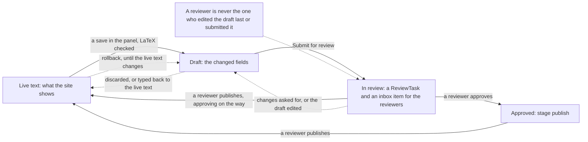
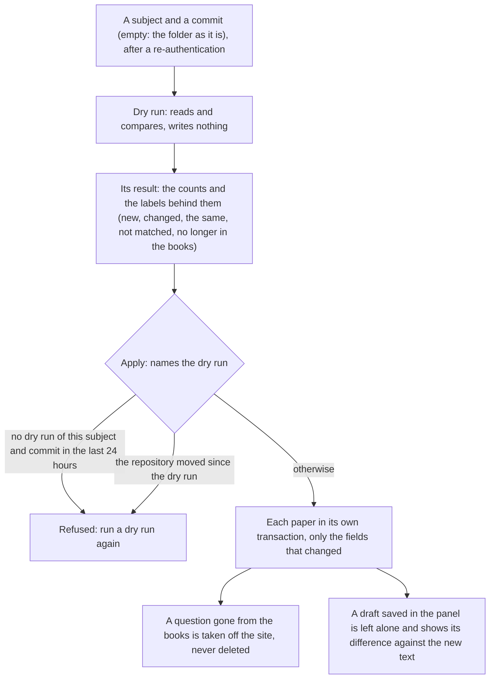

# content: the papers, their solutions, and the panel's content module

  

The books' papers as the website and the app show them (board, class, subject, book, paper, question, solution, read
from the books repository by `import_papers`), and, since Phase B, the Admin Control Panel's content module: a
question's or a solution's text changed in the panel as a draft that a second person reviews and publishes, the mistakes
readers report and their triage, the errata, the imports as staff jobs, the legal deposits, and the ISBN and LaTeX
checks. The panel draws what the API answers and decides nothing itself. Developers read it for the rules; what each
role's pages do is under "The module's pages, by role". The endpoints are in [API.md](../API.md) "Content (staff)", and
the public "Report a mistake" and errata in "Catalogue and solutions"; the rules every staff endpoint keeps are
[staff/README.md](../staff/README.md)'s.

> [!NOTE]
> **At a glance**
> - The site shows a question's or a solution's live text; the panel only ever writes its draft, after the LaTeX
>   check, and a second person reviews and publishes it.
> - A publish keeps the text it replaced on the review, so `rollback` can put it back until the live text changes
>   again; the panel offers five seconds to undo.
> - An import is a staff job: a dry run writes nothing, and its apply names the dry run (within 24 hours, the same
>   subject and commit) and refuses to run if the repository moved.
> - Readers' reports (5 an hour, 20 a day per address) are triaged: reported, confirmed or rejected, fixed online,
>   fixed in a printing; the errata list the confirmed and fixed ones.
> - Each book's legal deposits (four libraries, 30 days after publication) are an inbox item until all four have their
>   copy.

| File | What |
|---|---|
| `models.py` | `Board`, `ClassLevel`, `Subject`, `Book` (with its `isbn`, `format`, `published_on`), `Paper`, `Question` and `Solution` (each with `state`, `draft`, `draft_by`, `published_at`, `published_by`; a question also `is_published`), `ReviewTask`, `ErrorReport`, `LegalDeposit` |
| `review.py` | the draft and its review: `save_draft`, `discard_draft`, `submit`, `approve`, `needs_changes`, `publish`, `rollback`, `restore`; the line diffs |
| `reports.py` | reported mistakes: `receive` (the spam rules), `transition` (the triage), `tell`, `errata`, `purge_spam`, `flag_items` (the item analysis's flags) |
| `imports.py` | the books repository read and compared (`import_subject`), a dry run or its apply as a staff job (`run_job`, `clean_params`) |
| `latex.py` | the structural LaTeX and Markdown check of every text saved in the panel |
| `isbn.py` | the ISBN-13 check (python-stdnum), for the book and the shop's product |
| `staff_api.py` | `/api/v1/staff/content/` |
| `tasks.py` | the nightly jobs below |
| `../api/reports.py` | `POST /api/v1/reports/` (Report a mistake) and `GET /api/v1/errata/` |
| `management/commands/import_papers.py` | the import from the shell (`--dry-run` compares and writes nothing) |
| `admin.py` | the Django admin: the text of questions and solutions read-only for all but superusers (it changes through the panel's review); reviews, reports and deposits read-only |

## The live text and its draft

What the site shows is a question's or a solution's live text. The panel never changes it directly: a save writes the
record's `draft` (`{field: value}`; a question's text, table, options, marks, group and part headings and its OR flag,
a solution's Markdown), after the LaTeX check, and the record's `state` becomes `draft`. A field typed back to its live
value leaves the draft; an empty draft puts the record back to `published`. A question's order, label and tags change
at once (the import keys on the label). Every save is a version in the record's history (django-simple-history), and
any version can be brought back: a book's or a paper's fields at once, a question's or a solution's text into the
draft, to be reviewed like any other change.

## The review: always two people

`submit` sends the draft to a reviewer: a `ReviewTask` (stage `check`, state `in_progress`) holding a copy of the draft,
the record `in_review`, and an inbox item for the reviewers of the subject (`staff.publish_paper`) or the one named. A
reviewer approves it (stage `publish`), asks for changes with a comment (the editor's inbox item says so, the record is
a draft again) or publishes it, approving it on the way. A publish refuses a draft changed since it was submitted; a
change to a draft in review withdraws the review (submit it again). A publish keeps the text it replaced on the review
(`previous`): `rollback` puts it back live and the published text back into the draft, until the live text changes again
(an import, a later publish). In the panel a publish can be undone for five seconds after it, the same way. Every step
is an audit event naming the record by its codes.

> [!IMPORTANT]
> **The two-person rule has no override.** Whoever edited the draft last or submitted it decides nothing on it
> (`403 own_edit`), owners included.

*A draft's way to the live text: submitted, reviewed, published, and undone by a rollback until the live text changes again.*

## Reported mistakes and errata

Readers report from each solution of `/s/<code>/` and from a revision clip (the website's "Report a mistake"): the
page fills in the paper, the question, the step and the print run its QR code carried (`?printing=`); the reader picks
what is wrong and may add a note and an address to hear of the fix. A signed-in reader is kept as the reporter, a
verified teacher's report marked. Turnstile, a honeypot and 5 an hour and 20 a day per client address keep bots out;
a note that reads as spam (a link, markup, one character over and over, no word at all) is kept apart, out of the
queue, and deleted after 30 days. Each report opens an inbox item for whoever triages its subject
(`staff.triage_report`). The triage: reported, then confirmed or rejected (with a reason), then fixed online, then
fixed in a printing (`fixed_in`, the print run that carries the fix); a rejection can be reopened. Once fixed, "Tell
the reporter" emails them once (if they left an address), and the address is deleted then, or at a rejection. The
quiz's item analysis (`insights.ItemStat` with flags) joins the same queue nightly as reports of category
`item_analysis`, once per item and not again within 30 days of one closed. The errata (`errata/`) are the confirmed and
fixed mistakes per book and printing; those marked `public` are the website's (`GET /api/v1/errata/?book=`).

## Imports

`import_papers` and the panel's import read the same code (`imports.import_subject`). In the panel an import is a staff
job (`content_import`, `staff.import_content`, a re-authentication first): a dry run compares a subject of the books
repository (a commit, read with `git archive`, or the folder as it is; the test papers on a test site) with the
database and writes nothing, its result the counts and the labels behind them (new, changed, the same, not matched, no
longer in the books). Its apply names the dry run, within 24 hours and for the same subject and commit, and refuses to
run if the repository moved since; it writes each paper in its own transaction and only the fields that changed (the
history stays meaningful), and takes a question gone from the books off the site (`is_published`) rather than deleting
it. An import changes the live text and leaves a draft saved in the panel alone: the draft then shows its difference
against the new text. The server needs git and the books repository's checkout (`PAPERS_ROOT`, DEPLOYMENT.md section 4).

*An import in the panel: the dry run first, then an apply that names it.*

## Legal deposits

The Delivery of Books and Newspapers (Public Libraries) Act asks for one copy of every book and edition at four public
libraries (the National Library in Kolkata, the Connemara Public Library in Chennai, the Central Library of the
Asiatic Society in Mumbai, the Delhi Public Library) within 30 days of publication (`CONTENT_LEGAL_DEPOSIT_DAYS`; the
period is to be verified against the Act). A book's `published_on` starts the clock; each copy sent is recorded with
the day, the proof (a receipt or a consignment number, a scan of it optionally) and the ERPNext delivery note if any.
A nightly task keeps one inbox item per published book still missing some libraries, due on the last day, closed once
the four have it.

## ISBN and LaTeX

An ISBN is checked when it is set or changed (13 digits starting 978 or 979, the last one its check digit; hyphens may
be typed), on the book (stored as 13 digits) and on the shop's product (kept as typed). The LaTeX check
(`latex.problems`) is structural, without a renderer: `$`, `$$`, `\(`…`\)` and `\[`…`\]` closed (maths in a line on its
line), braces balanced and environments matched within each formula, no `\href`, `\url`, `\includegraphics` or
`\html…`, no raw HTML outside maths, a picture with its alt text (or the title "decorative") and a source of ours or
https. It gives no false alarm on the books repository's 23,217 texts. The panel's editor also parses every formula
with KaTeX before a save, with the website's options.

## The module's pages, by role

- **CONTENT_EDITOR** (within their subjects): the home's queues; books (add one, its ISBN, format, edition and
  publication day) and papers (title, time, the questions and solutions as a tree, the QR code of a print run); the
  editor of a question or a solution, with its preview as the site draws it and its history, then Submit for review;
  the reported mistakes to triage and the errata; the legal deposits to record. Never publishes.
- **REVIEWER** (within their subjects): the reviews waiting for them, each with its line diff and preview: approve,
  ask for changes, publish (five seconds to undo), never on their own draft; a paper published or unpublished, or made
  the book's open sample (`staff.publish_paper`); the last publish undone; the triage; the imports (a dry run, then its
  apply).
- **SUPPORT**: reads the reported mistakes ("did you get my report?") and nothing else here.
- **OWNER** and **ADMIN**: everything, still never deciding a draft they edited or submitted. **AUDITOR**: reads.

## The jobs

| When (India time) | Task |
|---|---|
| 02:20 | `content.tasks.flag_items`: the item analysis's flags to the triage queue (after insights' item analysis at 01:45) |
| 04:10 | `content.tasks.purge_spam`: spam reports older than 30 days deleted |
| 07:00 | `content.tasks.check_legal_deposits`: one inbox item per published book still missing libraries |

## Not built yet

Comments on a single line of a draft (a comment names a field); assigning a review to someone from the panel's
review page (the API takes `assignee` on submit); the website's public errata page (the API is there); the reports of
a quiz item from the app (the API takes them).

## Related documents

- [staff/README.md](../staff/README.md): the rules every staff endpoint keeps, and "Jobs" for `content_import` and its
  inbox items
- [learn/README.md](../learn/README.md): the Course module, whose quiz bank joins the same triage queue
- [insights/README.md](../insights/README.md): "Item analysis", the flags that reach the triage at 02:20
- [API.md](../API.md): "Content (staff)", and "Catalogue and solutions" for the public report and the errata
- [RUNBOOK.md](../RUNBOOK.md): "Content", an import, a wrong solution, undoing a publish, QR codes, legal deposits
- [DEPLOYMENT.md](../DEPLOYMENT.md): section 4 (`PAPERS_ROOT`, the books repository's checkout)
- [CONTENT_EDITOR.md](../../docs/guides/roles/CONTENT_EDITOR.md): the role's page (books, papers, the editor, the
  triage)
- [REVIEWER.md](../../docs/guides/roles/REVIEWER.md): the role's page (reviews, publishing, undoing, imports)
