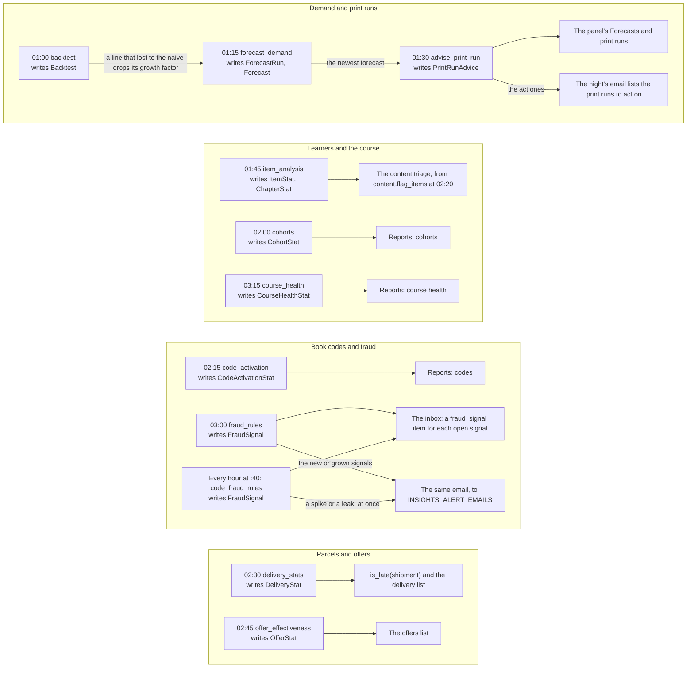
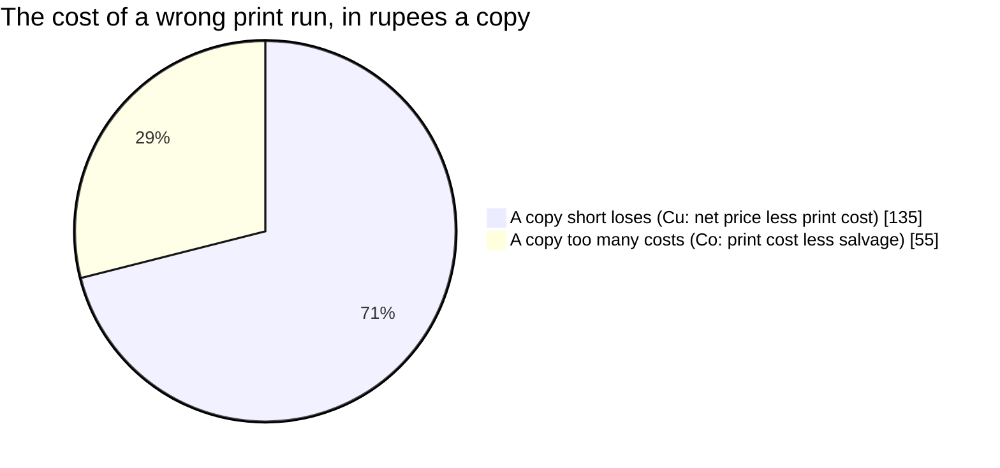

# Insights: the predictive jobs of the Admin Control Panel

   

The numbers the panel shows beside the facts: demand forecasts and print runs, the quiz's item analysis, cohorts, code
activation, delivery times, fraud signals and what offers did; and, since Phase B, the numbers of Home and the reports
(the metrics, the reports, their exports: "Home and Reports" below). The research behind every method is
[research-b2b-predictive.md](../../docs/research/2026-10-09-admin-control-panel/research-b2b-predictive.md), section 4
(and section 0 for why). Developers read it for the methods and the rules every number follows; whoever runs the season
reads "The monthly review, in season".

> [!NOTE]
> **At a glance**
> - Each job is a function over the database's rows that writes its own rows in one transaction; a Celery task runs
>   each at night from 01:00 to 03:15, and `manage.py insights_run <job>|all` runs them by hand.
> - A method must beat a naive baseline before the panel shows it, and every number says how it was made: the method,
>   `data_as_of`, the last backtest, `n` and, for a prediction, a range from P10 to P90.
> - Rules before machine learning: below about 200 known outcomes a model only fits noise, so every score is a rule
>   with its reasons.
> - Learner data stays aggregate (DPDP Act s. 9(3)): no row points to an account, a group under 5 shows its size only,
>   and nothing here feeds marketing, prices or offers.
> - Fraud rules count keyed hashes, never raw phone numbers, emails or IP addresses.
> - Home and the reports define each number once (`metrics.py`) and hide a cell under `INSIGHTS_MIN_CELL` (10) or
>   `INSIGHTS_MIN_CELL_CLASS` (5).

## Contents

- [The nightly pipeline](#the-nightly-pipeline)
- [The rules every number follows](#the-rules-every-number-follows)
- [The jobs](#the-jobs)
- [Home and Reports (Phase B)](#home-and-reports-phase-b)
- [The monthly review, in season](#the-monthly-review-in-season)
- [When to graduate a method](#when-to-graduate-a-method)
- [Seams](#seams)
- [Related documents](#related-documents)

## The nightly pipeline

Each job is a function over the database's rows (`insights/jobs/`) that writes its own rows in one transaction. A
Celery task runs each at night (01:00 to 03:15, `settings.CELERY_BEAT_SCHEDULE`), `manage.py insights_run <job>|all`
runs them by hand, the admin lists their rows read-only (Insights), and `/api/v1/insights/` gives them to staff
(API.md, "Insights (staff)"). The arithmetic is in `insights/stats.py`, on plain lists, checked against numbers worked
out by hand in `insights/tests/test_stats.py`. No library beyond the standard one: seasonal naive, a growth factor,
quantiles and correlations are a few lines each.

*Each job writes its own tables over the database's rows, and the panel, the reports, the content triage and the inbox read them.*

## The rules every number follows

- **A method must beat a naive baseline before the panel shows it.** The backtest stores `shown`; the API says
  `shown` and gives the last backtest's errors with every forecast. A forecast whose method has not been backtested
  yet (fewer than two seasons of sales) says so (`backtest: null`, `shown: false`): the panel labels it, or hides it.
- **Every number comes with how it was made:** the method, the data's time (`data_as_of`), the last backtest, the
  sample size (`n`), and a range (P10 to P90) where it is a prediction.
- **Rules before machine learning.** Below about 200 known outcomes (returned parcels, schools won or lost), a model
  only fits noise. Every score here is a rule with its reasons, the strongest three first.
- **Aggregate learner data only.** The DPDP Act, s. 9(3), forbids "tracking or behavioural monitoring of children or
  targeted advertising directed at children"; a child is anyone under 18 and most Class 12 students are. ExamLeaf is
  not an educational institution, so the exemption for schools does not cover it. So: no row in this app points to an
  account (a test asserts that no model has a key to the user or the learner), no per-learner list, risk score or
  ranking, groups under 5 show their size only, and nothing here may feed marketing, prices or offers. Flags about one
  student are for a school that is the data fiduciary, with ExamLeaf its processor, and only after legal review.
- **No raw phone numbers, emails or IP addresses.** What the fraud rules count (an account, an IP address, a phone
  number, an address, a code) is a keyed hash (`INSIGHTS_HASH_SALT`, else `SECRET_KEY`): equal values match, none can
  be read back. A new key starts the counts afresh.

A `district` of null is every district together; "unknown" is a PIN code missing from India Post's directory and
no district typed in the address (or, for book codes, no order to take one from).

## The jobs

### Demand forecast (`forecast_demand`, 01:15)

- **Inputs:** the copies of each printed book sold (orders that count: placed, not cancelled or refunded, not test
  mode on a live site; a bundle's copies count for its books), by week of the season and by district (the order's PIN
  code through `PinCode`, else the district typed); "email me when it is back" requests as copies the stock-out hid;
  the exam seasons staff enter (admin, Insights, Exam seasons). A season is the 52 weeks before its first paper.
- **Method:** a title's line is every printed book of its subject and kind (a new edition is a new product, so a new
  title takes the previous title's curve). Week w this season = week w last season × a damped growth factor: this
  season so far ÷ the same weeks last season, pulled toward 1 while few weeks are in (weight weeks ÷ (weeks + 4)).
  The growth factor is dropped (1, the plain seasonal naive) for a line whose backtest found it worse than none.
  P10 and P90: the 10th and 90th percentiles of last season's one-week-ahead errors (actual ÷ forecast) once there are
  ten weeks of them, else the stated default of 0.6 and 1.5 times the median. Districts: top-down, by last season's
  shares (never Croston's method on tiny district series). Two wanted titles of one line share its forecast by their
  sales this season.
- **Output:** a `ForecastRun` (method, parameters with each title's growth, spread, whether backtested and its share
  of the line, data time, code version) and its `Forecast` rows: per title and week from this week to the exam, every
  district together and each district.
- **How to read it:** P50 is the middle of the week's copies; two weeks in ten fall outside P10 to P90. `n` is the
  copies the forecast stands on: below a few dozen, read the range, not the middle. Nothing is forecast for a line
  with no sales last season: the first season gives the history.

### Backtest (`backtest`, 01:00)

- **Method:** rolling origin across last season's 52 weeks, from each origin (the weeks before it known) the forecast
  1 and 4 weeks ahead from the season before, against the seasonal naive (the same week of the season before). WAPE =
  sum of absolute errors ÷ copies sold (never MAPE: it divides by weeks that sold nothing); seasonal MASE = the
  method's mean absolute error ÷ the seasonal naive's on the same weeks. A row without a title sums every line.
- **How to read it:** MASE below 1 beats the naive, and `shown` is true. Four weeks ahead decides (about a reprint's
  lead time).

### Print-run advice (`advise_print_run`, 01:30)

- **Inputs:** the newest forecast; the title's print cost per copy, salvage per copy, copies on order and reprint
  lead time (admin, Insights, Print costs; ERPNext is to own them); its stock; the blended net price of the last
  year's sales after discounts (the selling price before it sold).
- **Method:** the newsvendor. A copy short loses Cu = net price − print cost, a copy too many costs Co = print cost −
  salvage; print the season's demand at the quantile Cu ÷ (Cu + Co). Net ₹195, print ₹60, salvage ₹5: 135 ÷ 190 =
  0.71, the P71. The quantile comes from the season's P10, P50 and P90 (a log-normal through them, each side its own
  spread). Reprint trigger: reprint once stock + on order ≤ the P90 of the demand over the lead time (the forecast
  plus the safety stock). Weeks of cover: the weeks the supply lasts, walking through the weekly forecasts.
- **Output:** a `PrintRunAdvice` per title: copies to print now, the target, the trigger, weeks of cover, the copies
  left at the exam, and a level: **act** ("reprint now": the supply is at the trigger, or lasts less than the lead time
  and a week), **watch** ("print N more for the season", or a leftover above 10 % of the supply beyond the target:
  move copies to distributors or stop the reprint), **ok**. The night's email lists the "act" ones.
- **Not yet:** printing less first and reprinting before the peak (the reprint option priced), B2B demand (the
  adoption pipeline × stage probabilities, from ERPNext).

The newsvendor's split in the example above: a copy short loses more than a copy too many costs, so the season's demand
is printed at a high quantile.

*Net price ₹195, print cost ₹60, salvage ₹5: Cu ÷ (Cu + Co) = 135 ÷ 190 = 0.71, the 71st percentile.*

### Item analysis (`item_analysis`, 01:45)

- **Inputs:** each learner's first attempt at each quiz item, and the option chosen for multiple choice
  (`learn.QuizAttempt.chosen`, recorded from 9 October 2026).
- **Method:** p = the share right; discrimination = the corrected item-total point-biserial (the answer against the
  learner's share right on the chapter's other items). Flags, TIMSS's thresholds: `low_discrimination` (below 0.10),
  `too_easy` (p above 0.95), `too_hard` (p below 0.25, multiple choice), `distractor_<n>` (a wrong option with a
  positive point-biserial: often a wrong key). Only once 30 learners answered (an own rule of thumb); n is always shown.
  The chapter's accuracy: the mean of its learners' shares right, and the last four weeks' less the four before.
- **How to read it:** fix the flagged items, choose webinar topics from hard chapters, look for errata. A flag is a
  prompt to look, not a verdict: an option chosen by a handful of learners can show a positive point-biserial by
  chance (the seeded data of 9 October did, with six).

### Cohorts (`cohorts`, 02:00)

- **Method:** a cohort is the month a learner's course first opened and how (book code, purchase, staff grant); each
  week since, the share active (a quiz answer, a flash card or a clip that day; a clip counts on the day of its last
  progress only, as the course keeps no more), and the share gone quiet (no activity for 14 days), while the exam is
  ahead (the exam date the learner gave). Groups under 5: the size only.
- **How to read it:** retention curves to compare cohorts; never a list of who left. Nudges go only through the
  reminders a learner turned on.

### Code activation (`code_activation`, 02:15)

Codes printed and redeemed per batch, in all and in the last 7 days, and by district: the redeemer's last order of the
code's subject before the redemption (its PIN code); a code from a book bought in a shop has none ("unknown").
Districts with fewer than 5 redemptions in a batch are counted together as "other districts".

### Delivery (`delivery_stats`, 02:30)

Days from shipped to delivered, per courier and destination district over the last year: the median (what checkout
could promise) and the P90. `insights.jobs.delivery.is_late(shipment)` is true past the route's P90 (5 deliveries
needed, else the courier's anywhere): the time to chase the courier.

### Offer effectiveness (`offer_effectiveness`, 02:45)

For each coupon and offer used in the last year: the orders that used it, their revenue, the discount given, every
order while it ran, every order in the same weeks a year before, and a 95 % interval for the ratio of the two (counts
taken as Poisson, the normal approximation on the log scale). Below 30 orders on either side, or when it ran last year
too, or when the interval holds 1, the note says "Not conclusive". It never names a winner: stopping as soon as a test
looks good turns a 5 % false-positive rate into 26 %.

### Fraud rules (`fraud_rules`, 03:00, then the email; the book codes' again every hour)

Each finding is a `FraudSignal`: its kind, the subject's hash, a count, a window, and details with no personal data
(the batches, and the order numbers or book code ids behind it, at most 20, for staff to open):

- failed book codes from one account (5), one IP address (10) or one device (5; the app sends its device token with
  the code, kept as a hash) in an hour, and an hour with at least 20 failures and three times the median hour of the
  week before (OWASP's token cracking); every try in the app is kept as a `RedemptionAttempt` (hashes of the account,
  the address, the device and the code, the batch, the outcome, a voided code's `void`; 180 days);
- codes redeemed from a print run not yet marked dispatched in the panel, within 30 days (a leak from the printer:
  `codes_undispatched`, the batch's hash and its label);
- one account redeeming more than 4 codes in 30 days (resale); one code tried by 3 accounts (a shared photo);
- 3 accounts sharing a phone number or an address on cash-on-delivery or coupon orders in 90 days.

A signal seen again updates the open one; once acknowledged (admin action), it comes back only if it grew. Each open
signal is an inbox item of kind `fraud_signal` (for `staff.acknowledge_signal`), closed when the signal is
acknowledged; the panel's print run page lists the signals that name it. The email to `INSIGHTS_ALERT_EMAILS` lists
the night's new or grown signals and the print runs to act on; the book codes' rules run again every hour
(`code_fraud_rules`, at :40), and a new spike of failures or a leak is emailed within that hour. Not built: repeated
COD refusals (the shipping app records a parcel returned to origin, and no rule counts them yet).

### Course health (`course_health`, 03:15)

How the revision course is used, by subject and chapter, as counts over complete days (92), weeks (56, Monday to
Sunday), months (14) and the last 7 and 28 days, each for the whole course, a subject and a chapter
(`CourseHealthStat`). Today is not counted, a week or a month only once over; staff accounts, which preview the course,
are not learners.

- **Inputs:** `Progress` (a clip's saved progress, counted on the day of its last save: the course keeps no completion
  time), `QuizAttempt` and `CardReview`.
- **Method:** the learners of a period are counted once however much they did, in memory (the distinct learners of a week
  cannot be added up from its days) and only the number is kept; clips started and completed, quiz answers and the right
  ones, flash cards turned over and the ones not known (lapses) are sums. A subject is a run per subject, six queries
  each. The night's rows replace the night before's.
- **How to read it:** a period without activity has no row (the report fills it with zero); a cell standing on fewer than
  `INSIGHTS_MIN_CELL_CLASS` (5) learners is hidden by the report. `computed_for` is the day it counted up to.

### Rules without a job

- `insights.jobs.risk.rto_risk(order, history)`: a cash-on-delivery order's risk of coming back unpaid. The PIN code's
  return rate smoothed toward its district's (20 parcels' weight), the customer's earlier returns, a first COD order,
  the order's value, a PIN code missing from the directory or in another state: **high** from 4 points (prepaid only,
  or confirm by SMS or WhatsApp), **medium** from 2 (a call), **low** (ship). `history` (`RtoHistory`) is what
  `history_for(order)` reads from the shipping app's parcels of the last 365 days: the cash-on-delivery ones
  delivered or returned to origin, to the order's PIN code and to its district, and the customer's earlier returns
  (matched by account, email address, or keyed hashes of the phone number and the address, compared and never
  kept) and earlier cash-on-delivery orders. The Orders module scores each such order with it when it is placed
  (`shop.services.assess_risk`). Zeros stand for a PIN code with no outcomes yet.
- `insights.jobs.risk.score_account(signals)` and `score_accounts(kind, accounts)`: a school's or distributor's
  score (ordered or adopted last year, verified teachers, codes redeemed nearby, a sample followed up, Class 12 pupils,
  months without contact), into `AccountScore`. No data source yet: the schools and distributors will be ERPNext's.

## Home and Reports (Phase B)

The panel's Home and its reports (plan 5.1 and 5.16; API.md "Home and reports (staff)"). The code: `metrics.py` (the
numbers), `reports.py` (the report queries), `cells.py` (the minimum cell), `staff_home.py` and `staff_api.py` (the
endpoints), `exports.py` (the reports as files).

**One definition per number** (`metrics.py`). A metric is a function whose docstring is its definition, the very words
the panel shows when the number is hovered or its "How this is counted" opened: net revenue (the payments first captured
in the period, less the refunds processed in it; a cash-on-delivery order when its parcel is delivered), orders placed,
orders to pack (the Orders list's "To pack" tab itself: it is built on its filter), codes redeemed, active learners
(accounts with any course activity in the last 7 days, counted, never listed), clips completed, quotes open, tickets due
today and tickets breached (the Support list's own filters), reports open and items flagged (the Content list's), refunds
to approve, bank refunds to mark paid, unmatched settlement items and COD overdue. Home, the reports and the Django
admin's dashboard call them; nothing else counts the same thing (`shop/templatetags/shop.py` is built on them, and
`insights.jobs.counted_orders` is `metrics.live_orders`). A metric whose source is not installed (Finance's
settlements, Support, Content, Course) raises `Absent`: Home leaves its card out, a report says "not set up". At the
merge of Phase B all four are installed, so none does.

**Test mode is kept out by construction.** Every order a number stands on comes from `live_orders()`, and what hangs on
an order (a payment, a refund, a parcel's remittance, a refund waiting for approval) is narrowed through its order's
`livemode`, all on a live site; a site running on test keys has nothing to tell apart, counts everything and says
`test_mode`. Home also says how many test orders it left out (`test_orders_left_out`).

**Home** (`GET home/`, any member of staff): the cards of the person's roles whose permissions they hold, in the order
of `metrics.SPECS` (totals first, then what waits). The owners get the money (net revenue, orders, codes redeemed,
active learners) and every queue, FINANCE the refunds to approve, bank refunds, unmatched settlement items and COD
overdue (and net revenue), SALES the orders to pack and quotes open, SUPPORT the tickets due and breached, the content
editors and reviewers the reports open and items flagged, the PACKER the orders to pack and nothing else, the AUDITOR the
totals. A total carries the previous period of the same length (a plain number, the difference and the percent: no
chart); a queue is the figure of this moment. Each card is a link to the list or report it counts, already filtered.
Cards fail one by one: a number that cannot be worked out is a card with an `error`.

**The reports** (`GET reports/…`, `staff.view_insights` and the data's own `view_` permission, named through a callable
permission so that a refusal names the one missing): sales by product, subject, class, board, edition and period (day,
week, month; the period at most 13 months); sales by state (the place of supply), district and PIN code; codes by batch
(printed, activated, activated in the last 7 days, the activation rate, sold and revoked) and by district; the
course health above; cash on delivery (what is outstanding by how late, what was remitted and the difference);
Razorpay's settlements (the Finance module's `shop.Settlement`, the live ones of the period, newest first); and the
print-run sum
recomputed (`POST reports/print-run/`: the critical ratio `Cu / (Cu + Co)` of `stats.py` from the net price, print
cost and salvage typed, and the season's demand from the newest forecast at that percentile, less the copies in
stock and on order: net 195, cost 60, salvage 5 give 0.7105, the 71st percentile; nothing is stored). The cohorts, the
forecasts and the nightly print-run advice stay `insights/api.py`'s. Every report answers `definition`, each column's
definition, `as_of` (and `computed_at` where a night's job made the rows), `test_mode` and its `rows`.

**Two codes reports exist, and both stay.** This one (`GET reports/codes/`, the console's `/reports/codes/`;
`staff.view_insights` with `learn.view_bookcode`, so ADMIN, the owners and the auditor) counts every code by print
run, with the last 7 days, and the districts as `code_activation` counted them each night (`?batch=` narrows them; a
district under `INSIGHTS_MIN_CELL` is hidden). Its "sold" is the copies of the book the run is printed in, sold in
all (every run of that book together, from `learn.CodeBatch.product`; a run with no book has none) and its
"revoked" is the codes voided before use (`BookCode.voided_at`). Both columns were empty until the Course module
recorded the book of a run and the voided codes; they are filled now. The Course module's own report
(`GET course/codes/report/`, the console's `/course/report/`; `learn/README.md` "The codes report", for whoever reads
the print runs, `learn.view_codebatch`) is worked out when asked, run by run: its "sold" counts the run's own window
(until the next run of the book, a bundle holding it included), its "revoked" is the access a code opened that
staff took back, its "void" is the codes voided before use (this report's "void" too), and its districts follow
`INSIGHTS_MIN_CELL` as this report does.

**The minimum cell** (`cells.py`, the settings `INSIGHTS_MIN_CELL` (10: districts, PIN codes, states, cohorts, searches)
and `INSIGHTS_MIN_CELL_CLASS` (5: a chapter's or a class's learners); neither below 5, `insights.E001`): a cell standing
on fewer people or orders is hidden, its numbers null and `hidden: true, under: k` on the row; nothing is "fewer than k"
but a number between 1 and k - 1 (a cell of nobody says 0). No report answers a total that includes the cells it hides
(the place report's `totals_shown` is the rows shown), and the averages of the daily course-health series count a
hidden day as 0 so that nothing leaks through them. The minimum protects what a table shows; it is not statistical
disclosure control: two tables can still be subtracted by someone who works at it. The existing endpoints apply it too:
`insights/cohorts/` hides the shares of a week under 10 learners, `insights/code-activation/` the counts of a
district under 10 redemptions.

**No person anywhere.** No report row has a user, a learner, an address or a contact; the queries count and sum, they
never list an account (`test_report_export.py` runs every report and every export over a minor's order, code and
progress and finds none of them). Learner data stays aggregate: no per-student rows (DPDP Act s. 9(3), above).

**Exports** (`exports.py`): any report as the job `report_export` (`POST /api/v1/staff/jobs/` with `{"kind":
"report_export", "params": {"report": "sales", "filters": {...}}}`; `staff.export_report`, high: FINANCE, ADMIN, the
owners, AUDITOR; the starter needs the report's own permissions too): the filters of the page, a CSV in the private storage linked to its starter for 5 minutes at a time
and kept a week, capped by `export_rows` with ADMIN's approval above it, a dry run first if asked. A hidden row says
"fewer than 10" in a file, never a number; text a spreadsheet would run as a formula is written as text (a leading
`= + - @` tab or return gets an apostrophe; numbers, negative ones too, are left alone); the file ends with the member of
staff's number and the time. Each export is the audit event `report.exported` with the report, its filters and its
row count.

**What each role finds**: OWNER and ADMIN every card and every report; FINANCE net revenue, the refund queues, COD and the
sales, place and COD reports, and the exports; SALES the orders to pack, the quotes and the sales reports; SUPPORT the
tickets' cards; CONTENT_EDITOR and REVIEWER the content queues; PACKER the orders to pack; AUDITOR the totals and every
report, read-only, and the exports; MARKETING the forecasts, cohorts and signals it had (no new report: it lacks the
orders' and the learners' data permissions).

The console draws all of it (examleaf-admin/README.md "Routes"): Home (`/`) starts with the person's numbers, streamed on
their own and each a link to what it counts, then the inbox, approvals, clocks and health as before; Reports (`/reports/`)
has a tab for each report the role may open (the insights' permission and the data's, as the API asks for both), the
filters in the address, tables with a bar beside the figure, "How this is counted" on every page, "Export as a file"
for whoever holds `staff.export_report`, and, on Forecasts and print runs, the print run of a title worked out again with
the inputs typed. A PACKER's Home is the orders to pack and the inbox; a SUPPORT member's the tickets due and breached; a
FINANCE member's the money and the queues of refunds, bank transfers, settlements and cash on delivery.

## The monthly review, in season

1. `dj insights_review`: each title's last four complete weeks, the forecast made before each week began, the copies
   sold and the seasonal naive, with the WAPE of both.
2. Read the backtest (admin, Insights, Forecast runs, the newest backtest: its summary). A method that loses to the
   naive two months running is retired; the forecast already drops the growth factor of a line whose backtest it
   lost, and the review shows whether the naive keeps winning this season too.
3. Look at the "act" and "watch" print runs and the fraud signals still open; acknowledge what was handled.
4. Write what changed (a price, an exam date moved, a stock-out) into the season's notes (admin, Insights, Exam
   seasons): next season's review reads them.

## When to graduate a method

- **ETS** (statsmodels' `ETSModel`, Holt-Winters with a damped trend) once there are two or three seasons of weekly
  history, and only if it beats this method in the backtest. pandas and statsmodels come in then, not before.
- **Logistic regression** (scikit-learn) for COD returns after about 200 returned parcels, for schools after about 200
  with a known outcome; its probabilities are calibrated, which a random forest's are not. Prophet: no ("several
  seasons of historical data").
- Never for learners: no model predicts anything about one student here.

## Seams

- The API is on the staff app's rules (`staff.api.StaffAppView`): `staff.view_insights` (FINANCE, SALES, MARKETING,
  ADMIN, the owners, AUDITOR) reads, `staff.acknowledge_signal` (ADMIN, the owners) acknowledges a fraud signal there
  and in the admin; on the admin host only; refusals and acknowledgements in the audit log. Fraud signals file staff
  inbox items (`fraud_signal`), closed by the acknowledgement.
- `RtoHistory` is filled by `history_for()` from the shipping app's parcels (delivered or returned to origin; the RTO
  reason and a lost parcel are not read); the repeated-refusal rule and a model after about 200 outcomes are not
  built.
- The reports read other modules' models by name, lazily, and are silent where the model is not installed (all are,
  at the merge of Phase B): the Finance module's `shop.Settlement` (its `lines` give a settlement's refunds;
  `reports.SETTLEMENT_FIELDS` lists the field names tried, the real model's among them; its refunds are summed from
  its lines) and
  `shop.SettlementLine` (the unmatched-items card: a line matched to no payment, refund or payment link, adjustments
  apart), and the Course module's `learn.CodeBatch` (its `label` and `product`: a batch's title, for the copies sold)
  and `BookCode.voided_at` (the codes revoked). `insights/tests/test_other_modules.py` runs the reports on stand-ins of
  the Finance models and is the test that the two sides still fit; if a module names a field otherwise, `reports.py`
  and `metrics.py` are the places to say so.
- `PrintCost` and the stock are to come from ERPNext (Item valuation, purchase orders, stock per warehouse) through the
  integrations; `AccountScore` from its schools and distributors; a batch's dispatch date from its Book Code Batch.

## Related documents

- [learn/README.md](../learn/README.md): the course whose use the item analysis, cohorts, course health and the fraud
  rules count
- [shipping/README.md](../shipping/README.md): the parcels behind the delivery times and the return risk
- [content/README.md](../content/README.md): the triage that the item analysis's flags join
- [staff/README.md](../staff/README.md): the permissions, the inbox, and "Jobs" for `report_export`
- [API.md](../API.md): "Insights (staff)" and "Home and reports (staff)"
- [RUNBOOK.md](../RUNBOOK.md): "Insights": a failed job, a fraud spike, a number that looks wrong, the monthly review, a
  new season
- [DEPLOYMENT.md](../DEPLOYMENT.md): section 21, the predictive jobs and their settings
- [research-b2b-predictive.md](../../docs/research/2026-10-09-admin-control-panel/research-b2b-predictive.md): section
  4, the method behind every job, and section 0 for why
