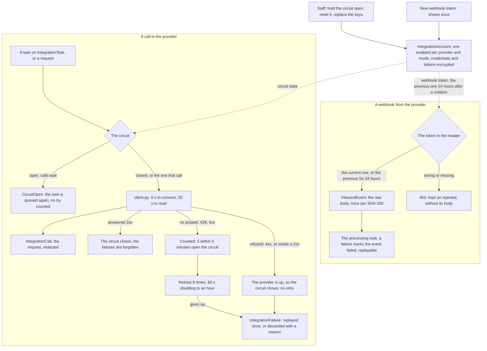

# integrations

   

The shared framework for every connection to a service others run for ExamLeaf: Shiprocket now (the `shipping` app), and
Razorpay, MSG91, SES, the storage and ERPNext when the admin panel manages them. It implements
[research-integrations.md](../../docs/research/2026-10-09-admin-control-panel/research-integrations.md) sections 3.3
(credentials), 3.10 (reliability, logs, test mode) and 5.2 (what the connections page shows), for the developers who add
a provider and the operators who keep its keys. Razorpay keeps its own webhook record (`shop.WebhookEvent`,
`shop/payments.py`); nothing here touches it.

> [!NOTE]
> **At a glance**
> - An `IntegrationAccount` is one provider in one mode (`test` or `live`), at most one enabled per provider; its
>   credentials and tokens are encrypted with `INTEGRATION_KEYS` and never shown whole.
> - Every request goes through `client.py`: logged (`IntegrationCall`, redacted) and counted by the account's circuit
>   breaker, which opens after 5 failures within 5 minutes and lets one trial call through after 5 more.
> - A task that calls a provider is retried on `IntegrationUnavailable` 8 times (60 seconds doubling to an hour, about
>   four hours) and then written to the dead-letter list, to be replayed once or discarded with a reason.
> - A webhook's token is the current one or, for 24 hours after a rotation, the previous one, compared in constant
>   time; a wrong one is kept as a rejected event without its body.
> - Razorpay's and MSG91's keys come from the environment until the panel holds some; Shiprocket's and ERPNext's are
>   the panel's alone.

## Contents

- [How the framework fits together](#how-the-framework-fits-together)
- [The model](#the-model)
- [Precedence: the environment's keys, then the panel's](#precedence-the-environments-keys-then-the-panels)
- [The connections page](#the-connections-page)
- [Adding a provider](#adding-a-provider)
- [Operations](#operations)
- [Related documents](#related-documents)

## How the framework fits together

An account is the hub: its keys are what a call is made with, its circuit decides whether the call is made at all, and
its webhook token decides who may call back. The call log, the inbound events and the dead letters are its records of
what happened, kept `INTEGRATIONS_RETENTION_DAYS` (90) days, the dead letters once dealt with.

*A call goes through the account's circuit and is logged; a webhook is let in by the account's token, the previous one still good for 24 hours after a rotation.*

## The model

| Model | What it is |
|---|---|
| `IntegrationAccount` | One provider in one mode (`test` or `live`); at most one enabled per provider, the one the site uses. Its secrets, encrypted: `credentials` (a JSON object: Shiprocket's API user's email and password), the cached access `token` (with `token_expires_at`), the `webhook_token` the provider sends with its webhooks and the `previous_webhook_token` (accepted 24 hours after a rotation). Also `rotate_by` (90 days after the credentials were set: our policy), `scopes` (what the credentials may do, as the provider granted it), `where_else_configured`, the last success, error and connection test, and the circuit breaker. |
| `IntegrationCall` | One request made to a provider: operation, method, path (no query string), status, duration, the provider's request id, the error, and an excerpt of what went and came back, redacted (`redact.py`: names dropped, phone numbers to their last four digits, email addresses masked, an address to its PIN, a proof of delivery dropped). |
| `IntegrationFailure` | The dead-letter list: a task that gave up (retries used up, or refused for good), with its arguments (ids, redacted all the same), tries and last error. `replay()` runs the task again once; `discard(reason)` needs a reason. |
| `InboundEvent` | A webhook as it came: the raw body and its SHA-256 (unique per provider: a repeat is kept once), a few headers (never the token), its state (`accepted`, then processed; `duplicate`: nothing new in it; `rejected`: a wrong or missing token, kept without its body; `failed`) and `replay()`. |

A secret is never shown or serialised: `masked()` gives the last four characters of each. Every model has a `__str__`
and a stable `kind` (`integration_account`, `integration_call`, `dead_letter`, `inbound_event`) for the staff inbox
and the audit log.

**Encryption** (`crypto.py`): Fernet through `cryptography`'s MultiFernet over `INTEGRATION_KEYS`, newest first: a
value is encrypted with the first key and read with any of them; `rotate()` encrypts a token again under the first key,
keeping its timestamp. Development and the tests, without keys, use one made from `SECRET_KEY`; a server has none of
its own and refuses to migrate (so to start) once an account exists (`integrations.E001`); a value that is not a
Fernet key stops the settings.

**The circuit breaker**, per account: closed (calls go through); open after 5 failures within 5 minutes (calls wait);
after 5 minutes one trial call goes (half open: a compare-and-set on the row, so one caller wins it), which closes it
again or opens it for another 5 minutes. A failure is the provider's (no answer, 429, 5xx); a refusal (4xx) proves it
is up. Staff hold it open (`force_open()`: no trial until `reset()`) or reset it. `integration_failed` is sent when it
opens, `integration_recovered` when it closes.

**The client** (`client.py`): httpx, 5 seconds to connect and 20 to read (`INTEGRATIONS_CONNECT_TIMEOUT`,
`INTEGRATIONS_READ_TIMEOUT`; a call may give its own, e.g. the 3-second quote). It makes no call while the circuit says
wait (`CircuitOpen`), logs each request, counts it for the circuit, and turns a failure into
`IntegrationUnavailable` (try again later; on a 429 or 503 its `retry_after`, the seconds the provider's
`Retry-After` asks for), `IntegrationRejected` (the provider answered and refused, also inside a 2xx for providers that
do that: `body_error()`) or `IntegrationAuthFailed` (401, 403).

> [!WARNING]
> **Never call a provider inside `transaction.atomic()`**: a failure would roll back its own log line and the
> breaker's count with the caller's changes. Claim the row instead (`shipping.models.ShipmentDetail.claim`), and save
> each step's result as it comes.

**Tasks** (`tasks.py`): `@shared_task(base=IntegrationTask, bind=True)`. Arguments are ids, never personal data. A
task is retried on `IntegrationUnavailable` after 60 seconds doubling to an hour, jittered, 8 times (about four hours:
the refund task's settings), put back in the queue without counting a try while the circuit is open, and written to
the dead-letter list (`dead_letter_created`) when it gives up. Run inline (tests, development without a broker), a
retry or an open circuit is raised to the caller instead. `InboundEventTask` is the base of a webhook's processing
task (a failure marks its `InboundEvent` failed); `services.dead_letter()` writes a dead letter for work that retries
by itself rather than through Celery (the ERPNext outbox).

**Signals** for the staff inbox (`signals.py`, sent after the commit): `integration_failed` and `integration_recovered`
(an item while the circuit is open), `dead_letter_created` and `dead_letter_closed` (replayed or discarded),
`inbound_event_failed` (its item closes once a replay processes the event). The staff app files and closes the items
(`staff/signals.py`), for the holders of `staff.view_system`; the ERPNext sync files its own dead letters instead
(`erp/inbox.py`, for `erp.replay_sync`).

## Precedence: the environment's keys, then the panel's

Razorpay and MSG91 started with keys in `.env` (`RAZORPAY_*`, `MSG91_AUTHKEY`); the panel can now hold them
(`services.panel_keys`, `PANEL_MANAGED`). The rule, read through the shared cache and forgotten at every change of an
account (`models.forget_panel_keys`, at once and again after the commit):

- **No account of the provider holds credentials**: the environment's keys apply, as before. The connections page
  shows them as `source: environment`, their last four characters only.
- **An account holds credentials and is enabled**: its keys apply, and Razorpay's webhook secrets are the account's
  (the current one and, for 24 hours after a rotation, the previous one). `shop.models.razorpay_keys` and
  `ops.sms.authkey` read them.
- **Accounts hold credentials, none is enabled**: the provider is switched off (`{}`): no payment link, no SMS.

So the first keys pasted in the panel must be of the mode the environment's run (Razorpay's `rzp_live_` or
`rzp_test_` key; MSG91's is live),
take over at once with the environment's webhook secret carried over, and nothing stops between the two
(`connections.replace_credentials`). Shiprocket and ERPNext have only the panel's (`PANEL_ONLY`); SES, the buckets,
Google and the error tracker stay in the environment, their cards read-only.

## The connections page

`connections.py` (the providers, the cards and the actions) and `api.py` (`/api/v1/staff/connections/`, API.md
"Connections (staff)"), for OWNER and ADMIN (`staff.manage_connections`, high: re-authenticated, audited, the owners
emailed) and read by FINANCE and AUDITOR (`integrations.view_integrationaccount`):

- **A card per provider** (`connections.PROVIDERS`: its kind, the fields its keys need, its modes, its webhook's
  authentication, whether it has a circuit): status (connected, degraded, expired, disabled, not configured), mode,
  where the keys come from, each credential's last four characters with who set it and when, the rotation due, the
  last test, the circuit, the calls of 24 hours and 7 days with their errors and p90, and what the provider adds
  (Razorpay's webhook health, MSG91's SMS and delivery reports, SES's bounce and complaint rates against 5 % and 0.1 %,
  the buckets, ERPNext's sync).
- **Test**: one harmless authenticated read with the keys in force (`CONNECTION_TESTS`), kept on the account.
- **Replace the keys**: the new ones tested first in the same request and kept only when the test passes; the audit
  event holds their last four characters before and after, never the keys. **Mode**: test, live or off.
  **Circuit**: held open or reset (Shiprocket and ERPNext, whose calls go through `client.py`).
- **Webhooks**: our address, the authentication, the token's last four characters, the week's events by state and
  `silent` (nothing for `INTEGRATION_WEBHOOK_SILENCE_HOURS` while the account is in use: `tasks.watch_webhooks` opens
  `webhook_silent` for Razorpay); a new token shown once, the previous one valid 24 hours.
- **Events, calls and dead letters**: listed, filtered and paged; an event or every failed one since a time processed
  again (`staff.replay_webhook`); a dead letter replayed once or discarded with a reason (ERPNext's through its
  outbox: `erp.replay_sync`).

## Adding a provider

1. Name it: `integrations.models.PROVIDERS["delhivery"] = "Delhivery"` in the new app's `AppConfig.ready()` (the
   field's choices read the dict: no migration).
2. A client: subclass `integrations.client.Client`, set `base_url`, give `headers()` (its authentication) and, if it
   answers errors with a 2xx, `body_error()`.
3. Its connection test, a harmless authenticated read: `integrations.services.CONNECTION_TESTS["delhivery"] = test`
   (a function of the account that returns what it read in a few words; build the client with `force=True`).
4. Its webhooks, if any: a view that checks the token (`account.webhook_token_matches(header)`, or for a provider
   that signs the body, an HMAC with each of `account.webhook_secrets()`: the current one and, 24 hours after a
   rotation, the previous), keeps the body
   (`integrations.services.receive_event`) and answers at once; the processing task in
   `integrations.models.INBOUND_PROCESSORS["delhivery"]` (a dotted path).
5. Its tasks on `IntegrationTask`, idempotent (look before you create).

## Operations

- **Keys.** `INTEGRATION_KEYS` in `.env`, e.g. one key made with
  `python -c "from cryptography.fernet import Fernet; print(Fernet.generate_key().decode())"`. Keep it with the other
  secrets' backup: a database backup without it cannot be read (RUNBOOK.md "Integration keys").
- **Rotation of the keys.** Put a new key first (`INTEGRATION_KEYS=new,old`), restart, run
  `manage.py rotate_integration_keys`, then remove the old key and restart again.
- **Credentials.** The panel's Settings → Connections (above): Replace the keys (tested before they are kept),
  Test, New token. The Django admin's actions stay for a break-glass session: Admin → Integrations → Integration
  accounts: "Replace the credentials" takes the JSON, never shows it again; then the action "Test the connection".
  "New webhook token" shows the new token once, on a page of its own, to paste at the provider within 24 hours (the
  previous one works that long).
- **Health.** `/health/integrations/` (a second uptime monitor, apart from `/health/`) fails while an enabled account
  has been unavailable for 30 minutes, or dead letters or failed inbound events wait.
- **Dead letters and failed events.** The connection's page in the panel (Replay, Discard with a reason, Process
  again, or every failed event since a time); the same in Admin → Integrations.
- **Retention.** `integrations.tasks.purge_old_records` at 04:45 deletes the call log, the inbound events and the
  dead letters dealt with older than `INTEGRATIONS_RETENTION_DAYS` (90); `manage.py integrations_retention` does it
  by hand.

## Related documents

- [shipping/README.md](../shipping/README.md): the first provider on the framework, with its carriers, webhook and tasks
- [ops/README.md](../ops/README.md): MSG91's delivery reports, SES's tracking webhook and the template registry
- [shop/README.md](../shop/README.md): "Finance", Razorpay's settlements read through the client
- [staff/README.md](../staff/README.md): the staff inbox the signals feed, and the permissions that read the connections
- [API.md](../API.md): "Connections (staff)", the connections page's endpoints
- [RUNBOOK.md](../RUNBOOK.md): "Connections", "Couriers and integrations" and "Secrets and key rotation" (the keys and
  the webhook tokens)
- [DEPLOYMENT.md](../DEPLOYMENT.md): section 22 (Shiprocket and the integration keys) and section 25 (the panel's
  connections)
- [research-integrations.md](../../docs/research/2026-10-09-admin-control-panel/research-integrations.md): sections 3.3,
  3.10 and 5.2, the research behind the framework
