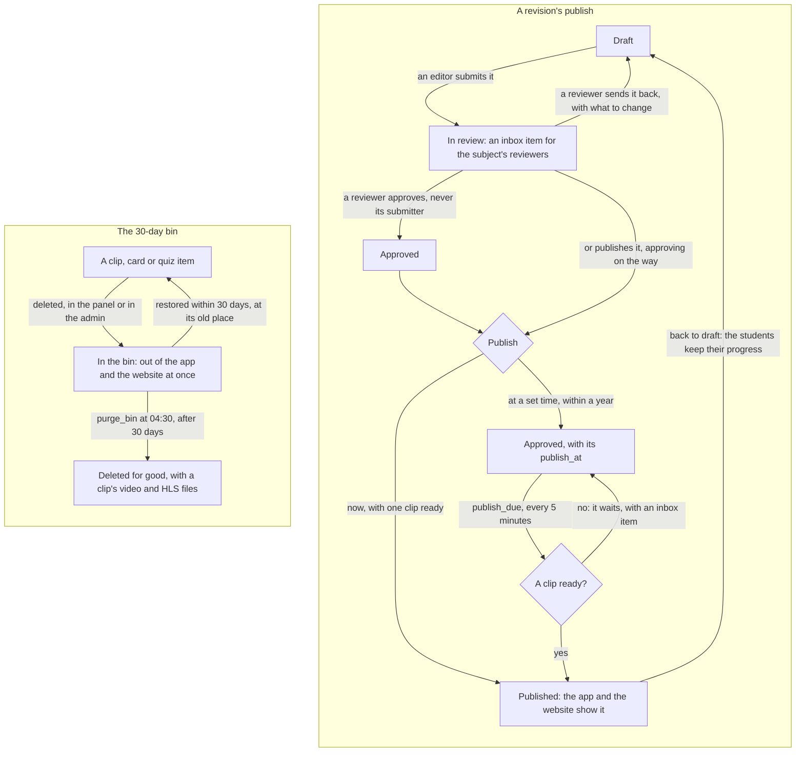
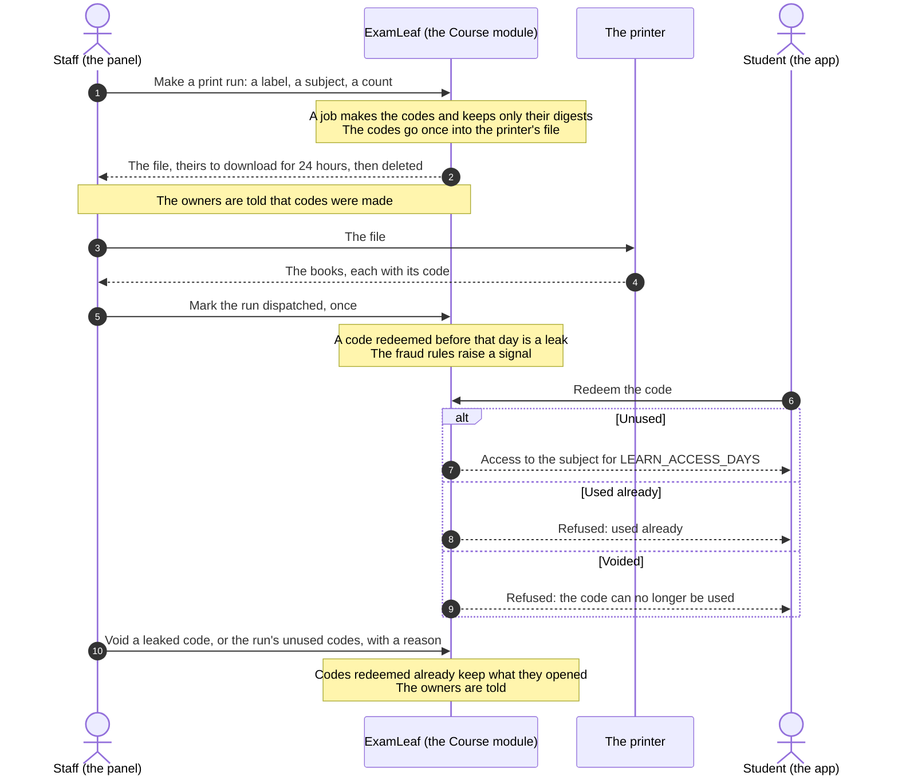

# learn: the revision course, and its Course module in the panel

  

The revision course the mobile app plays (per chapter a revision of short clips, one-mark quiz items, flash cards, a
pass plan, book codes printed in the books, entitlements, reminders), and the panel's Course module that runs it (the
[plan](../../docs/examleaf-admin-control-panel-plan.md) 5.11, 7.8, 5.16's codes report and 10.1's limits on learner
data; the [research](../../docs/research/2026-10-09-admin-control-panel/research-lms-crm-cms.md)'s LMS, CRM and CMS
notes 1.1 to 1.9). The app's and the website's API is in [API.md](../API.md) "Revision course"; the staff API in "Course
(staff)". The panel draws what the staff API answers and decides nothing itself; every rule below is in this app, for
the developers who change it.

> [!NOTE]
> **At a glance**
> - A chapter's revision goes draft, in review, approved, published: a reviewer who did not submit it approves, and
>   publishes now (one clip ready) or at a time within a year; `publish_due` runs every 5 minutes.
> - A deleted clip, card or quiz item stays restorable for 30 days at its old place; `purge_bin` (04:30) then deletes
>   the row and a clip's video and HLS files.
> - Book codes are kept as digests only: a print run's codes are written once into the printer's file, its maker's to
>   download for 24 hours, and a void code opens nothing.
> - Access is an entitlement, granted with a reason, extended or revoked; the student's progress is never touched.
> - Learner data stays aggregate: no list of learners, nothing ranks them, and a learner under 18 has a usage summary
>   of counts and the week last active.

| File | What |
|---|---|
| `models.py` | `Chapter`, `Revision` (draft, in review, approved, published; `submitted_by`, `reviewer`, `publish_at`), `Clip` (the `processing` state machine), `FlashCard`, `QuizItem` (with `topic`, `marks`, `difficulty`, `bloom` and its history), `BookCode` (digests only; `voided_at`), `CodeBatch` (a print run), `Entitlement` (`revoked_at`, its history), `Learner`, `Progress`, `QuizAttempt`, `CardReview`, `Device` |
| `course.py` | the course's rules for staff: the moves (`move()`), the review and publish (`submit`, `approve`, `needs_changes`, `publish`, `unpublish`, `publish_due`), the bin (`delete`, `restore`, `purge`), the bank's metadata and "needs checking" (`set_metadata`, `flag_item`), access (`grant`, `extend`, `revoke` and their checks) |
| `codes.py` | book codes for staff: a print run made by a job (`start`, `run_job`), dispatched, voided, one code voided, the lookup's one line, the batches' counts and the codes report |
| `approvals.py` | the course's actions for bulk jobs (`entitlement.grant`, `.extend`, `.revoke`, `item_metadata`), registered by `staff/approvals.py` |
| `staff_api.py` | `/api/v1/staff/course/`: the outline, revisions, clips, cards, items, the bin, entitlements, batches, codes, the report, a learner's page |
| `services.py`, `views.py`, `media.py`, `uploads.py` | the app's side: redemption (a void code refused), access, playback links, ffmpeg's HLS, uploads |
| `dashboard.py`, `plan.py` | the student's Learning page and pass plan (the learner page reuses the first) |
| `tasks.py` | clips processed; `publish_due` (every 5 minutes), `purge_bin` (04:30), `purge_code_files` (hourly), the reminders |
| `admin.py` | the Django admin: uploads and the rest; a delete there goes into the bin too, a publish needs `staff.publish_course` |
| `management/commands/` | `make_book_codes` (the shell's way: the panel's job is the usual one), `build_quiz_items`, `reprocess_clips`, `import_chapter_insights` |

## Lifecycles: a revision, the bin, a book code

A revision reaches the app only through a reviewer: it is published now, once one of its clips is ready, or at a time
within a year, which `publish_due` keeps. A clip, a card or a quiz item that is deleted waits 30 days in the bin.

*A revision's way to the students, and what the bin keeps for 30 days.*

A book code is made for a print run, printed in the books and redeemed once in the app. Only the code's digest is kept,
so the printer's file is the one copy of the codes, and staff void what leaks.

*A book code from the print run to its redemption or its voiding.*

## The rules

- **Order** is dense and the API's: a row moves first, last, or before or after a sibling (a revision's clips, a
  chapter's cards or quiz items), the siblings numbered again under a lock in one transaction. The console's drag and
  its "Move to…" send the same request; there is no other way to reorder.
- **Review and publish**: an editor submits a draft (an inbox item for the subject's reviewers); a reviewer who did not
  submit it approves it, sends it back with what to change, or publishes it now (one of its clips must be ready) or at
  a time within a year. `publish_due` publishes what is due once (`single_run`); one with no ready clip by then waits,
  with an inbox item. Back to draft is a reviewer's; students keep their progress.
- **The bin**: a deleted clip, card or quiz item leaves the app and the website at once (the default managers hide it;
  joins filter it) and stays restorable for 30 days at its old place; `purge_bin` then deletes the row and a clip's
  video and HLS files. The admin's delete goes there too.
- **The quiz bank** joins the nightly item analysis (`insights.ItemStat`): N/A under 30 learners. "Needs checking"
  files one report of category `item_analysis` in the content triage while one is open. Every change to an item is a
  version in its history.
- **Access** is an entitlement: granted with a reason (never to a closed or staff account, never over open access that
  covers it), extended by days from its end, revoked to yesterday. Progress is the student's and is never touched:
  access given again picks up where it stopped.
- **Book codes** are kept as digests only. A print run (`CodeBatch`, its label as the codes' `batch`) is made by a
  staff job that writes the codes once into the printer's file, its maker's to download for 24 hours and then deleted;
  the owners are told. A run is marked dispatched once; voiding it voids its unused codes (redeemed ones keep what they
  opened); one code can be voided alone. The lookup reads a code by its digest and answers in one line; it is audited
  by the code's keyed hash and throttled (`STAFF_THROTTLE_CODE_LOOKUP`).
- **The codes report** (`codes.report()`, `GET course/codes/report/`, the console's `/course/report/`; plan 5.16) is
  this module's own. It is worked out when asked, for the newest 200 print runs the reader's subjects reach, and gives
  each run: the codes printed; the copies of its book sold online (the book's lines, and those of a bundle holding it,
  in the orders that count, from the run's day until the next run of that book; ERPNext's copies for schools and
  distributors are not in it yet); the codes activated; "revoked", the access a code opened that staff took back (an
  entitlement of source book code with its `revoked_at`); "void", the codes voided before use; the activation rate; and
  the districts of the redemptions (the redeemer's last order of the code's subject, by its PIN code), one under the
  minimum (`INSIGHTS_MIN_CELL`, 10 by default: `insights/cells.py`) shown as "fewer than 10". The insights app has
  another codes report, `GET reports/codes/` (the console's `/reports/codes/`, `insights/README.md` "Home and Reports"),
  and both stay. Theirs is by print run too, with the last 7 days and the districts as the nightly job counted them (its
  minimum is the setting `INSIGHTS_MIN_CELL`); its "sold" is the book's copies sold in all, every run of it together,
  and its "void" is the codes voided before use, as here (its "revoked" column was renamed at the merge). Its "sold" and
  "void" columns were empty until this module recorded the book of a run (`CodeBatch.product`) and the voided codes
  (`BookCode.voided_at`); they are filled now.
- **Fraud rules** (`insights/jobs/fraud.py`, hourly): failed codes per account, address and device, a spike, one
  account redeeming many codes, one code tried by many accounts, a run redeemed before it was dispatched (a leak);
  keyed hashes only, each signal an inbox item (`fraud_signal`), the urgent ones emailed within the hour.
- **Learners**: no list of learners exists and nothing ranks them. Support opens one learner's page at a time (from a
  ticket, an access row, a code or the customer's record, whose Course section links to it), and every opening is a
  `sensitive_read`; the page links back to the customer's record for whoever may read customers. A learner under 18, or of unknown age,
  gets a usage summary: counts and the week last active, never times or a trail (DPDP Act s.9(3), plan 10.1).

## What each role's pages do

| Role | The Course module for them |
|---|---|
| CONTENT_EDITOR | the outline of their subjects: rows moved, edited, deleted and restored, must-do notes, revisions' titles and lengths, a revision submitted for review; clips retried; the quiz bank, an item changed and its metadata changed in bulk (a dry run first) |
| REVIEWER | the outline and the bank read; revisions approved, sent back, published now or at a time, back to draft (never their own submission) |
| SUPPORT | access granted, extended and revoked (alone or in bulk), a code looked up, a learner's page from a ticket (logged) with a phone signed out |
| SALES | a school order's print run made (the printer's file) and marked dispatched; the print runs and the codes report read |
| ADMIN, OWNER | everything above, and voiding a print run or a code (critical: a recent authentication, the owners told) |
| AUDITOR | every page read, nothing changed |

## Settings

`LEARN_MAX_UPLOAD_MB`, `LEARN_PUBLIC_VIDEO`, `LEARN_FREE_PREVIEW`, `LEARN_ACCESS_DAYS`, `LEARN_CODE_SECRET` (the app's;
README.md), and `STAFF_THROTTLE_CODE_LOOKUP` (120 an hour: book codes looked up by one member of staff; DEPLOYMENT.md).

## Related documents

- [content/README.md](../content/README.md): the content triage that a quiz item's "needs checking" joins
- [insights/README.md](../insights/README.md): the nightly item analysis, the fraud rules on book codes and the other
  codes report
- [staff/README.md](../staff/README.md): the approvals behind the course's bulk actions, and "Jobs" for `code_batch`
- [API.md](../API.md): "Revision course" for the app and the website, "Course (staff)" for the panel
- [RUNBOOK.md](../RUNBOOK.md): "The revision course", publishing, a failed clip, printing book codes, granting access, a
  lost code
- [DEPLOYMENT.md](../DEPLOYMENT.md): section 18, the revision course's settings and storage
- [docs/guides/roles](../../docs/guides/roles/README.md): the role guides, and which module each role acts in
- [examleaf-admin-control-panel-plan.md](../../docs/examleaf-admin-control-panel-plan.md): sections 5.11, 7.8, 5.16 and
  10.1, the plan behind the module
