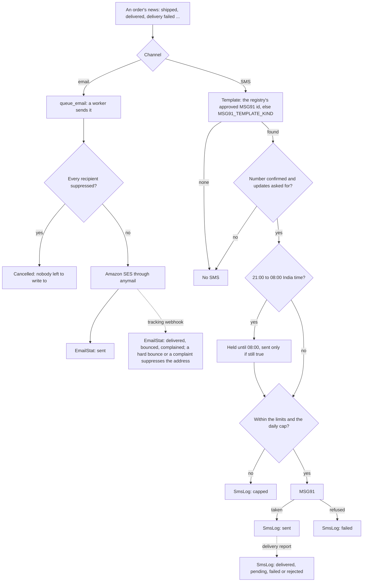

# ops: email, SMS and their templates

   

What the site sends and how it learns what became of it: email, SMS, the registry of the templates both are registered
with, and the backups' upload. The panel's Templates page and the MSG91 and SES cards of its connections page
([integrations/README.md](../integrations/README.md) "The connections page") read from here; the endpoints are in
[API.md](../API.md) "Templates (staff)". Developers and operators read it for the limits an SMS meets, what a template
must carry before it is sent and how a delivery report reaches its row.

> [!NOTE]
> **At a glance**
> - Email goes out through django-anymail (Amazon SES in production), SMS through MSG91 under India's DLT rules.
> - Every SMS is a `SmsLog` row from the moment it is asked for: queued, then sent, refused by the provider or held
>   back by a limit; MSG91's delivery report adds delivered, pending, failed or rejected.
> - `MessageTemplate` is the registry of what is registered with DLT and MSG91, one row per event, channel and
>   language, never deleted; an approved SMS template's MSG91 id is what is sent.
> - Each night `check_templates` (03:50) opens an inbox item for an approved SMS template unused for 75 days (DLT
>   deactivates one at 90) and for an approved template whose yearly self-certification is due.
> - SES's tracking webhook is verified (SNS signature, certificate, topic) before anymail reads it; a hard bounce or a
>   complaint puts the address on the suppression list.

| File | What |
|---|---|
| `models.py` | `EmailSuppression` (addresses the site no longer writes to), `SmsLog` (every SMS, with MSG91's delivery report), `MessageTemplate` (the registry), `EmailStat` (emails sent, delivered, bounced and complained, per day: counts only) |
| `sms.py` | `queue_sms()`, `send_sms`, the limits and the daily cap, the MSG91 backend; `authkey()` (the environment's or the panel's: [integrations/README.md](../integrations/README.md) "Precedence") and `template_id()` (the registry's approved template first, `MSG91_TEMPLATE_<KIND>` otherwise) |
| `staff_api.py` | `/api/v1/staff/templates/`: list, add, change, send a test to oneself |
| `webhooks.py` | MSG91's delivery reports (`POST /api/hooks/sms-events/`) and `apply_reports()` |
| `ses.py` | SES's tracking webhook with each SNS message's signature verified; `sync_suppressions()` |
| `tasks.py` | `send_email`, `process_sms_event`, `sync_ses_suppressions`, `check_templates`, the session and log-in clean-ups |
| `management/commands/upload_backup.py` | a dump to the backups bucket, with its `.sha256` sidecar |

## The path of a message

Email and SMS leave by different roads. An email is handed to a worker (`queue_email`; sent in the web process when the
queue is down) and meets the suppression list in anymail's `pre_send`. An SMS meets the template registry, the account's
consent, the quiet hours and the limits (per number, per account and per purpose, then `SMS_DAILY_CAP`) before MSG91 has
it, and its `SmsLog` row follows it from `queued` to MSG91's own report (`POST /api/hooks/sms-events/`). The quiet hours
are `shipping.messages.quiet` (21:00 to 08:00 India time), shared by the shop's order texts, the support acknowledgement
and the parent's consent link.

*The path of an order's news; a one-time code skips the consent and the quiet hours, the support acknowledgement and a parent's consent link keep them.*

## The template registry

`MessageTemplate` holds one message per event, channel (SMS, email, WhatsApp) and language (English, Assamese,
Bengali) as registered (research-integrations 4.2; plan 7.11): the text with DLT's `{#var#}`, each variable typed as
DLT types them (numeric, alphanumeric, url, urlott, cbn, email; 30 characters at most), the DLT template id (12 to 25
digits), the principal entity id, the sender header (six letters, or six digits for a promotional header) and its
suffix (`P`, `S`, `T` or `G`: the kind of sender), MSG91's template id, a WhatsApp template's name (Phase D), an email's subject, the
category (transactional for one-time codes, service, promotional; utility and authentication for WhatsApp), the approval state, the last use and the last
yearly self-certification. The rules are checked where they are kept (`staff_api.TemplateSerializer`): an SMS for one of
the kinds the site sends, as many variables as placeholders, a one-time code's only variable `otp`, an approved SMS
with its MSG91 id, an approved WhatsApp template with its name, an approved email with its subject. What a template is
for (event, channel, language) never changes: add another. Nothing is deleted. The migration that made the
registry (`0006_phase_b_settings`) copied each `MSG91_TEMPLATE_<KIND>` the environment set in as an approved row,
without its text: add the DLT ids and the text as registered.

`ops.sms` sends a kind with the approved SMS template's MSG91 id when the registry has one, with
`MSG91_TEMPLATE_<KIND>` otherwise, and writes the template's last use. Each night (`check_templates`, 03:50) an
approved SMS template unused for 75 days opens `template_idle` (DLT deactivates one at 90) and an approved template
whose self-certification is a year old less a month opens `template_certify`, both for `ops.change_messagetemplate`,
each done once the cause is gone. A test send (`templates/<id>/test/`, 10 an hour) goes to the sender's own confirmed
mobile number or address only, through the same limits as any SMS; a WhatsApp template cannot be sent yet.

## Delivery reports (MSG91)

`POST /api/hooks/sms-events/` takes MSG91's delivery reports with the token made on the connections page in the
`X-Webhook-Token` header (the current one and, for 24 hours after a rotation, the previous; compared in constant
time). A missing or wrong token: 403, kept as a rejected event without its body. A body without a report: 400.
Otherwise the body is kept (`InboundEvent`, once per body and once per report: its id hashes MSG91's request ids,
the numbers' last digits and the statuses) and `process_sms_event` writes each report on its `SmsLog` row by MSG91's
request id: delivered, pending, failed or rejected, with MSG91's words for a failure. A final state is never replaced
by a later report, and a report for no SMS of ours leaves the event a duplicate.

## SES

**Signatures.** `SesTrackingView` verifies each SNS message before anymail reads it (`ses.sns_problem`): the signing
certificate only from `https://sns.<region>.amazonaws.com/…pem` (fetched without redirects, kept a day), the signature
(SHA1 for SignatureVersion 1, SHA256 for 2) over SNS's canonical fields, the certificate's dates, and the topic
`SES_SNS_TOPIC_ARN` when it is set. A message that fails is a 400 and anymail never sees it. The view is mounted only
with `ANYMAIL_WEBHOOK_SECRET`'s basic auth or a topic set (AWS signs any topic's messages, so a signature alone does
not say they are ours).

**Suppressions.** SES's account-level suppression list is copied into `EmailSuppression` each night
(`sync_ses_suppressions`, 05:50, with the SES backend only), so the site stops writing to those addresses too; the
rows the site made itself stay. **Rates**: `EmailStat` counts what anymail sent and what the tracking webhook said, so
the SES card shows the week's bounce and complaint rates against SES's review thresholds (5 % and 0.1 %).

## What each role sees

ADMIN reads and changes the templates and sends tests; MARKETING and AUDITOR read them; OWNER does all of it. The SMS
log and the email suppressions stay in the Django admin (Ops), as before.

## Related documents

- [integrations/README.md](../integrations/README.md): the connections page, "Precedence" of the environment's keys and
  the panel's, and the webhook tokens' rotation
- [shipping/README.md](../shipping/README.md): "Telling the customer", the courier's news by email and SMS, held at
  night
- [API.md](../API.md): "Templates (staff)", the registry's endpoints
- [RUNBOOK.md](../RUNBOOK.md): "Email" (when it fails, bounces and complaints) and "SMS"
- [DEPLOYMENT.md](../DEPLOYMENT.md): the DLT registration and MSG91 (section 15), what is on and off (section 16), the
  delivery reports and SES's notifications (section 25)
- [staff/README.md](../staff/README.md): "Legal and privacy", the retention schedule that trims and purges the SMS log
- [research-integrations.md](../../docs/research/2026-10-09-admin-control-panel/research-integrations.md): sections 4.1
  to 4.4, the research behind MSG91, SES and the templates
