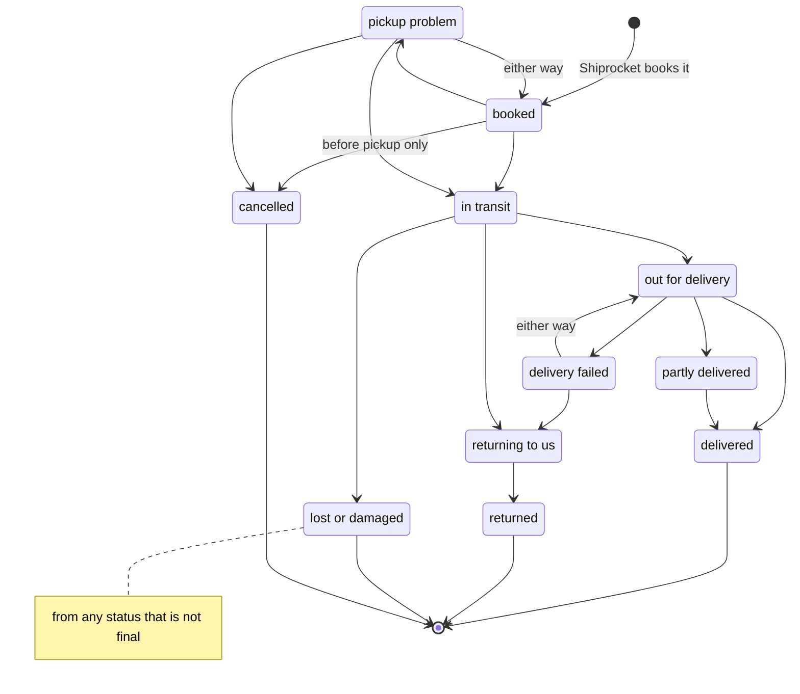
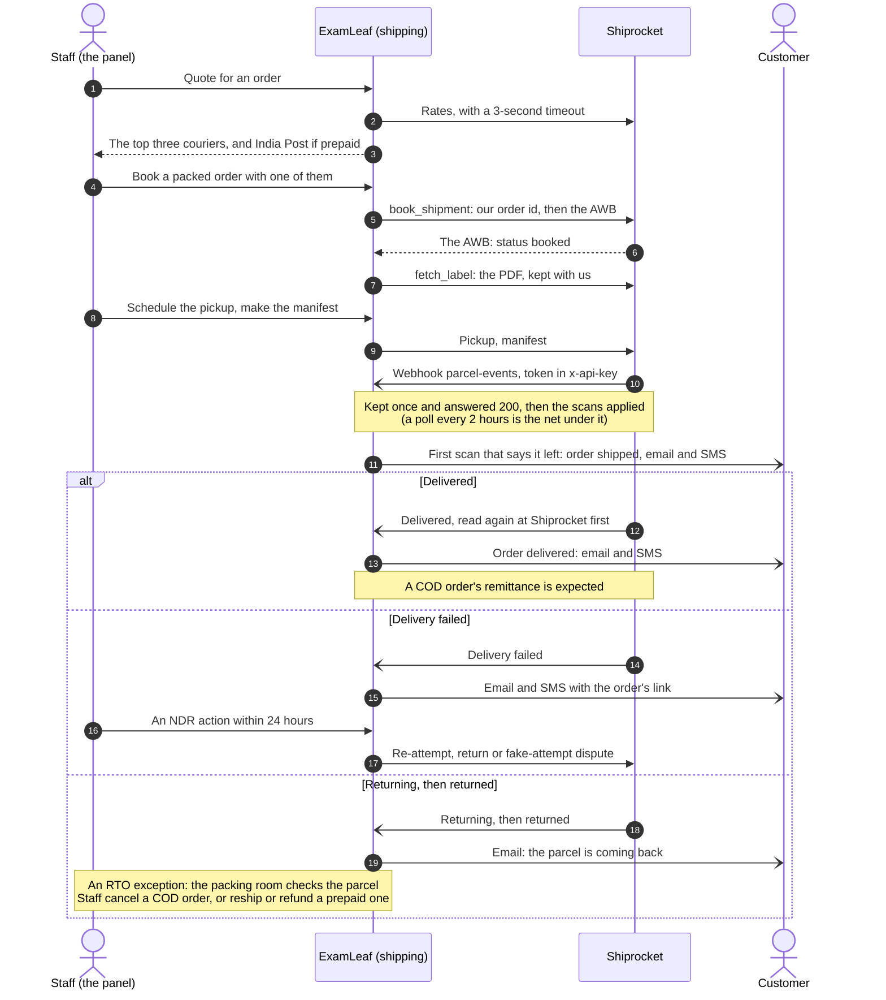

# shipping

   

Parcels and couriers: booking with a courier through Shiprocket, or sending by hand (India Post and any courier without
an API), the parcel's timeline from the courier's webhook and a polling sweep, what it means for the order and the
customer, and the money (charges, COD remittances, weight disputes). It implements
[research-integrations.md](../../docs/research/2026-10-09-admin-control-panel/research-integrations.md) section 3 on the
`integrations` framework ([integrations/README.md](../integrations/README.md)), for the developers who change it and the
operators who run it. The order keeps its own state machine (`shop/models.py`): the shipping app only calls its existing
transitions, ship and deliver.

> [!NOTE]
> **At a glance**
> - A parcel is `shop.Shipment`; its courier side is `ShipmentDetail`, one to one, with a carrier of `manual` or
>   `shiprocket` (a double in test mode: Shiprocket has no sandbox).
> - A status only moves forward, and four are final: delivered, returned, lost or damaged, cancelled.
> - The order changes only through its existing transitions: shipped at the first scan that says the parcel has left,
>   delivered once a delivery is confirmed.
> - The webhook `POST /api/hooks/parcel-events/` is unsigned: a token in `x-api-key` lets it in, a claim of delivered,
>   returned or lost is read again at the carrier first, and a poll every 2 hours is the net under it.
> - SMS about a parcel go only to accounts that asked for them, never from 21:00 to 08:00 India time (held, and sent
>   at 08:00 only if still true).
> - Nothing talks to a carrier inside a transaction: a parcel is claimed instead, and each step's result is saved as
>   it comes.

## Contents

- [The model](#the-model)
- [Carriers](#carriers)
- [The flows (`services.py`)](#the-flows-servicespy)
- [Operations](#operations)
- [Related documents](#related-documents)

## The model

A parcel is `shop.Shipment`, as before; its courier side is `ShipmentDetail`, one to one (shop's model and migrations
stay as they were: other work changes shop's models too).

| Model | What it is |
|---|---|
| `ShipmentDetail` | `carrier` (`manual` or `shiprocket`) and its `account`, our `status` (below; null until booked), `reference` (our order id at the carrier: the order number, `-R1`, `-R2` for each booking after the first, as Shiprocket never takes an id twice), the carrier's order and shipment ids, the courier (`courier_company_id`, `courier_name`), `label` and `parcel_photo` (kept by us, private storage), `weight_g` and the dimensions, `charged_weight_g`, `quoted_rate`, `cod_amount` (the cash to collect: the order's total for COD, empty for prepaid), `declared_value`, `last_event_at`, `pickup_location`, `pickup_date`, `manifested_at`. The AWB is the shipment's `tracking_number`. |
| `ShipmentEvent` | One courier scan: source (`webhook`, `poll`, `manual`), the carrier's code and label, our status, when, where, the raw scan; the digest of (AWB, code, time, activity) is unique, so a scan repeated in later payloads, or read again by a poll, is kept once. The parcel's timeline. |
| `PickupLocation` | Our pickup addresses by the nickname Shiprocket knows them by (36 characters at most); one default. |
| `ShipmentCharge` | One line of the wallet statement: freight, COD, RTO freight, excess weight and their reversals (negative), unique by the line's id (Shiprocket documents none: the digest of its AWB, description, amounts, time and balance). |
| `CodRemittance` | The cash a courier collected: expected (amount, day: delivered + 10 working days), remitted (amount, UTR, day), overdue, mismatched, not expected. |
| `ShippingException` | What staff must deal with by `due_at`: `pickup_problem`, `ndr`, `rto`, `lost`, `partial`, `weight_dispute`, `cod_overdue`, `no_movement`; one open per parcel and kind; `reference` (a dispute's id) makes it once for good. Resolved with what was done, or dismissed. `exception_opened` tells the staff inbox. |
| `PinServiceability` | The last survey's answer per PIN and courier: COD, prepaid, rate, days; courier 0: none serves it. |
| `PostalTariff` | India Post's price per weight slab from a date; empty until `manage.py loaddata postal_tariffs` (the published tariff as the research read it: verify at the counter). |

**Statuses** (`status.py`): booked, pickup problem, in transit, out for delivery, delivered, delivery failed,
returning, returned, lost or damaged, cancelled, partly delivered. Shiprocket's shipment status codes map to them
(the table of research 3.6; an unknown code changes nothing). A status only moves forward: booked (or a pickup
problem) → in transit → out for delivery (or a failed attempt, either way) → partly delivered → delivered; returning
→ returned is a branch of its own; lost or damaged at any point; cancelled only before pickup. Delivered, returned,
lost and cancelled are final.

*A parcel's status (`shipping/status.py`): it only moves forward, a loss or a return can follow any status that is not final, and the four final ones are never left.*

**What a status means** (`services.effects`): the first status that says the parcel has left ships the order (its
existing transition: the customer's "on its way" email, a COD order's bill); delivered (read again at the carrier when a
webhook says so) delivers it (the COD payment captured, the email) and expects the COD remittance; a pickup problem, a
failed delivery (24 hours to act), a return, a loss and a partial delivery open exceptions. The order has no "returned"
state: a COD parcel that comes back leaves the order shipped, with a note and an RTO exception that says to cancel it
(the founder's decision, research 6.1), and staff then cancel it with the Orders module's `cancel_returned`, the one way
its state machine goes from shipped to cancelled ([shop/README.md](../shop/README.md) "The rules").

**Telling the customer** (`messages.py`, through the shop's own emails and SMS): shipped (email and SMS: courier, AWB,
the order's page), out for delivery (SMS, COD only: keep ₹X ready), delivered (email and SMS, as when staff mark it),
delivery failed (email and SMS with the order's link), returning (email). SMS go only to accounts with a confirmed
number that asked for order updates, only with their DLT template registered, never from 21:00 to 08:00 India time
(held on the parcel, sent at 08:00 only if still true). WhatsApp is a hook (`notify_whatsapp`, MSG91 and an opt-in
record to come).

## Carriers

`carriers/base.py` is the interface: `quote`, `book`, `label`, `schedule_pickup`, `manifest`, `cancel`, `track`,
`ndr_action`, `parse_webhook`. `carriers/manual.py` is today's counter flow (staff type the courier and number;
tracking by the courier's page or 17TRACK). `carriers/shiprocket.py` is Shiprocket's API v1 (the password grant of
an API user, its token cached for 10 days and renewed from day 9 under a cache lock and after a 401; our order id;
refusals inside a 200 are refusals). `carriers/fake.py` is a double of Shiprocket for test mode and the tests (httpx's
MockTransport answering from `carriers/recorded/shiprocket.json`, shaped on the documented examples). `CARRIERS` maps a
name to its class; `carrier_for(account)` gives an account's (test mode: the double; Shiprocket has no sandbox).

**Adding a carrier** (Delhivery direct, the India Post bulk API): a subclass of `Carrier` mapping its own codes to
`status.Status` (a table like `SHIPROCKET_CODES`), a client on `integrations.client.Client`, `CARRIERS["name"]`,
`PROVIDERS["name"]` and its connection test (`integrations/README.md`), a recorded double for its test mode, and its
webhook view if it pushes. The statement and discrepancy rows are read in Shiprocket's field names: map another
carrier's rows to them.

## The flows (`services.py`)

`quote(order)` (3-second timeout, kept 10 minutes, the last good answer when Shiprocket cannot be asked; the top three
by research 3.4's rule; India Post beside them for a prepaid order) →
`prepare(order, account=..., courier_company_id=...)` (a packed order, or a shipped one whose parcel came back: the
parcel and its detail) → `book(shipment)` (task
`book_shipment`; idempotent: never twice, a lost answer found again, a parcel being booked waits; refused when the
cash to collect is not the order's total) → `fetch_label` (task) → `schedule_pickup` → `manifest` → the scans
(`apply_events`, from the webhook's task or `poll`) → `expect_cod`, `check_cod`, `sync_statement`,
`check_discrepancies`. Also `cancel` (until the courier is out for pickup), `ndr_action`, `ship_by_hand`,
`open_exception`, `resolve_exception`, `survey_pins`, `sync_pickup_locations`. None holds a transaction while it talks
to a carrier.

*A parcel from the quote to its delivery or return, with Shiprocket's scans arriving by the webhook or the poll.*

**Webhook**: `POST /api/hooks/parcel-events/` (no "shiprocket", "kartrocket", "sr" or "kr" in it): the token in
`x-api-key` compared in constant time with the enabled account's current one, or its previous one for 24 hours; none,
a wrong one or none set: 403. The raw body is kept once (`InboundEvent`), answered 200, processed by
`process_inbound_event`; a claim of delivered, returned or lost is read again by AWB first (the webhook is unsigned).

**Tasks and beat** (settings.py): `poll_tracking` every 2 hours (parcels silent 6 hours, 50 AWBs a call; 5 days
without a scan: an exception), `sync_statement` 05:00, `check_cod_remittances` 05:15 (overdue 2 working days after its
day: an exception), `check_weight_discrepancies` 05:30 (due 7 working days after raised), `renew_token` 05:45,
`survey_pins` Sundays 06:00 (`SHIPPING_SURVEY_BATCH` PINs, the oldest first), `send_held_messages` 08:00.

**Staff API**: `/api/v1/shipping/` (API.md "Shipping (staff)") on the staff app's rules (`staff.api.StaffAppView`: the
panel's session or an API key, the admin host only, refusals audited): `staff.view_parcels` for every read,
`staff.book_parcel` for the quote, booking, label, pickup, manifest, photograph and cancellation, `staff.act_on_exception`
for NDR actions and resolving exceptions, `staff.view_cod` and `staff.reconcile_cod` for cash on delivery and the
charges, `staff.manage_pickup_locations` (`staff/catalogue.py`; the roles: PACKER books, SALES acts on failed
deliveries, FINANCE reconciles COD, ADMIN and the owners all; `accounts/roles.py`). Querysets go through the staff app's
`scoped()` (a PACKER's parcels are the orders to pack and on their way). Every change is an audit event targeting the
order (`shipping.booked`, `shipping.ndr_action` with the names of the details changed …; the COD reconciliation is
`payment.cod_reconciled`, in the money chain). An exception opened (`exception_opened`) files a staff inbox item due
when it is (FINANCE's for cash on delivery, `act_on_exception`'s otherwise), moved forward with it, and closed once it
is resolved or dismissed, by staff or by the parcel's news (`exceptions_closed`). Serializers in `api_serializers.py`.

## Operations

- **Set up** (DEPLOYMENT.md "Shipping"): the Shiprocket API user, its account in the admin (test mode first),
  the pickup location (`POST /api/v1/shipping/pickup-locations/sync/`), the webhook and its token, the products'
  weights, the tariff fixture.
- **The live smoke test**: `manage.py shipping_smoke_test --yes` books a prepaid parcel to our own pickup address with
  the live account, assigns an AWB, fetches the label, cancels before pickup and looks for the reversal in the
  statement, printing every step. It refuses a test-mode account and runs only with `--yes` (the freight is debited,
  then given back).
- **By hand**: `shipping_poll_tracking`, `shipping_sync_statement [--days 7]`, `shipping_check_cod`,
  `shipping_check_discrepancies`, `shipping_survey_pins [PIN ...] [--limit N]` do what their tasks do.
- **RUNBOOK.md**: a circuit open, dead letters, COD overdue, weight disputes, a parcel that stopped moving.

## Related documents

- [integrations/README.md](../integrations/README.md): the framework this app runs on, with its client, circuit and
  webhook tokens
- [shop/README.md](../shop/README.md): the order's state machine, `cancel_returned` and the returns
- [ops/README.md](../ops/README.md): the SMS limits and the DLT templates behind the customer's news
- [insights/README.md](../insights/README.md): the delivery times and the return risk that the parcels feed
- [API.md](../API.md): "Shipping (staff)", the parcels' endpoints
- [RUNBOOK.md](../RUNBOOK.md): "Couriers and integrations", a circuit open, dead letters, COD overdue, weight disputes
- [DEPLOYMENT.md](../DEPLOYMENT.md): section 22 (Shiprocket, India Post and the integration keys)
- [research-integrations.md](../../docs/research/2026-10-09-admin-control-panel/research-integrations.md): section 3,
  the research behind the app
