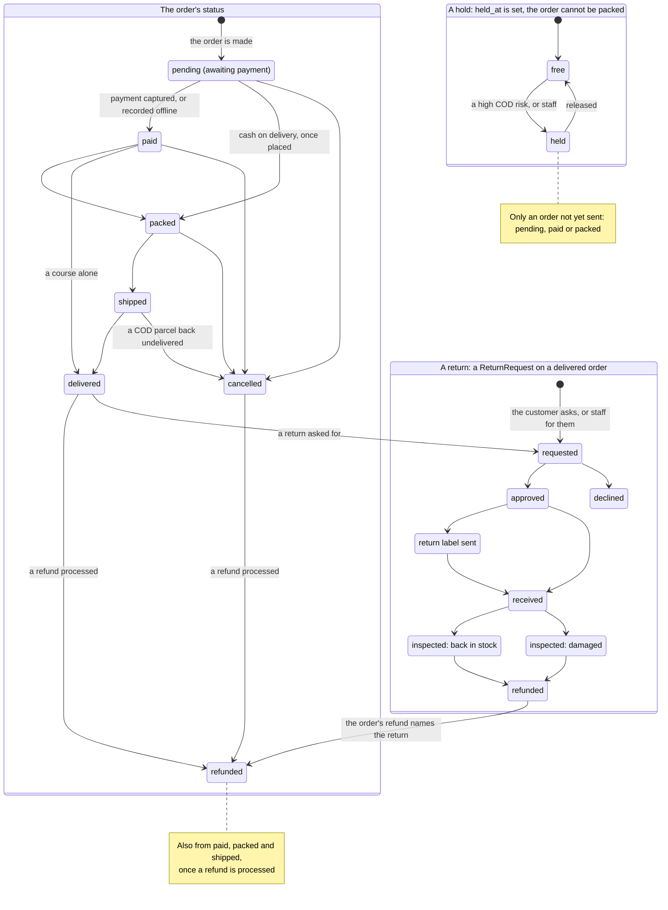
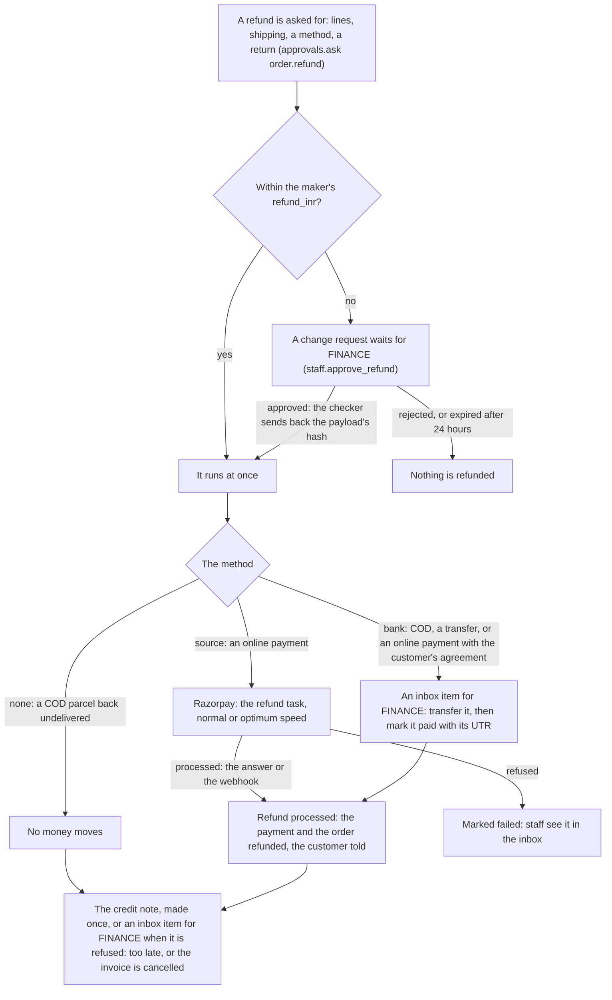

# shop: the Orders module, the tax desk, Finance and the Catalogue of the Admin Control Panel

    

The staff side of the shop, as the Admin Control Panel keeps it: the Orders module, the tax desk, Finance and the
Catalogue. Every rule is the shop's own (`services.py`, the order's state machine, the approvals); the staff API checks
who may do it and the panel draws what the API answers. Developers read it for the rules, and each module also says what
each role's pages do. The shop itself (cart, checkout, Razorpay, invoices) is described in [../README.md](../README.md)
"Shop"; the endpoints are in [../API.md](../API.md) "Orders (staff)", "Tax (staff)", "Finance (staff)" and "Catalogue
(staff)".

> [!NOTE]
> **At a glance**
> - An order is pending, paid, packed, shipped, delivered, cancelled or refunded; a hold is a flag and a return a
>   request of its own, and there is no "returned" state: a cash-on-delivery parcel back undelivered is cancelled.
> - Every refund is an `order.refund` request: within the maker's `refund_inr` it runs at once, above it FINANCE
>   approves; it goes back through Razorpay, or by bank or UPI marked paid with its UTR, and a credit note follows.
> - The tax desk decides the GST on a document: dated rates from the HSN and SAC master, a series of its own for each
>   type of document from FY 2027-28, and credit notes refused after 30 November following the invoice's year.
> - Finance fetches Razorpay's settlements each morning for yesterday (03:15), matches their lines to our payments and
>   refunds, and posts a matched settlement to ERPNext once.
> - In the Catalogue each part of a product has its own permission, and a price beyond the maker's discount limit
>   waits for FINANCE; from 1 January 2027 a reduced price shows the lowest price of the 30 days before.
> - Test-mode orders are out of every list, count and the packing queue unless asked for.

## Contents

- [Orders](#orders)
  - [The order's life](#the-orders-life)
  - [A refund's path](#a-refunds-path)
  - [The rules](#the-rules)
  - [What the pages do for each role](#what-the-pages-do-for-each-role)
  - [Not built](#not-built)
- [Tax](#tax)
  - [The model](#the-model)
  - [The rules](#the-rules-1)
  - [Permissions and pages](#permissions-and-pages)
  - [Inbox, jobs, settings](#inbox-jobs-settings)
  - [Decisions taken until the CA answers (plan 10.1, 10.2)](#decisions-taken-until-the-ca-answers-plan-101-102)
- [Finance](#finance)
  - [The rules](#the-rules-2)
  - [Permissions and pages](#permissions-and-pages-1)
  - [Inbox, jobs, settings](#inbox-jobs-settings-1)
- [Catalogue](#catalogue)
  - [The rules](#the-rules-3)
  - [Permissions and pages](#permissions-and-pages-2)
  - [Jobs, settings, ERPNext](#jobs-settings-erpnext)
- [Related documents](#related-documents)

## Orders

The staff side of the shop's orders (plan 5.3; the research in
[research-commerce-gst.md](../../docs/research/2026-10-09-admin-control-panel/research-commerce-gst.md) 1 and 6,
[research-lms-crm-cms.md](../../docs/research/2026-10-09-admin-control-panel/research-lms-crm-cms.md) 4.5 and 4.6):
finding orders, acting on them, refunds by line or by bank, returns, staff orders and quotes, the packing room and its
documents, and the cash-on-delivery risk. Every rule is the shop's own (`services.py`, the order's state machine); the
API checks who may do it and the panel draws what the API answers. The shop itself (cart, checkout, Razorpay, invoices)
is described in [../README.md](../README.md) "Shop"; the endpoints in [../API.md](../API.md) "Orders (staff)".

| File | What |
|---|---|
| `staff_orders.py` | `/api/v1/staff/orders/`: the list (filters, tabs, search with the person lookups audited), the record and its timeline, the moves, refunds, returns, staff orders and their preview, quotes, the packing queue, the PDFs |
| `order_jobs.py` | the bulk jobs: `orders_pack`, `orders_print` (one PDF), `orders_cancel` (250 at most), `orders_export` (CSV, a line per book with the GST split) |
| `services.py` | holds, tags, `assess_risk`, refunds by line (`refund_lines`, `price_lines`, `refund_with_details`, `mark_bank_refund_paid`), `cancel_returned`, the returns (`request_return` … `inspect_return`), `staff_grants`, `regenerate_documents`, `renotify`, and `notify`'s record of each message |
| `invoices.py` | the print documents (`Print`: the packing slip, the 4×6 hand label, the pick list, invoices merged) beside the invoice and credit notes |
| `models.py` | the order's hold, tags and risk; the refund's lines, shipping, restock, method, encrypted payee, UTR, ARN and change request; `ReturnRequest`; `OrderMessage` |
| `tasks.py` | `weekly_staff_grants` (Mondays 08:00), `send_held_sms` (08:00), the refund task's speed and ARN |
| `../staff/approvals.py` | `order.refund` (with lines, a method, a return) and `order.staff_discount` |
| `../insights/jobs/risk.py` | the COD risk rules: the PIN code's and district's returned parcels, the customer's past returns by keyed hashes, a first COD order, its value, an address no courier could find |

### The order's life

The order's statuses are the shop's own state machine, and the panel only calls its transitions. A hold is a flag on an
order not yet sent, and a return is a request of its own on a delivered order: neither is a status of the order, which
has no "returned" state (a cash-on-delivery parcel back undelivered is cancelled).

*An order's statuses, its hold and a return; the return's refund is what turns a delivered order into a refunded one.*

### A refund's path

Every refund, whoever asks for it, is an `order.refund` request: the maker's limit decides whether it runs at once or
waits for FINANCE, and the method decides who moves the money.

*A refund from the request to its credit note.*

### The rules

- **What a person may do** is the order's state machine crossed with their permissions (`actions` on the record; the
  `primary` one is the header's button): pack, send by hand and deliver are `staff.pack_order`; cancel, hold, release,
  tags, messages, payment links and documents `shop.change_order`; refunds `staff.refund_order`; offline payments
  `staff.record_offline_payment`; asking for, approving and declining returns `staff.handle_return`; receiving and
  inspecting them `staff.receive_return`; bank refunds' accounts and their payment `staff.approve_refund`; exports
  `shop.export_order`. A PACKER sees only the orders to pack and on their way (`ROLE_SCOPES`: paid, packed, shipped,
  and cash-on-delivery orders placed).
- **Refunds** go through `approvals.ask("order.refund", …)`: the amount is the lines' invoiced values (each line's share
  of the coupon and offers taken off; the last copies of a line take what is left of it to the paisa) and the shipping
  asked; within the maker's `refund_inr` it runs at once, above it FINANCE approves. Back to the source through Razorpay
  (normal or optimum speed), or by bank or UPI (cash on delivery and transfers; an online payment only with the
  customer's agreement, RBI's rule): the payee is encrypted with `integrations.crypto` and shown masked; FINANCE reveals
  it with a reason (a `sensitive_read`) and marks the transfer paid with its UTR, which processes the refund, emails the
  customer and makes the credit note, once. An `Idempotency-Key` answers the first request again. A payment older than
  6 months gets the warning before the person confirms.
- **A cash-on-delivery parcel back undelivered** (no `returned` state, the plan's 10.1): `cancel_returned` cancels the
  order, puts its copies back unless damaged and credits its invoice through a refund with method `none` (no money
  moves; ERPNext's payments flow skips it).
- **Returns** (`ReturnRequest`): requested → approved or declined → label sent → received → restocked or damaged →
  refunded. The customer asks on the website within `SHOP_RETURN_DAYS` of delivery (`POST /api/v1/orders/<number>/
  returns/`); staff may ask for them at any time. An inbox item (`return_request`) is due in 48 hours. Restocking adds
  the copies with the return as the reason; its refund (the order's refund naming the return) does not add them twice.
  Exchanges are not built.
- **Staff orders** (`order.staff_discount`): priced as the checkout prices them, the address's PIN code checked against
  its state; within the maker's `discount_percent` of the books (after the offers) the order is made at once, beyond it
  or for a ₹0 total it waits for FINANCE and does not exist until approved (the customer's details travel encrypted in
  the change request; what runs is priced again). `POST orders/preview/` shows the same answer before anything is
  asked. The owners' weekly email lists the week's staff discounts, offline payments and ₹0 orders by who gave them.
- **Holds and risk**: a COD order is scored when placed; a high score holds it ("payment check") while
  `SHOP_COD_HIGH_RISK_HOLD` is on (an inbox item `order_hold`). A held order leaves the packing queue and cannot be
  packed until released. Nothing about a person is stored by the risk rules.
- **Messages**: every status message goes through `notify` and is recorded (`OrderMessage`, with its SMS sent, held or
  dropped); an SMS due between 21:00 and 08:00 is held and sent at 08:00 if it is still true; "send again" sends only a
  message that is still true.
- **Test orders** (test keys on the live site) are out of every list, count and the packing queue unless asked for.
- **Personal data**: contacts are masked in every answer (the packing slip and label print the address whole, for
  `staff.pack_order`); a search for a person is a `customer.lookup` event with the query's keyed hash and the count;
  opening a child's order is a `sensitive_read`. No audit detail, inbox title, label or file name holds a name, an
  email, a phone number or an account.

### What the pages do for each role

The console's pages are `examleaf-admin/src/app/(panel)/orders/` (its README "Routes").

- **SALES** runs the orders: the list with its tabs, filters and saved views; an order's record with the next step,
  holds and tags, messages again, payment links, offline payments, the invoice made or sent again; refunds within
  ₹2,000 (above: FINANCE approves); returns (decide, receive, inspect); staff orders within 20% off and quotes made
  into orders; the bulk bar's cancel.
- **SALES_REP** makes staff orders (within 10% off; beyond it FINANCE approves) and turns quotes into orders; reads the
  list and the records.
- **SUPPORT** finds an order for a customer (a search for a person is recorded), reads its record and timeline, asks for
  refunds (within ₹1,000; above: FINANCE) and for returns, and decides returns.
- **PACKER** has the packing queue: the orders to pack, oldest first, what to pick, the weight hint and the cash to
  collect; marks them packed (5 seconds to undo), prints the packing slips, 4×6 labels and the pick list, sends by hand,
  marks delivered; receives and inspects returns. Nothing else of a customer.
- **FINANCE** approves refunds, offline payments and staff discounts above the makers' limits (the inbox), transfers
  bank refunds and marks them paid, exports the list (CSV with the GST split), and reads every order.
- **ADMIN** and the **owners** do all of it (the owners without a limit; approving money stays FINANCE's and the
  owners'); **AUDITOR** reads.

### Not built

Exchanges (a return is refunded and the customer orders again). The customer's page is the Customers module's
(`staff/README.md` "Phase B: customers"), couriers' bookings and labels the shipping app's. The payments list and
payment links are Finance's (below), the invoice and credit-note registers Tax's; the HSN master and the series are
below ("Tax"), prices and stock ("Catalogue").

## Tax

What decides the GST on a storefront document (plan 5.9; `docs/research/2026-10-09-admin-control-panel/
research-commerce-gst.md` section 5): the HSN and SAC master with dated rates, the bundles' treatments, the billing
state, the shipping that follows the goods, the document types and their number series, the credit notes' cut-off,
cancelling a document, the threshold monitor, the tax calendar and the GSTR-1 files. ERPNext's India Compliance owns
the returns and the government APIs after the cut-over; until then the platform's documents and export are the record.

| File | What |
|---|---|
| `tax.py` | the rules: the master looked up by date, a bundle's treatment, the billing state, the document type, the series' numbers, the credit notes' cut-off, cancelling, the products that disagree with the master, the threshold monitor, the calendar, the records' retention |
| `invoices.py` | the documents' arithmetic every report reads (the PDFs, the ERPNext contract, the export, the monitor): lines, the charges that follow the goods, round-off, totals, the copies |
| `gstr1.py` | the GSTR-1 files in the GST Offline Tool's CSV templates, for `manage.py export_gstr1` and the panel's job |
| `staff_tax.py` | the staff API, `/api/v1/staff/tax/` ([API.md](../API.md) "Tax (staff)") |
| `models.py` (the end) | `HsnCode`, `HsnRate`, `DocumentSeries`, `TaxThreshold`; the fields added to `Product`, `Order`, `OrderItem`, `Invoice`, `CreditNote` |

### The model

| Model or field | What it is |
|---|---|
| `HsnCode` | a code of the master: `code` (4, 6 or 8 digits; SAC codes are chapter 99's), `kind` (HSN goods, SAC services), `description`, `uqc` (GSTR-1's unit: NOS for books, NA for services) |
| `HsnRate` | a code's rate from a day: `rate`, `taxability` (taxable, nil-rated, exempt, non-GST: a taxed row is above 0, the others at 0), `effective_from`, `effective_to` (empty: until the next row starts), `notification` and `serial`, `note`. Rows are history: never edited or deleted; a new rate starts after the code's latest one |
| `DocumentSeries` | a number series of a financial year: `prefix`, `financial_year`, `document_type`, `live` (off: the test series), `next_number`, taken under a lock on its row |
| `TaxThreshold` | one line of the monitor on a night: `date`, `line`, `financial_year`, `value` (rupees, or documents for the counts), `limit`, `crossed`, `detail` (the documents' numbers for the counts) |
| `Product.hsn`, `tax_treatment`, `tax_note`, `tax_note_date` | the master code (`hsn_code` and `gst_rate` follow it on save: the code's text and today's rate); a bundle's treatment (split, composite, mixed) with the CA's decision as written and its date; `Product.tax_problem` says why it disagrees with the master today (the catalogue's red chip) |
| `Order.billing_state` | the place of supply, set at checkout |
| `OrderItem.parts` | a bundle sold split: its components as sold (product, title, code, rate, MRP, unit price, copies, and any paise its copies could not share), each a line of the invoice |
| `Invoice` and `CreditNote`: `series`, `document_type`, `taxable_value`, `exempt_value`, `tax_amount`, `cancelled_at`, `cancel_reason`, `cancelled_by` | the series' prefix, the type as issued (a credit note: its invoice's), the totals as issued, the cancellation |

The migration (`0021_phase_b_tax`) seeds the master with the rates of research 5.1 and their notifications: printed
books 4901, 4903 and maps 4905 exempt; notebooks 4820 exempt from 22 September 2025 (12 % before); e-books 998431 at
5 %; the revision course 999293 at 18 %; job-work printing 9988 at 5 % (12 % before); paper 4802 and board 4810 at 18 %
(12 % before); courier 9968 and gateway fees 9971 at 18 %. The master begins on 22 September 2025, the day of the last
change: the codes whose rate changed that day also keep the rate before it, from 1 July 2017 (its own start is not
recorded). It links every product whose code is on the master, and fills the orders' billing state (their parcel's
state, else Assam) and the documents' series and types as issued (a tax invoice whenever a line was taxed: the rule
then). Their totals are filled on first use (`tax.fill_totals`: the monitor's first night).

### The rules

- **Rates by date.** `tax.rate_on(code, day)`: the latest row started by then, unless it has ended. At checkout each
  line keeps its code and rate as the master gives them that day (`tax.order_line`); a product not on the master, or
  a day the master has no rate for, keeps its own fields, as before the master, and its chip says so.
- **Bundles** (plan 10.1: the course as its own priced line, all three treatments available): *split* (the default
  and the recommendation) invoices the components as lines, the bundle's price shared by their MRPs in whole paise
  (`tax.apportion`; its share of the discounts shared by their values); *composite* one line at the principal supply's
  code and rate (the component with the largest share of the MRP); *mixed* one line at the highest rate. A change of
  treatment applies to orders from then on, never backwards.
- **Billing state** (`tax.billing_state`): goods are supplied where the parcel goes; courses alone where the buyer says
  at checkout (`billing_state`), else their address, else Assam. A cart with books refuses a billing state other than
  its delivery state.
- **The shipping follows the goods** (`invoices.charges_of`): shared over the goods lines by their amounts and taxed
  with each, so exempt books ship exempt and a course takes none; summed by rate on the document. A cash-on-delivery fee
  would join it there (none is charged today). Each line's tax is worked out of its tax-inclusive amount to the paisa;
  any difference between what was paid and the lines is a round-off line of its own (none while the checkout's sums
  hold).
- **The document's type** (`tax.document_type`): every line taxed, a tax invoice; none, a bill of supply; both, one
  invoice-cum-bill of supply (Rule 46A: the storefront's buyers are unregistered; a registered buyer orders through
  Sales in ERPNext). The PDF: its title, the place of supply with the state's code, "Reverse charge: No", the buyer's
  name and address (always, so also from ₹50,000), codes to `SHOP_HSN_DIGITS` figures, the untaxed lines' reasons
  (each code's notification and serial), and three copies for goods (original for recipient, duplicate for
  transporter, triplicate for supplier), two for services.
- **Series** (`DocumentSeries.take`, `tax.number`): one after the other under the series row's lock, the document made
  in the same transaction (a rolled-back one leaves no gap: the next takes its number), from 1 each 1 April, at most
  `PP/2027-28/99999` (16 characters; beyond, `SeriesFull`). Until FY 2026-27 `EL` holds every invoice and `CN` the
  credit notes; from `SHOP_SERIES_FROM_FY` each type its own prefix (`SHOP_SERIES_PREFIXES`: TI, BS, IB, CN, DN, RV,
  RF until the CA confirms others). The test series `T` and `TC` count apart and reach no return.
- **Credit notes** (`CreditNote.for_refund`, `tax.check_credit_note`): against the invoice's rates and place of supply;
  none after 30 November following the invoice's financial year, nor against a cancelled invoice (`CreditNoteTooLate`,
  `InvoiceCancelled`). The refund goes out regardless; the task opens one `credit_note_missing` inbox item for FINANCE
  with the reason, and `tax.refund_problem(refund)` gives the refund path the same words.
- **Cancelling** (`tax.cancel`): a document keeps its number (Table 13 counts it cancelled) and leaves the returns; its
  PDF is made again, marked cancelled; the order and its refunds are left as they are. An invoice's credit notes are
  cancelled first. A document already reported in a filed GSTR-1 is corrected by a credit note instead (the CA's call).
- **Records** (`tax.held_orders`): an order whose real-series documents are within 72 months of their year's annual
  return (FY 2025-26: to 31 December 2032) keeps its customer's details: `services.forget_orders` passes it by,
  whoever asks. Orders are never deleted and their documents are PROTECTed; an erasure leaves the order with its user
  anonymised.
- **The threshold monitor** (`tax.watch_thresholds`, nightly at 01:45): the financial year's aggregate turnover so far
  (the storefront's taxable and exempt values, without tax, less its credit notes; ERPNext's B2B sales join at the
  cut-over) against ₹2 crore (GSTR-9), ₹4 crore (the warning), ₹5 crore (e-invoicing, leaving QRMP, 6-digit HSN) and
  ₹10 crore (30 days to the IRP); the year's invoices above ₹1 lakh to another state (table 5); the parcels with
  taxable goods above ₹50,000 (an e-way bill). The first night a turnover line is crossed in a year, and each night a
  count grows, one `tax_threshold` inbox item; staff closing it is final.
- **The calendar** (`tax.calendar`): the month's statutory dates from the law and `SHOP_GST_QRMP` (on: quarterly
  GSTR-1 on the 13th with the IFF in the quarter's first two months, PMT-06 on the 25th, GSTR-3B on the 24th for
  Assam; off: GSTR-1 on the 11th and GSTR-3B on the 20th), GSTR-9 on 31 December when the year passed ₹2 crore, the
  30 November cut-off, the Rule 42 true-up in the September return, the quarterly TDS statements.
- **GSTR-1** (`gstr1.py`): b2cl, b2cs (net of their credit notes), cdnur, exemp, hsn-b2b (empty: no registered buyers),
  hsn-b2c and docs in the Offline Tool's templates, and the credit notes' register; the real series only, cancelled
  documents in docs only; read in chunks.

### Permissions and pages

| Permission | Who | What |
|---|---|---|
| `shop.view_hsncode` | FINANCE, AUDITOR, ADMIN, OWNER; SALES and CONTENT_EDITOR read it only | the master, a code's history and products, the products that disagree |
| `shop.change_hsncode` | FINANCE, ADMIN, OWNER | a new code with its first rate, a new dated rate |
| `shop.view_documentseries` | FINANCE, AUDITOR, ADMIN, OWNER | the documents, a document with its lines and PDF, Table 13 |
| `shop.view_taxthreshold` | FINANCE, AUDITOR, ADMIN, OWNER | the threshold card, the calendar |
| `staff.cancel_document` | FINANCE, ADMIN, OWNER (high: re-authenticated) | cancel an invoice or a credit note |
| `staff.run_gstr1` | FINANCE, ADMIN, OWNER (medium) | the GSTR-1 job (above the starter's `export_rows`, ADMIN approves first) |

What the panel's Tax module (`examleaf-admin`, `/tax/`) does for each role:

- **FINANCE** keeps the master (a new code, a dated rate from a notification), watches the calendar and the threshold
  card each month, reads the documents and Table 13 before filing, cancels a document issued in error, runs the
  month's (or quarter's) GSTR-1 export for the CA, and answers the inbox's threshold and missing-credit-note items.
- **AUDITOR** reads all of it (the master's history, every document and its PDF, Table 13, the card, the calendar),
  writes nothing.
- **ADMIN and OWNER** do what FINANCE does; ADMIN also approves an export above FINANCE's row limit, and switches
  `SHOP_GST_QRMP` in Settings.
- **SALES** and **CONTENT_EDITOR** hold `shop.view_hsncode` alone, so they see the module's HSN and SAC pages and
  nothing else of it (no documents, series, calendar or export); no other role sees the module. The catalogue's
  product pages show each product's code, treatment, the CA's note and the red chip from the same fields.

### Inbox, jobs, settings

- Inbox kinds: `tax_threshold` (a line crossed: for `shop.change_hsncode`), `credit_note_missing` (a refund without its
  note: for `staff.cancel_document`).
- Job kind: `gstr1_export` (`{"month": "YYYY-MM", "months": 1 or 3}`: a month, or the quarter ending with it), its file
  the CSVs zipped, through the job's result link.
- Settings: `SHOP_SERIES_FROM_FY`, `SHOP_SERIES_PREFIXES`, `SHOP_HSN_DIGITS`, `SHOP_GST_QRMP` (DEPLOYMENT.md "Tax";
  the last also a panel switch).
- ERPNext: the outbox's invoice payload is unchanged (its contract refuses unknown fields): a split bundle sends its
  components as lines, which add up as before; the billing state reaches ERPNext only as the delivery address's state.

### Decisions taken until the CA answers (plan 10.1, 10.2)

The series prefixes TI, BS, IB, CN, DN, RV, RF from FY 2027-28; split as every bundle's default; books under "exempted"
in table 8 (not "nil rated"); the HSN summary and table 8 net of the period's credit notes; NOS and NA as the units;
the shipping exempt with the books it carries; QRMP on.

## Finance

What the platform owns of the money (plan 5.8; research `research-integrations.md` 4.1, `research-commerce-gst.md` 4,
`research-erpnext.md` 4.3 and 5.8): payments and the stuck ones, refunds and offline payments as FINANCE works them,
payment links (a staff order's, a B2B invoice's of ERPNext), Razorpay's settlements matched to our records and posted
to ERPNext, and Finance today. ERPNext keeps the books: payouts, purchase bills, the bank's reconciliation, closing a
period, MSME dues and the chart of accounts are its pages (the console's Finance page links them). The refund itself,
its approval and a bank refund marked paid are Orders' (above); the documents register is Tax's; cash on delivery's
remittances are the shipping app's. The endpoints: [../API.md](../API.md) "Finance (staff)".

| File | What |
|---|---|
| `staff_finance.py` | `/api/v1/staff/finance/`: payments (the stuck filter, a payment's record, Razorpay asked again), offline payments and refunds with the change requests waiting, payment links, settlements and their lines (matched by hand, a day fetched as a job), Finance today, a document's copy in ERPNext |
| `settlements.py` | Razorpay's settlement recon API through the integrations client (call log, circuit breaker, timeouts), kept once, matched by Razorpay's id, evaluated, posted to ERPNext once; `manual_match`, `fees_for(order)` (what Razorpay kept of an order's payments, for a page that wants it), the job `settlement_fetch` |
| `payments.py` | `awaiting_payment`, the webhook keeping its payment (`WebhookEvent.payment`); the B2B links: `send_invoice_link`, `cancel_invoice_link`, `record_invoice_link_payment` (the `payment_link.paid` webhook), `reconcile_invoice_link` |
| `models.py` (the end) | `Settlement`, `SettlementLine`, `InvoicePaymentLink`; `WebhookEvent.payment` |
| `tasks.py` | `reconcile_payments` (02:30), `fetch_settlements` (03:15), both `single_run` |
| `management/commands/` | `reconcile_payments` (the nightly run's orders, by hand), `fetch_settlements` (`--day`, `--dry-run`) |
| `fixtures/razorpay_settlements.json` | Razorpay's documented answers for the tests' double; `_inferred` marks what no live answer has shown yet |

### The rules

- **A stuck payment** is an online one created or authorised `SHOP_STUCK_PAYMENT_MINUTES` (15) ago that reached
  Razorpay (its checkout opened; a staff order's link only once past its 15 days) on an order still unpaid, or one
  captured on an order still pending. "Ask Razorpay again" (`staff.replay_webhook`) runs `payments.reconcile`: a
  captured payment is recorded, an authorised one captured first (a failed payment that turned authorised within its
  3 days), a second payment of a paid order refunded; the answer says what changed. The nightly run does it for every
  online order still waiting 10 minutes on, and for the B2B links still open.
- **Settlements** are fetched every morning for yesterday (India) and by hand for any day (a job), for the mode of the
  keys in force, never both. Each settlement and each of its lines is kept once (Razorpay's settlement id; settlement
  and entity id), only the fields `settlements.KEPT` names (no card, bank or contact field). A line is matched by
  Razorpay's id and amount: a payment line to our Payment (one settlement line each) or to a B2B link's payment, a
  refund line to our Refund; an adjustment always waits for FINANCE. A payment line whose receipt is one of our
  orders but whose payment we never heard of (a webhook lost) has its order asked of Razorpay first, 50 orders a
  fetch at most. A settlement whose lines are all ours and whose net is their sum is `matched` and posted to ERPNext
  once (`erp.producers.razorpay_settlement`: the Journal Entry moves Razorpay Clearing to the bank, the fees to an
  expense, their GST to input credit; while `ERP_SYNC_SETTLEMENTS` is off it waits and the next fetch posts it). Any
  other is `mismatched` and opens one inbox item (`settlement`, for `staff.reconcile_settlements`) saying what is
  wrong in counts; FINANCE matches the rest by hand, always with a note (the audit event's reason). A test-mode
  settlement is never posted; a posted one is never changed here (a line found after the posting opens its item: the
  entry is corrected in ERPNext by hand).
- **The fee**: a line keeps Razorpay's fee without its GST and the GST apart; a settlement's fees are what the money
  moved says Razorpay kept (gross − net − GST), whatever the fields' convention. Razorpay's `fee` includes its GST
  (its documentation); should a live answer say otherwise, `settlements.FEE_INCLUDES_TAX` is the one change.
- **Payment links**: a staff order's (`shop.change_order`; a staff order still waiting for its online payment) is made
  once and emailed, later the same one again, or cancelled; it lasts 15 days. A B2B invoice's is made for what is
  outstanding on an invoice the platform keeps a copy of (`ErpMirror`, while `ERP_PULL_B2B` pulls them): its address
  is answered for staff to send (no B2B customer's contact is kept here). Its payment (the `payment_link.paid`
  webhook, or asking Razorpay again) is recorded on the link and opens an inbox item (`b2b_payment`): ERPNext's
  contract takes payment entries only against the platform's own invoices (`create_payment_entry` needs their
  `examleaf_ref`), so FINANCE posts the Payment Entry in ERPNext by hand and records its name in the panel, which
  closes the item. Each link's making, cancelling, payment and posting is audited.
- **Test mode**: test-key rows are out of every list and count unless asked for; Finance today never counts them.
- **Personal data**: none in a settlement line, an inbox title, an audit detail or a job's result: ids, amounts, days.

### Permissions and pages

| Permission | Who | What |
|---|---|---|
| `shop.view_payment` | FINANCE, SALES, SUPPORT, AUDITOR, ADMIN, OWNER | Finance today, payments and a payment's record, offline payments, payment links |
| `shop.view_refund` | FINANCE, SALES, SUPPORT, AUDITOR, ADMIN, OWNER | refunds and the refund requests waiting |
| `shop.view_settlement`, `shop.view_settlementline` | FINANCE, AUDITOR, ADMIN, OWNER | settlements and their lines |
| `staff.replay_webhook` | FINANCE, ADMIN, OWNER (medium) | ask Razorpay again about a payment or a B2B link |
| `staff.reconcile_settlements` | FINANCE, ADMIN, OWNER (medium) | fetch a day, match a line by hand, record a B2B payment's ERPNext entry |
| `shop.change_order` | SALES, SALES_REP, ADMIN, OWNER | make, send again or cancel a payment link |
| `staff.view_cod` | FINANCE, SALES, AUDITOR, ADMIN, OWNER | Finance today's cash-on-delivery rows (also opens the page alone) |

What the panel's Finance module (`examleaf-admin`, `/finance/`) does for each role:

- **FINANCE** starts the day on Finance today: approves the refunds and offline payments waiting (each line opens its
  list, each request its approval), transfers the bank refunds (Orders' page), asks Razorpay again about a stuck
  payment, matches what a settlement could not and fetches a day the nightly run missed, posts a paid B2B invoice's
  Payment Entry in ERPNext and records it, looks up a document's copy in ERPNext, and opens ERPNext's books from the
  links.
- **SALES** reads payments, refunds and links, and makes, sends again and cancels a staff order's link or a B2B
  invoice's; **SALES_REP** makes them through Orders (no lists here).
- **SUPPORT** reads a payment and its refunds to answer "did my payment go through?" and "where is my refund?" (the
  refund timelines are under the refunds list); no settlements.
- **AUDITOR** reads all of it; **ADMIN** and the **owners** do what FINANCE does (approving money stays FINANCE's and
  the owners').

### Inbox, jobs, settings

- Inbox kinds: `settlement` (a settlement that does not match, for `staff.reconcile_settlements`; done once it
  matches), `b2b_payment` (a B2B invoice paid by link, for `staff.reconcile_settlements`; done once its entry is
  recorded).
- Job kind: `settlement_fetch` (`{"day": "YYYY-MM-DD"}`, a dry run keeps nothing), its result the counts (settlements,
  new ones, lines, matched now, orders found paid, each state).
- Settings: `SHOP_STUCK_PAYMENT_MINUTES` (15). The flows `ERP_SYNC_SETTLEMENTS` and `ERP_PULL_B2B` are ERPNext's
  (`erp/README.md`).

## Catalogue

Products, their prices, tax and stock, coupons and offers, delivery rates and the shelves, as the panel's Catalogue
module keeps them (plan 5.5; `docs/research/2026-10-09-admin-control-panel/research-commerce-gst.md` 2 and 6,
`research-lms-crm-cms.md` 0 and 3.5, `inventory.md` 3 and 11.3). The rules are the shop's own (the cart, the checkout,
the approvals); the API checks each part of a change against its own permission and the panel draws what it answers.
ERPNext's stock by warehouse and batch, its B2B price lists and pricing rules come in later phases.

| File | What |
|---|---|
| `staff_catalogue.py` | `/api/v1/staff/catalogue/` ([API.md](../API.md) "Catalogue (staff)"): products by section, pictures, a bundle's books, stock by hand, versions, the prior price before saving, the barcode; coupons and offers through their approvals; rates, shelves, collections, types; the home and the forms' choices; the import's upload |
| `catalogue.py` | the courier's rule (`incomplete`, `courier_problem`, `check_physical`), stock (`stock_state`, `held_copies`, `set_stock`), the ISBN once per kind, single-use codes (`make_codes`), the coupon and offer fields with their guardrails, versions in one row each |
| `catalogue_jobs.py` | the jobs `coupon_codes`, `product_import` (a dry run, then its apply) and `product_export` |
| `pricing.py` | the prior price: the price changes read from the product's history in one query, `prior_price`, `proposal` |
| `copy_rules.py` | the dark-pattern phrases (`SHOP_DARK_PATTERN_PHRASES`) refused with the pattern they read as |
| `barcode.py` | the EAN-13 barcode drawn from the standard's L, G and R patterns (no dependency) |
| `cart.py`, `services.py` | coupons by products and categories, a first order's coupon, stacking; a single-use code taken by the order made with it |
| `models.py` (the end) | `CouponCode`; the product's dimensions and packaging, the coupons' scope and rules, the offers' countdown and banner, histories on products, coupons, offers and shipping rates |

### The rules

- **Each part of a product has its people.** The page, the shelves, the courier's data and the search engines' words
  are `shop.change_product` (CONTENT_EDITOR, SALES); the MRP and the selling price `staff.change_price` (SALES), always
  through the approval `product.price`: more off the MRP than the maker's `discount_percent` (SALES 20%) waits for
  FINANCE (202), within it the price saves at once; the HSN or SAC code, a bundle's treatment and the CA's note
  `staff.change_product_tax` (FINANCE); stock `staff.set_stock` (SALES). A change sends only what it changes, and the
  first part the person lacks is the one refused (and logged).
- **New products** are made at their MRP and off sale unless ticked; a lower price follows through its approval. The
  kind is fixed once sold; an ISBN is a valid ISBN-13, once among the products of a kind (one ISBN for each
  format); a course needs a SAC code.
- **The courier's data**: something to post weighs more than 0 g and has a packaging kind (a flyer, the courier's
  standard bag, by default) or its three dimensions; a box needs its dimensions; a bundle of books weighs, unless each
  of its books does. The migration packed every product with something to post in a flyer and left the weights as they
  were: `?incomplete=1` and the home's card list those still at 0 g.
- **Stock** is set by hand with the reason (audited), refused when orders changed the count since the page read it; a
  bundle's copies are its books', a course has none. A bundle's books are fixed once orders have taken its copies (a
  cancellation or a return gives back the books it holds then): make a new bundle. `reserved` counts the copies of
  orders placed and not yet sent, `awaiting_payment` those of orders not yet paid, test orders left out on a live site.
- **History and the prior price**: products, coupons, offers and shipping rates keep each version with who and why (a
  price's change request names itself). From `SHOP_PRIOR_PRICE_FROM` (1 January 2027, the amended E-Commerce Rules) a
  reduced price shows the lowest selling price of the 30 days before the reduction (`prior_price` on the storefront's
  product, printed on the website beside the price); before that date, or when the price is not reduced, nothing.
  Editing a price shows the effect first (`prior-price/?price=`).
- **Coupons**: per cent or rupees off, a minimum on the books they apply to, dates, limits in all and per customer,
  products and categories in or out, a first order only, stacking with the automatic offers or not, and single-use
  codes: a school's batch is a job (`coupon_codes`: how many, a prefix, the school's name), its CSV the school's,
  `PREFIX-XXXXXXXX` with no 0, O, 1, I or L (making them is `shop.add_couponcode`, high: re-authenticated; the codes
  list masks a code not spent yet to its prefix and last four). A codes-only coupon's own code is refused at the cart;
  a code is taken by the order made with it, in that order's transaction (one order a code), and a cancelled order
  frees it. Making a
  coupon is `coupon.create`, changing one `coupon.change`: a deeper discount (or one switched back on) beyond the
  maker's limit waits for FINANCE.
- **Offers** (`offer.create`, `offer.change`): the dark-pattern guardrails are validation, not advice. A countdown needs
  a real end, and once shown its end never moves later; the names, banners and coupon descriptions are checked against
  `SHOP_DARK_PATTERN_PHRASES` (only fools, you will regret, don't miss, last chance, hurry, and limited time without a
  date), refused with the pattern they read as. "Only N left" is the storefront's stock against its low line, never a
  typed number; the cart adds nothing the customer did not ask for; every fee (delivery; there is no cash-on-delivery
  fee) is in the cart's breakup before checkout. Tests in `test_catalogue_rules.py` hold each of these.
- **The 13 dark patterns** of the CCPA's 2023 guidelines, which the yearly self-audit (Legal and privacy) reviews: false
  urgency, basket sneaking, confirm shaming, forced action, subscription trap, interface interference, bait and
  switch, drip pricing, disguised advertisement, nagging, trick question, SaaS billing, rogue malware.
- **No price discrimination between consumers of the same class** (the founder's rule; the Consumer Protection
  (E-Commerce) Rules, rule 4(11)): different prices only through published channels (the school, distributor and
  teacher price lists, ERPNext's). No coupon or offer names an account or a list of accounts, and none can: there is
  no such field, and a test checks the serializers and models for one.
- **Shipping rates**: no state in two active rates, one rate at most for every other state; a change applies to carts
  at once and keeps a version; orders keep the shipping they were charged.
- **The import and export**: the admin's export format with the courier's columns. An import is a dry run first (what
  each row would make, change or leave, a price that would wait, each row's error), then its apply names that dry run,
  the same bytes, within 24 hours, once; each row goes through the rules above in its own transaction; stock and the
  GST rate are never imported. The export takes the list's filters, escapes cells that would start a formula, and
  waits for an approver above `export_rows`. Both stay ADMIN's (plan 5.5: "ADMIN only"); the admin's own import is a
  superuser's now, as the admin's price, tax, coupon and offer fields are.

### Permissions and pages

| Permission | Who | What |
|---|---|---|
| `shop.view_product` | every shop role, MARKETING, FINANCE | the module: the home, the products, a product, the stock |
| `shop.add_product`, `shop.change_product` | SALES, CONTENT_EDITOR, ADMIN, OWNER | a new product; the page's fields, the courier's data, pictures, a bundle's books |
| `staff.change_price` | SALES, ADMIN, OWNER (medium) | the MRP and the selling price, through `product.price` |
| `staff.set_stock` | SALES, ADMIN, OWNER (medium) | copies set by hand |
| `staff.change_product_tax` | FINANCE, ADMIN, OWNER (medium) | the HSN or SAC code, a bundle's treatment, the CA's note |
| `shop.*_coupon`, `shop.*_offer` | MARKETING, SALES, ADMIN, OWNER (FINANCE reads) | coupons and offers through their approvals |
| `shop.view_couponcode`, `shop.add_couponcode` | MARKETING, SALES, ADMIN, OWNER | a coupon's codes; a school's batch |
| `shop.*_shippingrate` | SALES, ADMIN, OWNER | the delivery rates |
| `shop.*_category`, `shop.*_collection`, `shop.*_producttype`, `shop.*_attribute` | CONTENT_EDITOR, ADMIN, OWNER (SALES and MARKETING read the shelves) | the shelves, collections, types |
| `shop.import_product` (high), `shop.export_product` | ADMIN, OWNER | the import and the export |

What the panel's Catalogue module (`examleaf-admin`, `/catalogue/`) does for each role:

- **SALES** keeps prices and stock: the products with their chips, a product's prices (the website's prior price shown
  before saving; beyond 20% off FINANCE approves), its copies set with the reason, its courier's data (the incomplete
  list empties as they weigh), coupons, offers, a school's single-use codes and the delivery rates.
- **CONTENT_EDITOR** keeps the product pages: words, shelves, attributes, pictures, the search engines' words, a
  bundle's books, new products, the shelf tree and its moves, collections.
- **MARKETING** drafts coupons and offers (beyond 20% FINANCE approves) and makes a school's codes; reads the products
  and the shelves.
- **FINANCE** sets the HSN or SAC code, a bundle's treatment and the CA's note on a product, approves price, coupon and
  offer changes beyond the makers' limits (the inbox), and reads the rest.
- **ADMIN and the owners** do all of it and alone import and export; **AUDITOR** reads.

### Jobs, settings, ERPNext

- Job kinds: `coupon_codes` (`{"coupon", "count", "prefix", "note"}`, above `bulk_rows` approved first; its file the
  school's CSV), `product_import` (`{"file", "dry_run_job"}`: the apply of a dry run started by `catalogue/import/`),
  `product_export` (`{"filters"}`, above `export_rows` approved first).
- Settings: `SHOP_PRIOR_PRICE_FROM`, `SHOP_DARK_PATTERN_PHRASES` (DEPLOYMENT.md).
- ERPNext: a product saved in the panel enqueues `item.upserted` as the admin's saves do (its weight among the fields the
  item carries), a bundle's books `bundle.upserted`; stock set by hand does not (ERPNext's stock comes in Phase C).

## Related documents

- [examleaf-web/README.md](../README.md): the shop itself ("Shop"), with its cart, checkout, Razorpay and invoices
- [staff/README.md](../staff/README.md): the approvals table with `order.refund`, the jobs and the roles' limits
- [shipping/README.md](../shipping/README.md): the parcels, the courier's news, and the order's ship and deliver
- [erp/README.md](../erp/README.md): the ERPNext sync of invoices, credit notes and settlements
- [API.md](../API.md): "Orders (staff)", "Tax (staff)", "Finance (staff)" and "Catalogue (staff)"
- [RUNBOOK.md](../RUNBOOK.md): "The shop", a stuck payment, a refund, settlements, GSTR-1, tax, coupons, staff orders
- [DEPLOYMENT.md](../DEPLOYMENT.md): the settings under "Tax", "Finance" and "Catalogue"
- [decisions.md](../../docs/decisions.md): the decisions taken until the CA answers, and the setting that carries each
